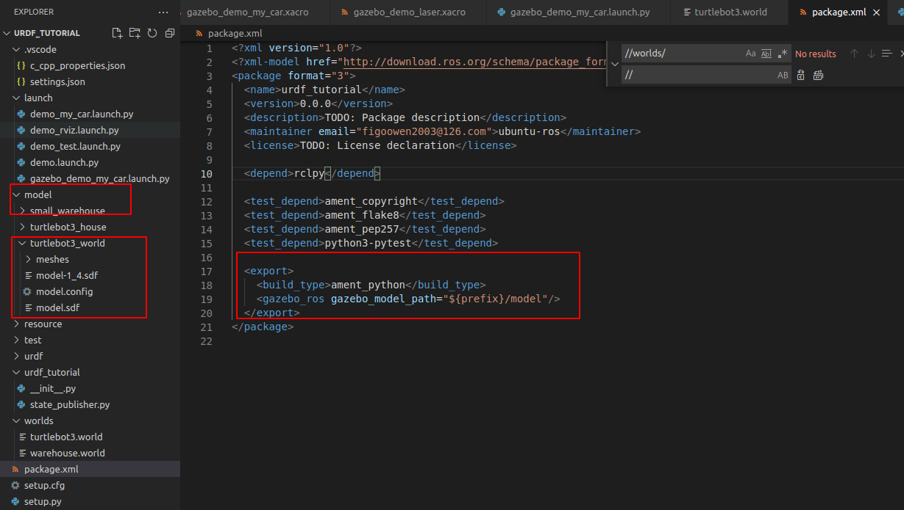
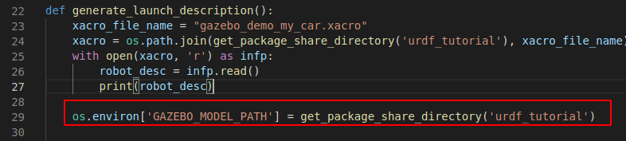
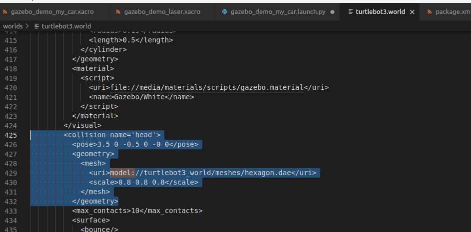

# World文件

世界文件包含了仿真中的所有元素，如机器人，灯光，传感器和静态对象。该文件以SDF格式来表示，通常用.world作为扩展名。

Gazebo服务器（gzserver）读取这个文件并生成一个世界。Gazebo中已经集成了大量的world模型，可以参考源码https://github.com/osrf/gazebo/tree/master/worlds。


# Model文件

model文件也使用SDF格式，文件内只有一个<model>...</model>标签。model文件的目的是促进模型的复用，并简化world文件（一个world文件中可以包含多个<model>...</model>标签）。一旦创建了一个model文件，它就可以按照如下的语法插入到world文件中：

```
<include>
  <uri>model://model_file_name</uri>
</include>
```

在线模型数据库中提供了许多的model文件，在连接互联网的条件下，可以从数据库中插入任何模型，模型的内容将在Gazebo运行时自动下载。

以下是一个典型的model文件（详细信息可参考http://gazebosim.org/tutorials?tut=build_model）：

```
<?xml version='1.0'?>
<sdf version="1.4">
  <model name="my_model">
    <pose>0 0 0.5 0 0 0</pose>
    <static>true</static>
    <link name="link">
      <inertial>
        <mass>1.0</mass>
        <inertia> <!-- inertias are tricky to compute -->
          <!-- http://gazebosim.org/tutorials?tut=inertia&cat=build_robot -->
          <ixx>0.083</ixx>       <!-- for a box: ixx = 0.083 * mass * (y*y + z*z) -->
          <ixy>0.0</ixy>         <!-- for a box: ixy = 0 -->
          <ixz>0.0</ixz>         <!-- for a box: ixz = 0 -->
          <iyy>0.083</iyy>       <!-- for a box: iyy = 0.083 * mass * (x*x + z*z) -->
          <iyz>0.0</iyz>         <!-- for a box: iyz = 0 -->
          <izz>0.083</izz>       <!-- for a box: izz = 0.083 * mass * (x*x + y*y) -->
        </inertia>
      </inertial>
      <collision name="collision">
        <geometry>
          <box>
            <size>1 1 1</size>
          </box>
        </geometry>
      </collision>
      <visual name="visual">
        <geometry>
          <box>
            <size>1 1 1</size>
          </box>
        </geometry>
      </visual>
    </link>
  </model>
</sdf>
```

# 环境变量

Gazebo使用许多环境变量来定位文件，并在服务器和客户端之间建立通信。大多数情况下都可以使用默认值来编译，无须设置任何变量。

常用的环境变量如下：

- GAZEBO_MODEL_PATH：Gazebo查找所有model目录集
- GAZEBO_RESOURCE_PATH：Gazebo查找其他资源如world和media的目录集
- GAZEBO_MASTER_URI：Gazebo master的uri，用来指定启动服务器的IP和端口，并告诉客户端连接到哪里
- GAZEBO_PLUGIN_PATH：Gazebo运行时查找插件动态库的目录集
- GAZEBO_MODEL_DATABASE_URI：在线模型数据库的uri，Gazebo将从这里下载models


# Gazebo Server

gzserver解析命令行中给出的world文件，然后调用物理和传感器引擎模拟出这个世界

```
gzserver worlds/empty_sky.world
```

gzserver后面的world文件名字可以是：相对于当前目录；绝对路径；相对于GAZEBO_RESOURCE_PATH表达的路径；worlds/<world_name>表示一个已经安装到Gazebo的路径；


# Graphical Client

图形客户端连接到正在运行的gzserver并将所有元素可视化，使用方法为：

```
gzclient
```

Gazebo也可将server与client组合到一起

```
gazebo worlds/empty_sky.world
```


# Plugins

插件是一个与Gazebo交互的方便的机制。插件可以在命令行中加载，也可以放到sdf文件中

Gazebo首先加载命令行中指定的插件，然后加载sdf文件中指定的插件。有些插件是由gzserver加载的，如影响物理属性的插件，其他插件这是由gzclient加载的。

命令行方式如下：

```
gzserver -s <plugin_filename>
```

-s表示它是一个系统插件，<plugin_filename>是可以在GAZEBO_PLUGIN_PATH中找到的动态库的名称，如：

```
gzclient --gui-client-plugin libTimerGUIPlugin.so
```


# 实例

## 指定Gazebo搜索model文件的路径

### 在编译时指定

- 在package.xml文件添加如下标签	

  ```
  <export>
     <gazebo_ros gazebo_model_path="${prefix}/models"/>
  </export>
  ```

  一个实际的例子：

  

  ${prefix}表示的是当前的package所在的目录urdf_tutorial，本工程中mesh文件夹位于urdf_tutorial/model路径下，因此如上图所示，gazebo_model_path被设置为${prefix}/model	

- 另一种方法是在launch文件中添加环境变量

  

  这里的含义是Gazebo运行加载世界时，要搜寻的model文件在/home/ubuntu-ros/demo_ws/install/urdf_tutorial/share/urdf_tutorial路径下，这里的install目录由colcon编译生成。

以上两种方法对应的world文件写法如下



### 运行时指定

```
export GAZEBO_MODEL_PATH=/home/demo_ws/src/urdf_tutorial/model
```

如此是将环境变量添加到.bashrc文件