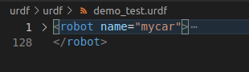

# 在Gazebo中显示urdf

## urdf语法简介

urdf文件是一个标准的xml文件，其中预定义了一系列的标签用于描述机器人模型，主要标签包括：

- robot根标签
- link连杆标签
- joint关节标签
- gazebo标签，用于集成gazebo中的插件，在使用gazebo仿真时会用到，用于配置仿真环境所需要的参数

### robot标签



属性name用于指定机器人模型的名字，可以是任意字符串

展开robot标签，内部的都是子级标签

### link标签

link标签用于描述机器人某个部件的外观和物理属性，比如机器人底座、轮子、激光雷达、摄像头等等。每一个部件都对应着一个link，在link标签内，可以设计该部件的形状、尺寸、颜色、惯性矩阵、碰撞参数等一系列属性。

1. name 为部件命名

2. 子标签

   - visual 描述可视的外观
     - geometry 设置连杆的形状
       - box 长方体
         - 属性 size=长(x) 宽(y) 高(z)
       - cylinder 圆柱
         - 属性 radius=半径 length=高度
       - sphere 球体
         - 属性 radius=半径
       - mesh 为连杆添加皮肤
         - 属性 filename=资源路径(格式:**package://<packagename>/<path>/文件**)
   - origin 设置偏移量与倾斜弧度
     - 偏移量 xyz=x偏移 y偏移 z偏移
     - 倾斜 rpy= r翻滚 p俯仰 yaw偏航（单位弧度）
   - material 设置材料属性（颜色）
     - name
     - color
   - collision 连杆的碰撞属性
   - inertial 连杆的惯性矩阵

3. 实例

   ```
       <!-- add base link 
           参数
               形状:圆柱 
               半径:10     cm 
               高度:8      cm 
               离地:1.5    cm        
       -->
       <link name="base_link">
           <visual>
               <geometry>
                   <cylinder radius="0.1" length="0.08" />
               </geometry>
               <origin xyz="0 0 0" rpy="0 0 0" />
               <material name="yellow">
                   <color rgba="0.8 0.3 0.1 0.5" />
               </material>
           </visual>
       </link>
   ```

### joint标签

joint标签用于描述机器人关节的运动学和动力学属性，还可以指定关节运动的安全极限，机器人的两个link以joint的形式连接，不同的关节有不同的运动形式：旋转、滑动、固定、旋转速度、旋转角速度限制等等。

1. 属性

   - name 关节的名字
   - type 关节的运动形式
     - continuous 旋转关节，绕单轴无限旋转
     - revolute 旋转关节，类似continuous，但有角度限制
     - prismatic 滑动关节，沿着某一轴线移动的关节，有位置极限
     - planer 平面关节，允许在平面正交方向上平移或旋转
     - floating 浮动关节，允许进行平移、旋转运动
     - fixed 固定关节，不允许运动的特殊关节

2. 子标签

   - parent（不可省略）

     parent link 父级连杆，对应link中的名字

   - child（不可省略）

     child link 子级连杆，对应link中的名字

   - origin

     xyz = 各轴上的偏移量 rpy=绕各轴旋转的弧度

   - axis

     xyz 设置绕哪个轴进行旋转

3. 实例

   ```
   <robot name="mycar">
       <link name="base_footprint">
           <visual>
               <geometry>
                   <sphere radius="0.001" />
               </geometry>
           </visual>
       </link>
       <!-- add base link 
           参数
               形状:圆柱 
               半径:10     cm 
               高度:8      cm 
               离地:1.5    cm        
       -->
       <link name="base_link">
           <visual>
               <geometry>
                   <cylinder radius="0.1" length="0.08" />
               </geometry>
               <origin xyz="0 0 0" rpy="0 0 0" />
               <material name="yellow">
                   <color rgba="0.8 0.3 0.1 0.5" />
               </material>
           </visual>
       </link>
       <joint name="base_link2base_footprint" type="fixed">
           <parent link="base_footprint" />
           <child link="base_link" />
           <origin xyz="0 0 0.055" />
       </joint>
   
       <!-- add drive wheel 
           驱动轮是侧翻的圆柱
           参数
               半径: 3.25 cm
               宽度: 1.5  cm
               颜色: 黑色
           关节设置:
               x = 0
               y = 底盘的半径 + 轮胎宽度 / 2
               z = 离地间距 + 底盘长度 / 2 - 轮胎半径 = 1.5 + 4 - 3.25 = 2.25(cm)
               axis = 0 1 0    
       -->
       <link name="left_wheel">
           <visual>
               <geometry>
                   <cylinder radius="0.0325" length="0.015" />
               </geometry>
               <origin xyz="0 0 0" rpy="1.5705 0 0" />
               <material name="black">
                   <color rgba="0.0 0.0 0.0 1.0" />
               </material>
           </visual>
       </link>
       <joint name="left_wheel2base_link" type="continuous">
           <parent link="base_link" />
           <child link="left_wheel" />
           <origin xyz="0 0.1 -0.0225" />
           <axis xyz="0 1 0" />
       </joint>
   
       <link name="right_wheel">
           <visual>
               <geometry>
                   <cylinder radius="0.0325" length="0.015" />
               </geometry>
               <origin xyz="0 0 0" rpy="1.5705 0 0" />
               <material name="black">
                   <color rgba="0.0 0.0 0.0 1.0" />
               </material>
           </visual>
       </link>
       <joint name="right_wheel2base_link" type="continuous">
           <parent link="base_link" />
           <child link="right_wheel" />
           <origin xyz="0 -0.1 -0.0225" />
           <axis xyz="0 1 0" />
       </joint>
   
       <!-- add support wheel 
           参数
               形状: 球体
               半径: 0.75 cm
               颜色: 黑色
   
           关节设置:
               x = 自定义(底盘半径 - 万向轮半径) = 0.1 - 0.0075 = 0.0925(cm)
               y = 0
               z = 底盘长度 / 2 + 离地间距 / 2 = 0.08 / 2 + 0.015 / 2 = 0.0475 
               axis= 1 1 1    
       -->
       <link name="front_wheel">
           <visual>
               <geometry>
                   <sphere radius="0.0075" />
               </geometry>
               <origin xyz="0 0 0" rpy="0 0 0" />
               <material name="black">
                   <color rgba="0.0 0.0 0.0 1.0" />
               </material>            
           </visual>       
       </link>
       <joint name="front_wheel2base_link" type="continuous">
           <parent link="base_link" />
           <child link="front_wheel" />
           <origin xyz="0.0925 0 -0.0475" />
           <axis xyz="1 1 1" />
       </joint>
   
       <link name="back_wheel">
           <visual>
               <geometry>
                   <sphere radius="0.0075" />
               </geometry>
               <origin xyz="0 0 0" rpy="0 0 0" />
               <material name="black">
                   <color rgba="0.0 0.0 0.0 1.0" />
               </material>            
           </visual>       
       </link>
       <joint name="back_wheel2base_link" type="continuous">
           <parent link="base_link" />
           <child link="back_wheel" />
           <origin xyz="-0.0925 0 -0.0475" />
           <axis xyz="1 1 1" />
       </joint> 
   </robot>
   ```


# 在Gazebo中使用urdf

## urdf适配Gazebo

不同于在rviz中解析urdf文件，如果需要在Gazebo中使用urdf，需要完成以下几个环节

- 必须在link标签内使用inertial标签，此标签标注了机器人某个刚体部件的惯性矩阵，用于一些力学相关的仿真计算
- 必须在link标签内使用collision标签，用于提供碰撞检测的依据
- 可以在link标签内使用gazebo标签，作用如下
  - 将颜色转化为Gazebo支持的格式
  - 将stl文件转化为dae文件以获得更优的皮肤效果
  - 添加传感器插件
- 可以在joint标签内使用gazebo标签，作用如下
  - 添加执行器控制插件
  - 设置合适的阻尼（动力学相关）
- 可以在robot标签内使用gazebo标签
- 可以添加如<link name="world" />的link标签，这样机器人会被严格的连接到一个世界中

总之，gazebo标签是对urdf格式的扩展，它允许指定出现在sdf格式却没有被包含在urdf格式中的多种属性。目前有三种不同类型的gazebo标签，一种用于robot标签内，一种用于link标签内，还有一种用于joint标签内。我们将在后面展开讨论。

### 简单的实例

```
<!-- 
    创建一个机器人模型(盒状即可)，显示在 Gazebo 中 
-->

<robot name="mycar">
    <link name="base_link">
        <visual>
            <geometry>
                <box size="0.5 0.2 0.1" />
            </geometry>
            <origin xyz="0.0 0.0 0.0" rpy="0.0 0.0 0.0" />
            <material name="yellow">
                <color rgba="0.5 0.3 0.0 1" />
            </material>
        </visual>
        <collision>
            <geometry>
                <box size="0.5 0.2 0.1" />
            </geometry>
            <origin xyz="0.0 0.0 0.0" rpy="0.0 0.0 0.0" />
        </collision>
        <inertial>
            <origin xyz="0 0 0" />
            <mass value="6" />
            <inertia ixx="1" ixy="0" ixz="0" iyy="1" iyz="0" izz="1" />
        </inertial>
    </link>
    <gazebo reference="base_link">
        <material>Gazebo/Black</material>
    </gazebo>

</robot>
```

#### 启动Gazebo并显示模型

```
import os
from ament_index_python.packages import get_package_share_directory
from launch import LaunchDescription
from launch.actions import ExecuteProcess
from launch.actions import DeclareLaunchArgument
from launch.substitutions import LaunchConfiguration, Command
from launch_ros.actions import Node
from launch.actions import IncludeLaunchDescription
from launch.launch_description_sources import PythonLaunchDescriptionSource


def generate_launch_description():
    use_sim_time = LaunchConfiguration('use_sim_time', default='false')
    urdf_file_name = 'my_car.urdf' # urdf file name
    urdf = os.path.join(
        get_package_share_directory('urdf_tutorial'),
        urdf_file_name)
    with open(urdf, 'r') as infp:
        robot_desc = infp.read()
        print(robot_desc)

    pkg_gazebo_ros = get_package_share_directory('gazebo_ros')
    world = os.path.join(pkg_gazebo_ros, '/launch/empty_world.launch')
    
    return LaunchDescription([
        DeclareLaunchArgument(
            'use_sim_time',
            default_value='false',
            description='Use simulation (Gazebo) clock if true'),

        Node(
            package='robot_state_publisher',
            executable='robot_state_publisher',
            name='robot_state_publisher',
            output='screen',
            parameters=[{'use_sim_time': use_sim_time, 'robot_description': robot_desc}],
            arguments=[urdf]),

        IncludeLaunchDescription(
            PythonLaunchDescriptionSource(
                os.path.join(pkg_gazebo_ros, 'launch', 'gzserver.launch.py')
            ),
            launch_arguments={'world': world}.items(),
        ),

        IncludeLaunchDescription(
            PythonLaunchDescriptionSource(
                os.path.join(pkg_gazebo_ros, 'launch', 'gzclient.launch.py')
            ),
        ),
        
        Node(package='gazebo_ros', executable='spawn_entity.py',
            arguments=['-entity', 'mycar', '-topic', '/robot_description'],
            output='screen'),         
    ])

```

解释：

解析urdf文件，并将其内容加载到参数服务器

```
        Node(
            package='robot_state_publisher',
            executable='robot_state_publisher',
            name='robot_state_publisher',
            output='screen',
            parameters=[{'use_sim_time': use_sim_time, 'robot_description': robot_desc}],
            arguments=[urdf]),
```

利用gazebo_ros_pkgs中的功能包孵化机器人模型

```
        Node(package='gazebo_ros', executable='spawn_entity.py',
            arguments=['-entity', 'mycar', '-topic', '/robot_description'],
            output='screen'),  
```

## urdf新增标签详解

### collision

collision表示碰撞蚕食。如果机器人link是标准的几何形状，和link中的visual标签内容可以保持一致（复制，粘贴即可）

### inertial

inertial表示惯性矩阵。为了让Gazebo的物理引擎能正常工作，必须提供inertial标签。惯性矩阵的设置需要结合link标签中的质量和外形参数动态生成。link标签中的质量必须大于。如果存在任何的扭矩，如果惯性矩阵的主惯性矩为0，会导致无限加速的问题。通常惯性矩阵需要通过对机器人部件进行测量或者通过CAD软件进行近似来获得。以下是PRBot的一个例子：

```
    <inertial>
      <origin xyz="0 0 ${height1/2}" rpy="0 0 0"/>
      <mass value="1"/>
      <inertia
        ixx="1.0" ixy="0.0" ixz="0.0"
        iyy="1.0" iyz="0.0"
        izz="1.0"/>
    </inertial>
```

实际使用中，我们已经封装好了标准的球体、圆柱与立方体的惯性矩阵公式（以xacro来实现），可以在使用中直接copy：

球体的惯性矩阵

```
<!-- Macro for inertia matrix -->
    <xacro:macro name="sphere_inertial_matrix" params="m r">
        <inertial>
            <mass value="${m}" />
            <inertia ixx="${2*m*r*r/5}" ixy="0" ixz="0"
                iyy="${2*m*r*r/5}" iyz="0" 
                izz="${2*m*r*r/5}" />
        </inertial>
    </xacro:macro>
```

圆柱的惯性矩阵

```
<xacro:macro name="cylinder_inertial_matrix" params="m r h">
        <inertial>
            <mass value="${m}" />
            <inertia ixx="${m*(3*r*r+h*h)/12}" ixy = "0" ixz = "0"
                iyy="${m*(3*r*r+h*h)/12}" iyz = "0"
                izz="${m*r*r/2}" /> 
        </inertial>
    </xacro:macro>
```

立方体的惯性矩阵

```
 <xacro:macro name="Box_inertial_matrix" params="m l w h">
       <inertial>
               <mass value="${m}" />
               <inertia ixx="${m*(h*h + l*l)/12}" ixy = "0" ixz = "0"
                   iyy="${m*(w*w + l*l)/12}" iyz= "0"
                   izz="${m*(w*w + h*h)/12}" />
       </inertial>
   </xacro:macro>
```

### gazebo

#### link中的gazebo

| 名称          | 类型   | 描述                                                         |
| ------------- | :----- | ------------------------------------------------------------ |
| material      | value  | Material of visual element                                   |
| gravity       | bool   | Use gravity                                                  |
| dampingFactor | double | 连杆速度的指数速度衰减                                       |
| maxVel        | double | Exponential velocity decay of the link velocity - takes the value and multiplies the previous link velocity by (1-dampingFactor). |
| minDepth      | double | minimum allowable depth before contact correction impulse is applied |
| mu1           | double | Friction coefficients μ for the principal contact directions along the contact surface as defined by the [Open Dynamics Engine (ODE)](http://www.ode.org/) (see parameter descriptions in [ODE's user guide](http://www.ode.org/ode-latest-userguide.html#sec_7_3_7)) |
| mu2           | double | same as above                                                |
| fdir1         | string | 3-tuple specifying direction of mu1 in the collision local reference frame. |
| kp            | double | Contact stiffness k_p and damping k_d for rigid body contacts as defined by ODE ([ODE uses erp and cfm](http://www.ode.org/ode-latest-userguide.html#sec_7_3_7) but there is a [mapping between erp/cfm and stiffness/damping](https://github.com/osrf/gazebo/blob/gazebo9/gazebo/physics/ode/ODEJoint.cc)) |
| kd            | double | same as above                                                |
| selfCollide   | bool   | If true, the link can collide with other links in the model. |
| maxContacts   | int    | Maximum number of contacts allowed between two entities. This value overrides the max_contacts element defined in physics. |
| laserRetro    | double | intensity value returned by laser sensor.                    |

#### joint中的gazebo

| 名称                 | 类型   | 描述                                                         |
| -------------------- | ------ | ------------------------------------------------------------ |
| stopCfm              | double | Joint stop constraint force mixing (cfm) and error reduction parameter (erp) used by ODE |
| stopErp              | double | same as above                                                |
| provideFeedback      | bool   | Allows joints to publish their wrench data (force-torque) via a Gazebo plugin |
| implicitSpringDamper | bool   | If this flag is set to true, ODE will use ERP and CFM to simulate damping. This is a more stable numerical method for damping than the default damping tag. The cfmDamping element is deprecated and should be changed to implicitSpringDamper. |
| springStiffness      | bool   | same as above                                                |
| springReference      | double | Equilibrium position for the spring.                         |
| cfmDamping           | double | same as above                                                |
| fudgeFactor          | double | Scale the excess for in a joint motor at joint limits. Should be between zero and one. |

#### robot中的gazebo

如果gazebo标签没有与属性reference=“”连用，那么意味着gazebo标签属于整个robot

| 名称   | 类型 | 描述                                                         |
| ------ | ---- | ------------------------------------------------------------ |
| static | bool | if set to true, the model is immovable. Otherwise the model is simulated in the dynamics engine. |

