# Dolly, the robot

​	dolly是一个跟随机器人，dolly的demo由ros2和Gazebo（Ignition）组合实现

## Dolly的版本

| Branch                                                       | ROS      | Gazebo-classic      | Ignition                                                     | OS                          |
| ------------------------------------------------------------ | -------- | ------------------- | ------------------------------------------------------------ | --------------------------- |
| [crystal](https://github.com/chapulina/dolly/tree/crystal)   | Crystal  | Gazebo 9            |  | Ubuntu Bionic               |
| [dashing](https://github.com/chapulina/dolly/tree/dashing)   | Dashing  | Gazebo 9            |  | Ubuntu Bionic, macOS Sierra |
| [eloquent](https://github.com/chapulina/dolly/tree/eloquent) | Eloquent | Gazebo 9, Gazebo 11 | Citadel                                                      | Ubuntu Bionic               |
| [foxy](https://github.com/chapulina/dolly/tree/foxy)         | Foxy     | Gazebo 11           | Citadel                                                      | Ubuntu Focal                |

## Dolly的功能包集合

	* dolly：元功能包，提供所有其他的功能包
	* dolly_follow ：实现了支持跟随逻辑的节点（node）
	* dolly_gazebo：robot model，simulation world以及gazebo的launch脚本
	* dolly_ignition：robot model，simulation world以及Ignition的launch脚本

## Dolly show


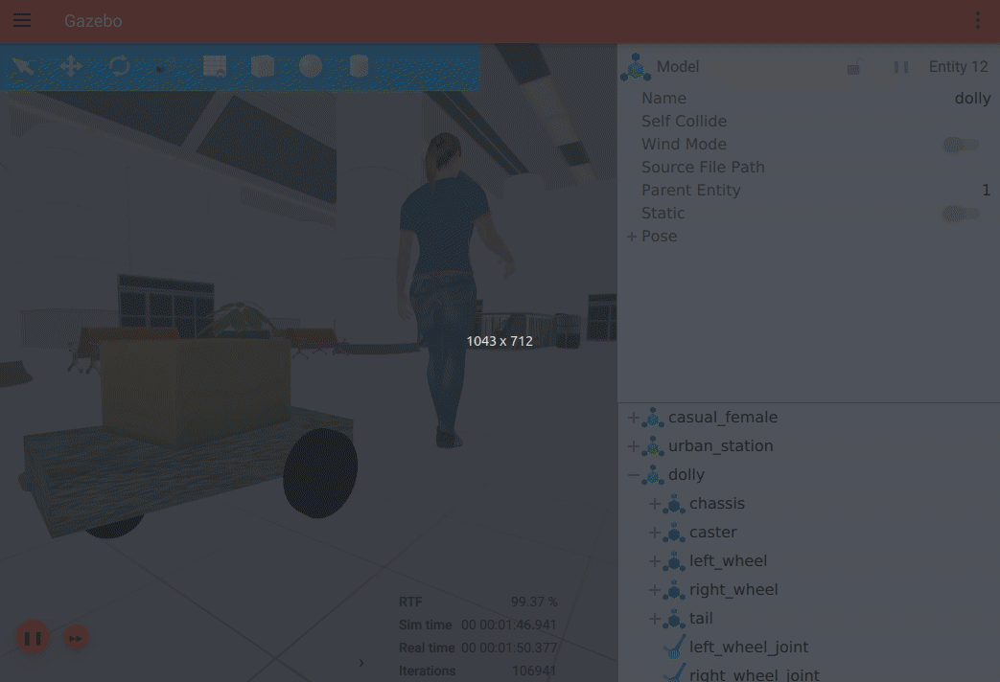


# How to install

1. 二进制安装

   dolly目前已经支持多个ros版本

   | ROS      |          Packages           |
   | -------- | :-------------------------: |
   | Dashing  |     `ros-dashing-dolly`     |
   |          | `ros-dashing-dolly-follow`  |
   |          | `ros-dashing-dolly-gazebo`  |
   | Eloquent |    `ros-eloquent-dolly`     |
   |          | `ros-eloquent-dolly-follow` |
   |          | `ros-eloquent-dolly-gazebo` |

2. 源码安装

   - 安装至少一个仿真器，Gazebo或者Ignition。目前我安装的是Gazebo 11.3.0

   - 安装合适的ros2版本，参考此处https://docs.ros.org/en/eloquent/Installation/Linux-Install-Debians.html

   - 根据你所安装的ros2版本，clone 对应的dolly源码

     ```shell
      mkdir -p ~/ws/src
      cd ~/ws/src
      git clone https://github.com/chapulina/dolly -b <distro>
     ```

     <distro>为dolly的版本号：如foxy

   - 如果安装的是Ignition，并且是Eloquent或更早的版本，需要克隆bridget

     ```shell
     git clone https://github.com/ignitionrobotics/ros_ign -b <distro>
     ```

   - 安装依赖

     ```shell
      cd ~/ws
      rosdep install --from-paths src --ignore-src -r -y \
          --skip-keys=ignition-math6 \
          --skip-keys=ignition-msgs5 \
          --skip-keys=ignition-transport8 \
          --skip-keys=ignition-gazebo3
     ```

     Ubuntu Focal（20.04）上，无需--skip-keys参数

   - 编译和安装

     ```shell
     cd ~/ws
     colcon build
     ```

     - 最好是挂上代理，然后编译，如果一次没有过，可以多试几次

# 运行

1. 在Gazebo中运行

   - 设置环境变量，务必按如下顺序进行操作

     ```shell
      . /usr/share/gazebo/setup.sh
      . ~/ws/install/setup.bash
     ```

     tip：如果在设置环境变量之后，命令`ros2 pkg list | grep dolly_gazebo`的执行结果是空，那么Gazebo的依赖不会被正确设置

   - 在自建城市中启动dolly

     `ros2 launch dolly_gazebo dolly.launch.py world:=dolly_city.world`

   - 在空的world中启动dolly

     `ros2 launch dolly_gazebo dolly.launch.py world:=dolly_empty.world`

     tip：

      - 运行时报错

        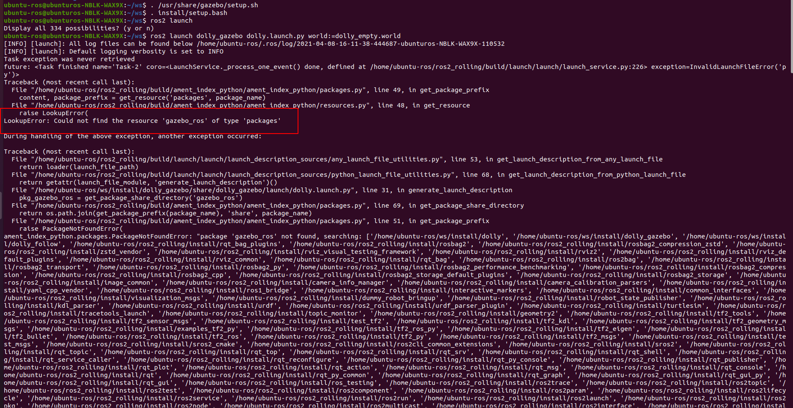

        该运行错误是因为找不到gazebo_ros这个package，我们分以下几步解决这个问题

        （1）安装gazebo_ros_pkgs（需要是ros2版的）

        ​			参照文档http://gazebosim.org/tutorials?tut=ros2_installing&cat=connect_ros进行操作，推荐使用debian pkg进行安装

        ​			这里使用了源码编译方式进行安装（适合于开发者），碰到以下问题

        ​			a. 最好是挂上代理进行编译

        ​			b. 编译有可能出错，需要多编译几次，或者指定失败的pkg单独编译

        ​			c. 编译某些包的时候，可能因为编译器的原因，导致单元测试失败，这里采用的				是在CmakeList将单元测试相关的内容注释掉

        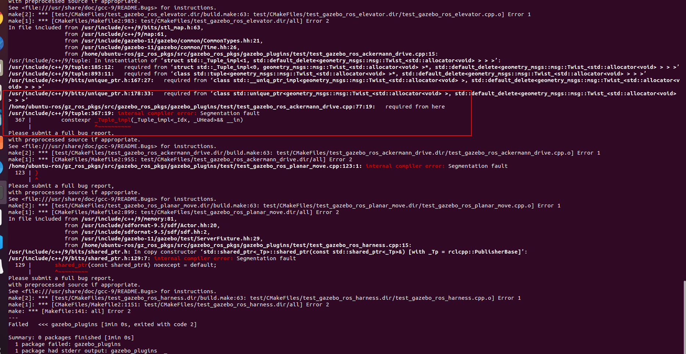

        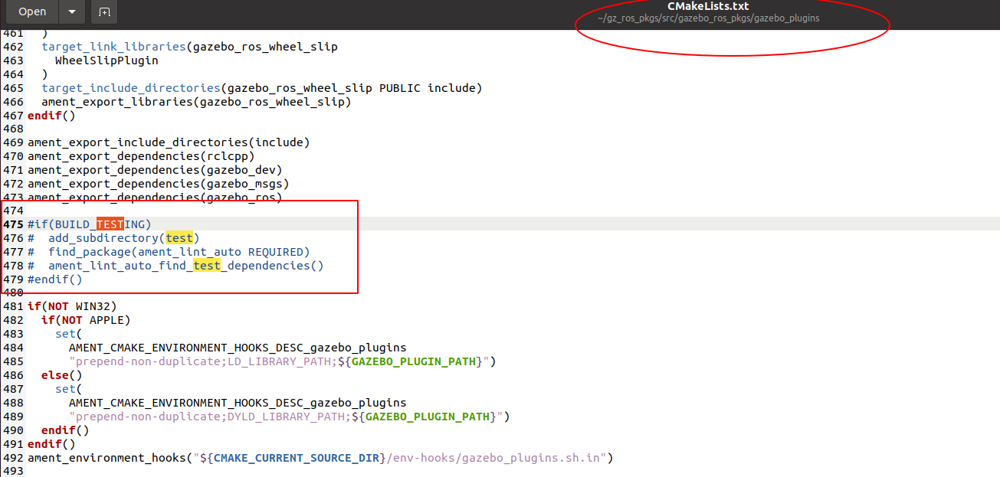

        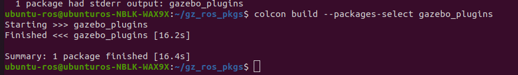

        其他package（如gazebo_ros）也可能发生类似的单元测试编译报错，同样需要注释掉CmakeList中的相关内容

        （2）设置环境变量时需要增加一句，如下

        ```shell
         . /usr/share/gazebo/setup.sh
         . ~/ws/install/setup.bash
         . ~/gz_ros_pkgs/install/setup.bash #需要加载gazebo_ros_pkgs的工作空间
        ```

        

2. 在Ignition中运行（我们当前使用的是Gazebo，没有实践Ignition的版本，可能有坑）

   - 设置环境变量

     `. ~/ws/install/setup.bash`

     tip：如果在设置环境变量之后，命令`ros2 pkg list | grep dolly_ignition`的执行结果是空，那么Ignition的依赖不会被正确设置

   - 在一个station中启动dolly

     `ros2 launch dolly_ignition dolly.launch.py`

# 实测结果

- `ros2 launch dolly_gazebo dolly.launch.py world:=dolly_empty.world`

  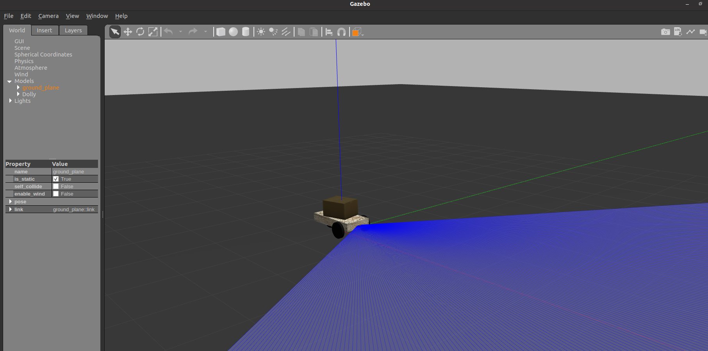

  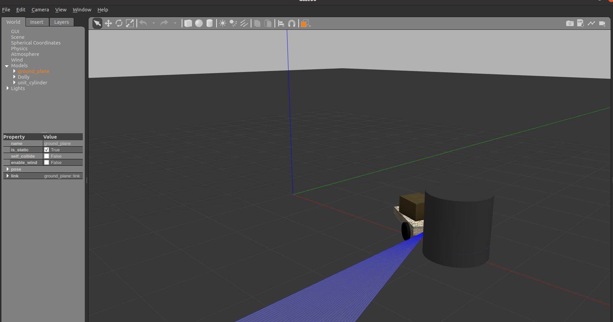

  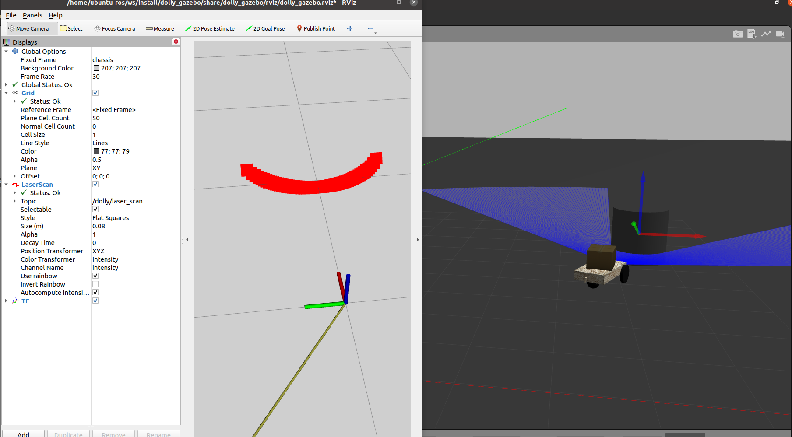

- `ros2 launch dolly_gazebo dolly.launch.py world:=dolly_city.world`

  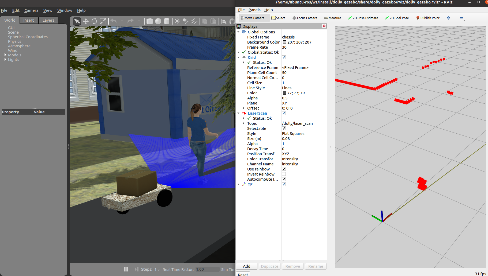

  tips: 在启动之后，会报出如下错误

  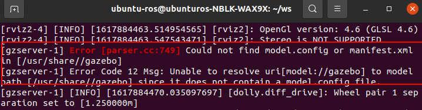

  查看/usr/share/gazebo路径下，确实没有model.config这个文件

  并且我们发现存在/usr/share/gazebo-11这个文件夹，因为我们安装的就是gazebo11

  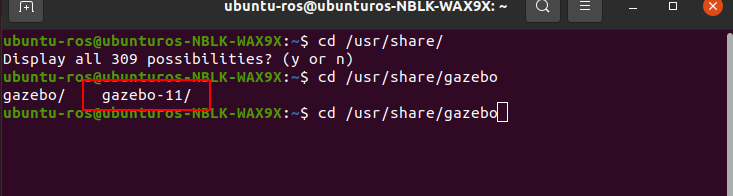

  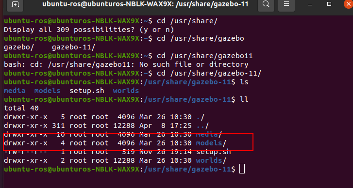

  因此在运行前设置环境变量时，`. /usr/share/gazebo/setup.sh变更为`. /usr/share/gazebo-11/setup.sh`，解决此问题