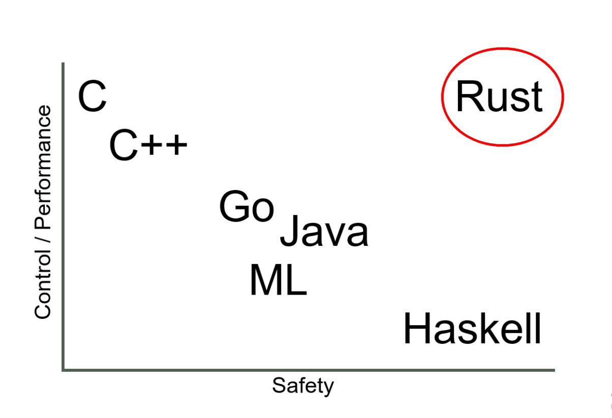

# 现代语言的现状

## 什么是现代编程语言

术语“现代编程语言”有歧义。许多人认为Python、JavaScript等语言是现代编程语言。同时，他们认为Java是一种古老的编程语言。实际上，它们都是在同一时间出现的:1995年。

大多数主流编程语言都是在上个世纪发展起来的，主要是在20世纪70年代(如C)、80年代(如c++)、90年代(如Java、Python、JavaScript)。这些语言并不是为了利用现代软件开发生态系统而设计的:多核CPU、GPU、快速网络、移动设备、容器和云。尽管他们中的许多人在他们的语言中具有像并发这样的改进特性并进行了自我调整，但他们也提供了向后兼容性，不能丢弃旧的、过时的特性。

Python在python2和python3之间做得很好(或者不好，取决于上下文)。这些语言通常提供10种方法来做同样的事情，并且不关心开发者的人体工程学。

根据StackOverflow开发者的调查，大多数主流的旧编程语言都在“最可怕的语言”类别中名列前茅:

现代编程语言的时间线，大致可以划分在2007年，它具备以下两个特征：

​	首先，开发现代编程语言是为了充分利用现代计算机硬件(多核CPU、GPU、TPU)、移动设备、大数据集、快速网络、容器和云的优势。此外，大多数现代编程语言提供了更高的开发人员人机工程学如下所示:

- 简洁的代码(更少的样板代码)

- 内置的并发性支持

- 空指针安全

- 类型推断

- 更简单的特性集

- 较低的认知负荷

- 混合所有编程范例的最佳特性

​       其次，榜单上的许多编程语言都具有破坏性，并将永远改变软件行业。其中一些已经成为主流编程语言，而另一些则准备取得突破。把这些语言作为第二种编程语言来学习是明智的。

## Rust语言

当前，系统编程语言领域是由C、c++等类元语言主导的。尽管它们可以完全控制程序和硬件，但它们缺乏内存安全。即使它们支持并发，使用C/ c++编写并发程序也是一项挑战，因为没有并发安全性。其他流行的编程语言是解释语言，如Java、Python和PHP。它们提供了安全性，但需要庞大的运行时间或虚拟机。因为它们的大型运行时，像Java这样的语言不适合系统编程。

人们曾多次尝试将C/ c++的强大功能与Haskell和Java的安全性结合起来。看起来Rust是第一种成功的产品级编程语言。

Graydon Hoare最初开发Rust是作为一个副业项目。他受到了编程语言Cyclone的启发。Rust是开源的，Mozilla和其他许多公司和社区一起领导着该语言的开发。《Rust》于2015年首次发布，很快就引起了社区的注意。在之前的一篇文章中，我深入研究了Rust，并讨论了为什么在大数据领域使用Rust比使用c++和Java更好:

主要特点:

- 提供具有所有权和借用概念的内存安全和并发安全性。

- 内存安全和并发安全性的编译时保证，也就是说，如果一个程序代码经过编译，那么它既是内存安全和数据竞争自由的。这是《Rust》最吸引人的特点。

- 它还提供了ML Haskell的表达能力。通过不可变数据结构和函数式编程特性，Rust提供了函数式并发和数据并发。

- Rust的速度快得惊人。习惯锈给予更好的性能比习惯的c++作为基准游戏。

- 没有运行时，Rust提供了现代硬件(TPU, GPU，多核CPU)的完全控制。

- Rust支持LLVM。因此，Rust提供了一流的与WebAssembly的互操作性，并允许极其快速的Web代码。

人气：

自2015年首次亮相以来，Rust受到了开发者的广泛认可，并连续五年(2016、2017、2018、2019、2020)在StackOverflow开发者调查中被评为最受喜爱的语言:

人气网站PyPl将Rust排名第16位，呈上升趋势:

对比它提供的功能集，难怪微软、亚马逊、谷歌等科技巨头最终宣布投资Rust作为一种长期的系统编程语言。

在过去的5年里，Rust的牵引力每年都在增加，正如谷歌趋势所示:

## Go语言

谷歌是最大的网络规模公司之一。本世纪初，谷歌面临两个扩展问题:开发扩展和应用扩展。开发伸缩性意味着他们不能通过雇佣更多的开发人员来添加更多的特性。应用程序可伸缩性意味着他们不能轻松地开发可以伸缩到“谷歌”规模机器集群的应用程序。大约在2007年，谷歌开始创建一种新的“实用”编程语言，可以解决这两个伸缩性问题。罗布·派克(Rob Pike, UTF-8)和肯·汤普森(Ken Thompson, UNIX OS)让两位世界上最有才华的软件工程师创造了一种新的语言。

2012年，谷歌发布了第一个官方版本的Go编程语言。Go是一种系统编程语言，但不同于Rust。它也有一个运行时和垃圾收集器(几个兆字节)。但与Java或Python不同的是，此运行时与生成的代码一起打包。最后，Go生成一个可以在机器上运行的原生二进制代码，而不需要额外的依赖关系或运行时。

主要特点:

- Go拥有一流的并发支持。它不提供“共享内存”并发通过线程和锁，因为它更难编程。相反，它提供了一个基于CSP的消息传递并发性(基于Tony Hoare的论文)。Go使用“Goroutine”(轻量级绿色线程)和“Channel”来传递消息。

- Go最致命的特点就是简单。它是最简单的系统编程语言。一个新的软件开发人员可以像Python那样在几天内编写出高效的代码。一些最大的原生云项目(Kubernetes, Docker)是用Go编写的。

- Go还内置了垃圾收集器，这意味着开发人员不需要担心像C/ c++那样的内存管理。

- 谷歌在Go上投入了大量资金。因此，Go拥有大量的工装支持。对于新的Go开发者来说，有一个庞大的工具生态系统。

- 通常，开发人员将20%的时间用于编写新代码，80%的时间用于维护现有代码。由于其简单性，Go在语言维护领域非常出色。如今，Go在商业应用程序中大量使用。

人气:

自从Go首次出现以来，软件开发社区已经欣然接受了它。在2009年和2018年，Go进入了TIOBE指数的编程语言名人堂名单。Go的成功为Rust等新一代编程语言铺平了道路。

Go已经是一种主流编程语言。最近，Go团队宣布了“Go2”的工作，只是为了让语言更加坚实:

在几乎所有流行的编程语言比较网站中，Go排名一度很高，超过了许多现有语言，但是近2年有所下滑。2021年6月的TIOBE指数排名，Go排名第20:

同样根据Stackoverflow的调查，Go也掉出了十大最受欢迎的编程语言之列:

根据谷歌趋势近5年的结果，也能看出Go语言从2020年开始呈现出热度下滑的趋势

# 现代语言的应用场景

不同的编程语言被用于计算机可以执行的各种功能。

大多数最流行的编程语言都是面向对象的。本质上，这是一种围绕数据(也称为对象)组织的编程模型。面向对象编程语言易于操作、重用和扩展，这使它们成为构建软件的理想语言。

另一种主要的编程语言是函数式编程。这些语言基于数学函数，使用线性数学逻辑。它们在列表处理应用程序和大数据分析等方面非常有用。

## Rust

## Go

Golang，或俗称Go，是最年轻的编程语言之一，由于广泛的用户应用，该语言近来越来越受欢迎。由于其可表达性、高性能和编译速度，它已经能够为企业所有者和开发人员解决许多问题。

**构建本地云应用程序**

云计算是现代软件体系结构的关键因素之一，它用于设计和构建能够伸缩和共享资源的软件应用程序。Golang作为一种现代的跨平台编程语言，是原生云应用程序和微服务的绝佳选择。它使您能够快速开发可伸缩和可靠的云应用程序，以满足您的消费者的当前需求。它还允许你在Kubernetes中使用Docker容器化构建Go应用程序。Kubernetes是用Go编写的，它可以为你提供自动扩展和多集群支持。

例如:自由市场(MercadoLibre)——一家总部设在美国的阿根廷公司，专门从事电子商务和在线拍卖，它正在使用Golang动态处理大量流量。广泛且精心策划的Go工具包使自由市场经验丰富的工程师能够快速高效地构建高度关键的云原生应用。

**创建快速而优雅的**cli

你有没有想过在图形用户界面(GUI)的世界里，命令行界面(CLI)有什么用?与GUI不同的是，CLI是一个纯文本界面，它基于最适合基于任务的自动化的软件工程原理工作。Go提供了一个易于使用的界面来构建基于cli的基础设施和具有远程和自动化功能的云应用程序。然而，在Golang中开发CLI工具和应用程序时，开发者使用的是这两种主要工具:Cobra和Viper。

例如:美国电信集团康卡斯特，使用Golang作为一个CLI客户端，让公司管理，订阅和发布高流量的网站给客户。不仅如此，该公司还使用Go来支持其开源Apache Pulsar客户端库。

**支持DevOps和SRE**

Go语言已经在DevOps(开发运营)和SRE(站点可靠性工程)中找到了越来越多的用户基础。由于戈朗的工作原则是“一次建设，全程推广”，因此非常适合遵循CI/CD实践的项目。它不仅使您能够自动化和改进您的CI/CD流程，还可以帮助您使您的网站更可靠和可伸缩。总而言之，Go服务于DevOps和SRE，从cli、小脚本到复杂的自动化服务。

例如:Kubernetes和Docker等CI/CD工具，用Golang编写，为IBM的DevOps团队提供了一个用户友好的界面，以简化他们的DevOps流程。此外，为了方便地向其消息传递中间件IBM MQ发送和接收消息，该公司还引入了基于go的API构建。

**用于高度可伸缩的数据库实现**

Golang可以为您提供优秀的支持，帮助您构建和管理高度可伸缩的数据库。Go数据库驱动程序能够让你轻松地使用标准SQL和其他数据库包，如Oracle, MongoDB, Postgres, MySQL, BigQuery, SQLite, Redis等。

例如:在线内容发布网站Medium使用Golang来管理和扩展其数据库。该公司使用一种用Go编写的独特服务来管理其数据库，通常被称为“GoSocial”。

**web开发**

Golang非常适合web开发和构建可扩展的多处理器系统。它可以帮助你的企业在开发最新的网络应用程序和软件时，简化你或你的开发者面临的复杂问题。Golang不仅可以让你从零开始构建web应用程序，还可以让你构建认证系统，以提供更大的安全性。一些最好的Go web开发框架包括Mango, Martini, Flamingo, HTTP/Net, Beego, Echo和GoCraft。

例如:英国政府使用Golang来构建高性能I/ o应用程序和HTTP基础设施。在确信了该语言的HTTP/Net包和并发模型后，GOV.UK的web开发者也进行了一些为政府构建新路由器的实验。

## C

C编程语言最早发布于1972年。它是一种高级过程语言，已经成为最广泛使用的语言之一。尽管英语年代久远，但它仍然是一种相对复杂的语言，但它的影响可以在许多其他语言中看到。c#、c++、Java、Python等等都从C中汲取了灵感。

C语言是一种通用语言，在许多不同的领域都有使用。它主要用于创建系统应用程序，这意味着Windows和Linux等操作系统使用了大量的C语言编程。你也可以用C来创建游戏、图形和应用程序，这些都需要大量的计算。

## C++

c++是一种高级面向对象的编程语言，它帮助程序员编写快速、可移植的程序。c++以标准模板库(STL)的形式提供了丰富的库支持。

**操作系统**

无论是微软Windows还是Mac OSX或Linux，它们都是用c++编写的。C/ c++是所有知名操作系统的主干，因为它是一种强类型和快速编程语言，这使它成为开发操作系统的理想选择。此外，C非常接近汇编语言，这进一步有助于编写低级操作系统模块。

**浏览器**

各种浏览器的渲染引擎都是用c++编程的，因为它提供的速度很快。渲染引擎要求更快的执行，以确保用户不必等待内容出现在屏幕上。因此，这种低延迟系统采用c++作为编程语言。

**库**

许多高级库使用c++作为核心编程语言。例如，一些机器学习库使用c++作为后端，因为它的速度快。Tensorflow是使用最广泛的机器学习库之一，它使用c++作为后端编程语言。这样的库需要高性能的计算，因为它们涉及到用于训练机器学习模型的巨大矩阵的乘法。因此，性能变得至关重要。c++在这些库中起到了拯救作用。

**图形**

所有的图形应用程序都需要快速渲染，就像web浏览器一样，c++也有助于减少延迟。使用计算机视觉、数字图像处理、高端图形处理的软件——它们都使用c++作为后端编程语言。即使是那些以图像为主的流行游戏也使用c++作为主要的编程语言。c++在这种情况下提供的速度有助于开发人员扩展目标受众，因为优化后的应用程序甚至可以在没有高计算能力的低端设备上运行。

**银行应用程序**

Infosys Finacle是最常用的核心银行系统之一，它使用c++作为后端编程语言之一。银行应用程序每天处理数以百万计的事务，需要高并发性和低延迟支持。c++自动成为这类应用程序的首选，因为它的速度和多线程支持可以通过各种标准模板库获得，这些标准模板库是c++编程工具包的一部分。

**云/分布式系统**

开发云存储系统和其他分布式系统的大型组织也使用c++，因为它可以很好地与硬件连接，并与许多机器兼容。云存储系统使用可扩展的文件系统，这些文件系统与硬件工作相近。c++成为这种情况下的首选，因为它接近于硬件，而且c++中的多线程库提供了高并发性和负载容忍度，这在这种情况下是非常需要的。

**数据库**

Postgres和MySQL——两个使用最广泛的数据库是用c++和C (c++的前身)编写的。这些数据库几乎被用于我们日常生活中使用的所有知名应用程序中——Quora、YouTube等。

**嵌入式系统**

各种嵌入式系统，如医疗机器、智能手表等，都使用c++作为主要的编程语言，因为与其他高级编程语言相比，c++更接近于硬件级别。

**电话交换机**

由于c++是速度最快的编程语言之一，它被广泛应用于电话交换机、路由器和空间探测器的编程中。

**编译器**

各种编程语言的编译器都使用C和c++作为后端编程语言。这是因为C和c++都是相对较低级别的语言，更接近于硬件，因此是这种编译系统的理想选择。以上是c++编程语言的一些用法和应用。现在，让我们进一步了解c++相对于其他编程语言的优势。

## Java

Java是一种非常流行的面向对象编程语言。它的流行部分源于这样一个事实:一旦您用Java编写了一段代码，它就可以在任何带有Java平台的设备上运行。

Java核心的“编写一次，随处运行”概念意味着它有许多不同的用途。然而，它的一些主要用途包括商业软件、web应用程序和移动应用程序。例如，谷歌的Android操作系统使用Java作为其原生语言。

## Python

Python是一种面向对象的高级编程语言，于1992年推出。它是以一种相对直观的方式构建的，这使得它对于那些想要快速开发的人来说是理想的。现在它是一种非常流行的语言，这意味着有大量的Python工作可做。

**1. WEB开发**

Python拥有很多免费数据函数库、免费web网页模板系统、以及与web服务器进行交互的库，可以实现web开发，搭建web框架，目前比较有名气的Python web框架为Django。从事该领域应从数据、组件、安全等多领域进行学习，从底层了解其工作原理并可驾驭任何业内主流的Web框架。

**2.** **网络编程**

网络编程是Python学习的另一方向，网络编程在生活和开发中无处不在，哪里有通讯就有网络，它可以称为是一切开发的“基石”。对于所有编程开发人员必须要知其然并知其所以然，所以网络部分将从协议、封包、解包等底层进行深入剖析。

**3.** **爬虫开发**

在爬虫领域，Python几乎是霸主地位，将网络一切数据作为资源，通过自动化程序进行有针对性的数据采集以及处理。从事该领域应学习爬虫策略、高性能异步IO、分布式爬虫等，并针对Scrapy框架源码进行深入剖析，从而理解其原理并实现自定义爬虫框架。

**4.** **云计算开发**

Python是从事云计算工作需要掌握的一门编程语言，目前很火的云计算框架OpenStack就是由Python开发的，如果想要深入学习并进行二次开发，就需要具备Python的技能。

**5.** **人工智能**

MASA和Google早期大量使用Python，为Python积累了丰富的科学运算库，当AI时代来临后，Python从众多编程语言中脱颖而出，各种人工智能算法都基于Python编写，尤其PyTorch之后，Python作为AI时代头牌语言的位置基本确定。

**6.** **自动化运维**

Python是一门综合性的语言，能满足绝大部分自动化运维需求，前端和后端都可以做，从事该领域，应从设计层面、框架选择、灵活性、扩展性、故障处理、以及如何优化等层面进行学习。

**7.** **金融分析**

金融分析包含金融知识和Python相关模块的学习，学习内容囊括Numpy\Pandas\Scipy数据分析模块等，以及常见金融分析策略如“双均线”、“周规则交易”、“羊驼策略”、“Dual Thrust 交易策略”等。

**8.** **科学运算**

Python是一门很适合做科学计算的编程语言，97年开始，NASA就大量使用Python进行各种复杂的科学运算，随着NumPy、SciPy、Matplotlib、Enthought librarys等众多程序库的开发，使得Python越来越适合做科学计算、绘制高质量的2D和3D图像。

**9.** **游戏开发**

在网络游戏开发中，Python也有很多应用，相比于Lua or C++，Python比Lua有更高阶的抽象能力，可以用更少的代码描述游戏业务逻辑，Python非常适合编写1万行以上的项目，而且能够很好的把网游项目的规模控制在10万行代码以内。

**10.** **桌面软件**

Python在图形界面开发上很强大，可以用tkinter/PyQT框架开发各种桌面软件！

