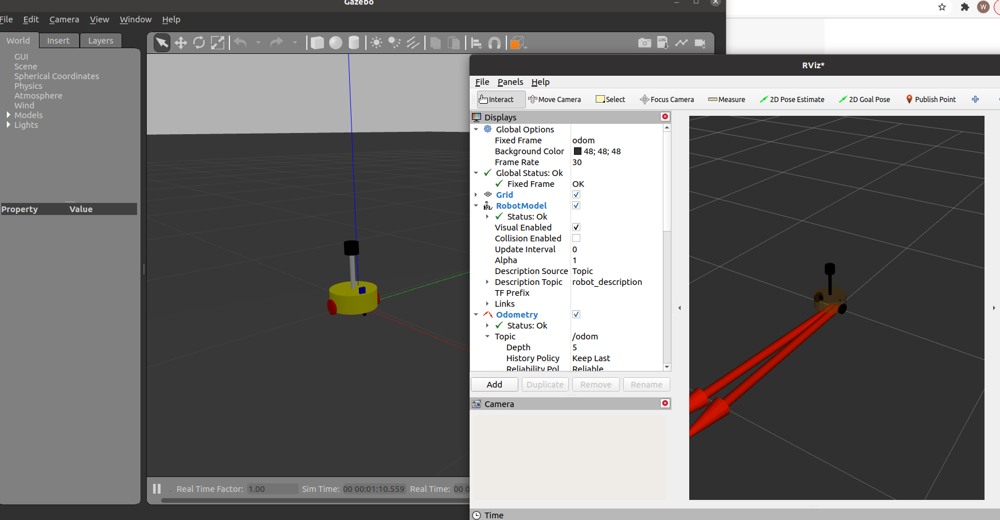
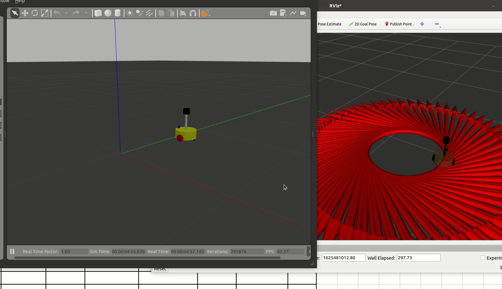
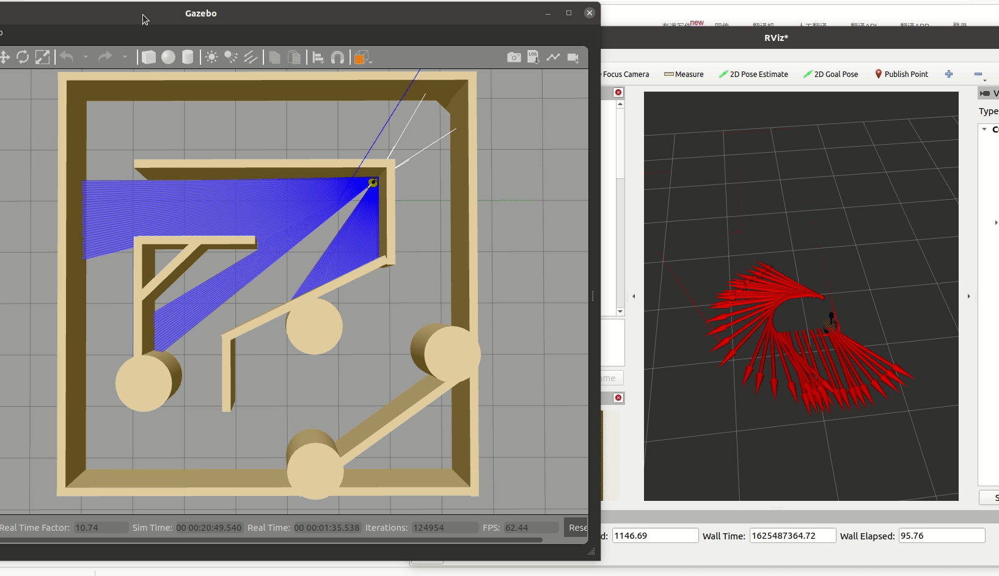
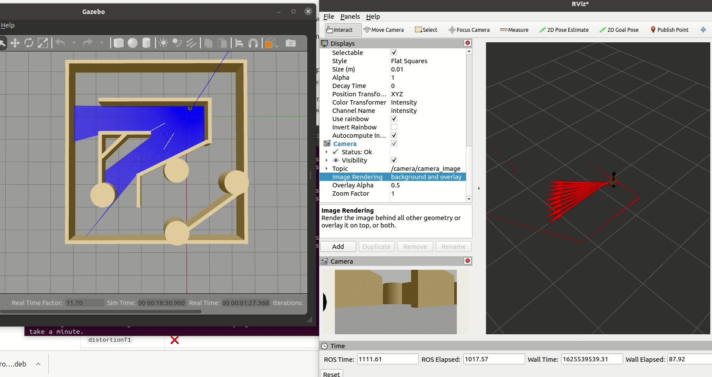

# 机器人运动控制简介

## 1. ros2_control

- ros2_control是一套软件包，它包含了控制器接口，控制器管理器，传输和硬件接口。它是机器人控制的中间件，是一套规范，不同的机器人平台只要按照这套规范实现，就可以保证与ROS程序兼容，通过这套规范，实现了一种可插拔的架构设计。
- ros2_control框架有以下软件包组成（https://github.com/ros-controls/ros2_control）
  - ros_control 框架的主要接口和组件
  - ros2_controllers 控制器，如前进指令控制器、关节轨迹控制器、差速控制器
  - control_toolbox 一些被控制器广泛使用的控制理论的实现
  - realtime_tools 用于实时性支持的通用工具包，如实时缓冲区和发布程序
  - control_msgs 通用的消息

## 2. Gazebo对ros2_control的实现

Gazebo是一个独立的应用程序，支持ros和ros2。Gazebo与任何一个版本的ROS都是通过一组名为gazebo_ros_pkgs的功能包集来实现交互的。这些功能包集建立起来Gazebo与ROS2的消息服务之间的桥梁。

- ros2中gazebo_ros_pkgs的组成

  - gazebo_dev 为支持ros发行版的Gazebo默认版提供cmake的配置，因此，下游的功能包可以之依赖gazebo_dev，而无需查找Gazebo。
  - gazebo_msgs 用于与ROS2交互的消息与服务数据结构
  - gazebo_ros 提供C++类和函数，可以被其他插件使用，如gazebo::Node，它还提供了一些常用的插件
  - gazebo_plugins 一系列的Gazebo插件，将传感器和其他的特性暴露给ROS2。如，gazebo_ros_camera发布ROS2图像，gazebo_ros_diff_drive提供了通过ROS2控制和检查差速驱动机器人的接口。

- gazebo_ros2_control 在ROS1中，该功能包名为gazebo_ros_control，并被作为gazebo_ros_pkgs元功能包的一个子包，而在ROS2中，它是独立的gazebo_ros2_control的功能包。

  gazebo_ros2_control是一个实现了ros2_control接口的控制管理器实例，该实例将连接到Gazebo模型上。

## 3. 机器人运动控制的实现流程

### 3.1 为joint添加控制器

机器人模型采用了博客《URDF集成到Gazebo》中实操模型

- 新建文件gazebo_demo_move.xacro，添加差速模型

  ```
  <robot name="my_car_move" xmlns:xacro="http://wiki.ros.org/xacro">
      <gazebo>
        <plugin name="mycar_diff_drive" filename="libgazebo_ros_diff_drive.so">
  
          <ros>
            <!-- <namespace>/demo</namespace> -->
          </ros>
  
          <update_rate>30</update_rate>
  
           <!-- wheels -->
           <left_joint>left_wheel2base_link</left_joint>
           <right_joint>right_wheel2base_link</right_joint>
  
           <!-- kinematics -->
           <wheel_separation>${base_link_radius * 2}</wheel_separation>
           <wheel_diameter>${wheel_radius * 2}</wheel_diameter>
  
           <!-- limits -->
           <max_wheel_torque>20</max_wheel_torque>
           <max_wheel_acceleration>1.0</max_wheel_acceleration>
  
          <command_topic>cmd_vel</command_topic>
  
          <!-- output -->
          <publish_odom>true</publish_odom>
          <publish_odom_tf>true</publish_odom_tf>
          <publish_wheel_tf>false</publish_wheel_tf>
  
          <odometry_topic>odom</odometry_topic>
          <odometry_frame>odom</odometry_frame>
          <robot_base_frame>base_footprint</robot_base_frame>
  
        </plugin>
  
        <plugin name="my_car_joint_state" filename="libgazebo_ros_joint_state_publisher.so">
          <ros>
            <!-- <namespace>/tb3</namespace> -->
            <remapping>~/out:=joint_states</remapping>
          </ros>
          <update_rate>30</update_rate>
          <joint_name>left_wheel2base_link</joint_name>
          <joint_name>right_wheel2base_link</joint_name>
          <joint_name>front_wheel2base_link</joint_name>
          <joint_name>back_wheel2base_link</joint_name>  
        </plugin>  
      </gazebo>
  </robot>
  ```

  从源码可以看出，需要添加控制器插件的标签，具体形式为<gazebo>

  ​		<plugin name="">

  ​		</plugin>

  </gazebo>

  - 添加gazebo_ros_control的插件

    - 差速插件 libgazebo_ros_diff_drive.so
    - 关节状态发布插件 libgazebo_ros_joint_state_publisher.so，主要是解决rivz中的坐标变换问题

    二者都需要在标签内指明所有需要控制的joint的名称

- 将上述xacro文件集成到机器人模型文件gazebo_demo_my_car.xacro中

```
<robot name="mycar" xmlns:xacro="http://www.ros.org/wiki/xacro">
    <xacro:include filename="gazebo_demo_inertia_head.xacro" />
    <xacro:include filename="gazebo_demo_car_base.xacro" />
    <xacro:include filename="gazebo_demo_camera.xacro" />
    <xacro:include filename="gazebo_demo_laser.xacro" />
    <xacro:include filename="gazebo_demo_move.xacro" />
</robot>
```

- 启动launch文件，运行结果如下



- 命令行输入指令

```
ros2 topic pub -r 10 /cmd_vel geometry_msgs/Twist '{linear: {x: 0.2, y: 0, z: 0}, angular: {x: 0, y: 0, z: 0.5}}'
```



### 3.2 添加雷达仿真

- 新建gazebo_demo_sensor.xacro文件，添加雷达插件

  ```
  <robot name="my_sensors" xmlns:xacro="http://wiki.ros.org/xacro">
    <gazebo reference="laser">
      <sensor type="ray" name="rplidar">
          <visualize>true</visualize>
          <ray>
          <scan>
              <horizontal>
              <samples>720</samples>
              <resolution>1</resolution>
              <min_angle>-3</min_angle>
              <max_angle>3</max_angle>
              </horizontal>
          </scan>
          <range>
              <min>0.10</min>
              <max>30.0</max>
              <resolution>0.01</resolution>
          </range>
          <!-- Using gazebo's noise instead of plugin's -->
          <noise>
              <type>gaussian</type>
              <mean>0.0</mean>
              <stddev>0.01</stddev>
          </noise>
          </ray>
          <!-- Using gazebo's update rate instead of plugin's -->
          <update_rate>30</update_rate>
  
          <plugin name="gazebo_ros_head_hokuyo_controller" filename="libgazebo_ros_ray_sensor.so">
          <!-- Change namespace and output topic so published topic is /rrbot/laser/scan -->
          <ros>
              <namespace>/laser</namespace>
              <remapping>~/out:=scan</remapping>
          </ros>
          <!-- Set output to sensor_msgs/LaserScan to get same output type as gazebo_ros_laser -->
          <output_type>sensor_msgs/LaserScan</output_type>
          <!-- <frame_name> ommited, will default to hokuo_link -->
          </plugin>
      </sensor>
    </gazebo>
  </robot>
  ```

  - gazebo reference 应当和机器人模型中的雷达名称相同
  - sensor type 可以是ray或gpu_ray，二者目前没区别
  - namespace 默认为root，可以不写
  - <remapping>~/out:=scan</remapping> topic名
  - output_type 可以是以下值：
    - sensor_msgs/PointCloud2 3D点云（默认值）
    - sensor_msgs/PointCloud 3D点云
    - sensor_msgs/LaserScan 2D扫描，使用中心垂直射线
    - sensor_msgs/Range 单个距离值，父传感器所有射线范围的最小值

- 将上述xacro文件包含到机器人模型文件中

  ```
  <robot name="mycar" xmlns:xacro="http://www.ros.org/wiki/xacro">
      <xacro:include filename="gazebo_demo_inertia_head.xacro" />
      <xacro:include filename="gazebo_demo_car_base.xacro" />
      <xacro:include filename="gazebo_demo_camera.xacro" />
      <xacro:include filename="gazebo_demo_laser.xacro" />
      <xacro:include filename="gazebo_demo_move.xacro" />
      <xacro:include filename="gazebo_demo_sensor.xacro" />
  </robot>
  ```

- 启动launch文件，显示如下

  

### 3.3 添加摄像头仿真

- 打开gazebo_demo_sensor.xacro文件，添加摄像头插件

  ```
  <robot name="my_sensors" xmlns:xacro="http://wiki.ros.org/xacro">
  	...
  	...
    <gazebo reference="camera">
      <!-- 类型设置为 camara -->
      <sensor type="camera" name="camera_node">
          <always_on>true</always_on>
          <visualize>true</visualize>
          <update_rate>30</update_rate>
          <camera name="intel_realsense_r200">
              <horizontal_fov>1.02974</horizontal_fov>
              <image>
                  <width>1920</width>
                  <height>1080</height>
                  <format>R8G8B8</format>
              </image>
              <clip>
                  <near>0.02</near>
                  <far>300</far>
              </clip>
              <noise>
                  <type>gaussian</type>
                  <!-- Noise is sampled independently per pixel on each frame.
                      That pixel's noise value is added to each of its color
                      channels, which at that point lie in the range [0,1]. -->
                  <mean>0.0</mean>
                  <stddev>0.007</stddev>
              </noise>
              <distortion>
                <k1>0.0</k1>
                <k2>0.0</k2>
                <k3>0.0</k3>
                <p1>0.0</p1>
                <p2>0.0</p2>
                <center>0.5 0.5</center>
              </distortion>          
          </camera>
          <plugin name="camera_driver" filename="libgazebo_ros_camera.so">
              <ros>
                  <namespace>camera</namespace>
                  <remapping>image_raw:=camera_image</remapping>
                  <remapping>camera_info:=camera_info</remapping>
              </ros>
              <camera_name>/camera</camera_name>
              <frame_name>camera</frame_name>
              <hack_baseline>0.07</hack_baseline>
          </plugin>
      </sensor>
    </gazebo>	
  </robot>	
  ```

- 无需修改机器人模型文件，直接启动launch文件

  

