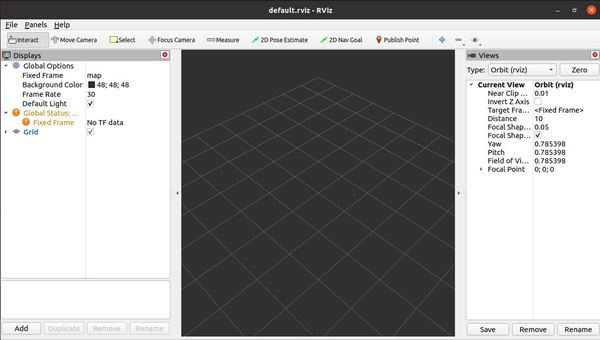

# 什么是rviz

- rviz是ROS visualization的缩写，是一种用于机器人、传感器和算法的3D可视化软件工具。他是您能够看到机器人对其所在世界的感知（真实的或者模拟的）

- rviz的目的是是您能够看到机器人的状态。它使用传感器的数据来尝试着描述其所在环境中发生的事情。

  

# 什么是Gazebo

- Gazebo是机器人仿真的3D软件。它的目的是模拟一个机器人，并且为这个机器人在真实世界物理环境中的行为提供一个非常接近的替代方案。比如它可以来计算力对机器人行为的影响。

- “**rviz** shows you what the robot *thinks* is happening, while **Gazebo** shows you what is *really* happening.”

