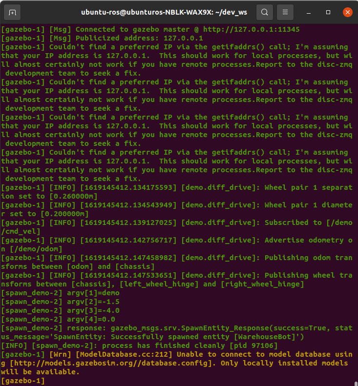

# 使用ROS2孵化world模型和机器人模型

## 创建spawner(孵化)功能包

- 打开一个新的terminal，新建workspace(以dev_ws为例)

  `mkdir -p ~/dev_ws/src`

  `cd ~/dev_ws/src`

- 创建名为cpp_warehouse_robot_spawner_pkg的功能包

  `ros2 pkg create --build-type ament_cmake cpp_warehouse_robot_spawner_pkg`

## package的初始设置

- 查看功能包目录中的内容

  `cd ~/dev_ws/src/cpp_warehouse_robot_spawner_pkg`

  `dir`

  

- 编辑package.xml文件，写入以下内容

  ```
  <?xml version="1.0"?>
  <?xml-model href="http://download.ros.org/schema/package_format3.xsd" schematypens="http://www.w3.org/2001/XMLSchema"?>
  <package format="3">
    <name>cpp_warehouse_robot_spawner_pkg</name>
    <version>0.0.0</version>
    <description>how to spawn a mobile robot in warehouse</description>
    <maintainer email="figoowen2003@126.com">ubuntu-ros</maintainer>
    <license>Apache License 2.0</license>
  
    <buildtool_depend>ament_cmake</buildtool_depend>
  
    <test_depend>ament_lint_auto</test_depend>
    <test_depend>ament_lint_common</test_depend>
  
    <export>
      <build_type>ament_cmake</build_type>
    </export>
  </package>
  ```

- 编辑CmakeLists.txt文件，写入以下内容

  ```
  cmake_minimum_required(VERSION 3.5)
  project(cpp_warehouse_robot_spawner_pkg)
  
  # Default to C99
  if(NOT CMAKE_C_STANDARD)
    set(CMAKE_C_STANDARD 99)
  endif()
  
  # Default to C++17
  if(NOT CMAKE_CXX_STANDARD)
    set(CMAKE_CXX_STANDARD 17)
  endif()
  
  if(CMAKE_COMPILER_IS_GNUCXX OR CMAKE_CXX_COMPILER_ID MATCHES "Clang")
    add_compile_options(-Wall -Wextra -Wpedantic)
  endif()
  
  # find dependencies
  find_package(ament_cmake REQUIRED)
  # uncomment the following section in order to fill in
  # further dependencies manually.
  # find_package(<dependency> REQUIRED)
  find_package(rclcpp REQUIRED)
  find_package(gazebo_msgs REQUIRED)
  find_package(ament_index_cpp REQUIRED)
  
  add_executable(client src/spawner_demo.cpp)
  ament_target_dependencies(client rclcpp gazebo_msgs ament_index_cpp)
  
  install(TARGETS client DESTINATION lib/${PROJECT_NAME})
  
  if(BUILD_TESTING)
    find_package(ament_lint_auto REQUIRED)
    # the following line skips the linter which checks for copyrights
    # uncomment the line when a copyright and license is not present in all source files
    #set(ament_cmake_copyright_FOUND TRUE)
    # the following line skips cpplint (only works in a git repo)
    # uncomment the line when this package is not in a git repo
    #set(ament_cmake_cpplint_FOUND TRUE)
    ament_lint_auto_find_test_dependencies()
  endif()
  
  # Install launch files.
  install(DIRECTORY
  launch
  models
  worlds
  DESTINATION share/${PROJECT_NAME}/
  )
  
  ament_package()
  ```

- 从~/.gazebo/models/路径下拷贝机器人模型和仓库模型

  `cd ~/.gazebo/models`

  `cp -r mobile_warehouse_robot ~/dev_ws/src/cpp_warehouse_robot_spawner_pkg/models`

  `cp -r small_warehouse ~/dev_ws/src/cpp_warehouse_robot_spawner_pkg/models`

  同时拷贝下载的meshes文件

  `cp -r hokuyo ~/dev_ws/src/cpp_warehouse_robot_spawner_pkg/models`

  `cp -r warehouse_robot ~/dev_ws/src/cpp_warehouse_robot_spawner_pkg/models`

  检查以下所有的model都拷贝成功

  `cd ~/dev_ws/src/cpp_warehouse_robot_spawner_pkg/models`

  `dir`

  

- 创建后缀名为world的sdf文件

  `mkdir ~/dev_ws/src/cpp_warehouse_robot_spawner_pkg/worlds`

  `cd ~/dev_ws/src/cpp_warehouse_robot_spawner_pkg/worlds`

  `gedit warehouse.world`
  写入以下内容

  ```
  <sdf version='1.4'>
    <world name='default'>
      <light name='sun' type='directional'>
        <cast_shadows>1</cast_shadows>
        <pose>0 0 10 0 -0 0</pose>
        <diffuse>0.8 0.8 0.8 1</diffuse>
        <specular>0.2 0.2 0.2 1</specular>
        <attenuation>
          <range>1000</range>
          <constant>0.9</constant>
          <linear>0.01</linear>
          <quadratic>0.001</quadratic>
        </attenuation>
        <direction>0.5 0.1 -0.9</direction>
      </light>
          <model name='ground_plane'>
        <static>1</static>
        <link name='link'>
          <collision name='collision'>
            <geometry>
              <plane>
                <normal>0 0 1</normal>
                <size>100 100</size>
              </plane>
            </geometry>
            <surface>
              <friction>
                <ode>
                  <mu>100</mu>
                  <mu2>50</mu2>
                </ode>
              </friction>
              <bounce/>
              <contact>
                <ode/>
              </contact>
            </surface>
            <max_contacts>10</max_contacts>
          </collision>
          <visual name='visual'>
            <cast_shadows>0</cast_shadows>
            <geometry>
              <plane>
                <normal>0 0 1</normal>
                <size>100 100</size>
              </plane>
            </geometry>
            <material>
              <script>
                <uri>file://media/materials/scripts/gazebo.material</uri>
                <name>Gazebo/Grey</name>
              </script>
            </material>
          </visual>
          <velocity_decay>
            <linear>0</linear>
            <angular>0</angular>
          </velocity_decay>
          <self_collide>0</self_collide>
          <kinematic>0</kinematic>
          <gravity>1</gravity>
        </link>
      </model>
      <scene>
        <ambient>0.4 0.4 0.4 1</ambient>
        <background>0.7 0.7 0.7 1</background>
        <shadows>0</shadows>
      </scene>
      <physics type='ode'>
        <max_step_size>0.01</max_step_size>
        <real_time_factor>1</real_time_factor>
        <real_time_update_rate>0</real_time_update_rate>
        <gravity>0 0 -9.8</gravity>
      </physics>
      <state world_name='default'>
        <sim_time>0 0</sim_time>
        <real_time>0 44986</real_time>
        <wall_time>1377677575 940727583</wall_time>
      </state>
      <gui fullscreen='0'>
        <camera name='user_camera'>
          <pose>2.6 -1.69 12.2 0 1.56 3.14</pose>
          <view_controller>orbit</view_controller>
        </camera>
      </gui>
      <!-- A simple warehouse -->
      <include>
        <uri>model://small_warehouse</uri>
        <pose>2.4 -2.1 0 0 0 0</pose>
      </include>
      
      <!-- mobile_warehouse_robot 
        <include>
          <pose>0 0 0.33 0 0 0</pose>
          <uri>model://mobile_warehouse_robot</uri>
        </include>   -->
    </world>
  </sdf>
  ```

## 创建一个世界孵化器(spawner)的节点（Node）

`cd ~/dev_ws/src/cpp_warehouse_robot_spawner_pkg/src/`

新建名为spawn_demo.cpp的文件

`gedit spawn_demo.cpp`

写入以下内容

```
#include <rclcpp/rclcpp.hpp>
// #include <rclcpp/executors.hpp>
#include <gazebo_msgs/srv/spawn_entity.hpp>
#include <ament_index_cpp/get_package_share_directory.hpp>

#include <filesystem>
#include <fstream>
#include <iostream>
#include <sstream>
#include <stdlib.h>
#include <string>
#include <vector>

using namespace std;
namespace fs = std::filesystem;

int main(int argc, char *argv[]) {
    // Start node, forward command line arguments to ROS
    rclcpp::init(argc, argv);

    // Create spawn node
    // rclcpp::Node node = rclcpp::Node("entity_spawner");
    auto node = rclcpp::Node::make_shared("entity_spawner");

    // Show progress in the terminal window
    RCLCPP_INFO(node->get_logger(), "Creating Service client to connect to '/spawn_entity'");
    // Create SpawnEntity
    // rclcpp::Client<gazebo_msgs::srv::SpawnEntity>::SharedPtr client = node->create_client<gazebo_msgs::srv::SpawnEntity>("/spawn_entity");
    auto client = node->create_client<gazebo_msgs::srv::SpawnEntity>("/spawn_entity");

    // Get the spawn_entity service
    RCLCPP_INFO(node->get_logger(), "Connecting to '/spawn_entity' service...");
    while (!client->wait_for_service(1s)) {
        if (!rclcpp::ok()) {
            RCLCPP_INFO(node->get_logger(), "spawn client was interrupted while \
                waiting for the service. Exiting.");
            return 0;
        }
        RCLCPP_INFO(node->get_logger(), "Service not available, waiting again...");
    }

    // Get the file path for the robot model
    // may throw PackageNotFoundError exception
    string package_share_directory = ament_index_cpp::get_package_share_directory("warehouse_robot_spawner_pkg");
    fs::path dir(package_share_directory);
    fs::path sdfFilePath = dir / fs::path("models") / fs::path("mobile_warehouse_robot") 
        / fs::path("model.sdf");
    cout << "robt_sdf = " << sdfFilePath << endl;
    // Get the content of robot sdf file
    ifstream sdfFile(sdfFilePath);
    string line;
    stringstream buffer;
    if (sdfFile.is_open()) {       
        buffer << sdfFile.rdbuf();
        // cout << "buffer = " << buffer.str() << endl;          
        sdfFile.close();
    } else {
        cout << "======== open sdf failed ========" << endl;
    }  

    // Set data for request, argvs come from gazebo_world.launch.py
    auto request = std::make_shared<gazebo_msgs::srv::SpawnEntity::Request>();
    request->name = argv[1];
    cout << argv[1] << endl;
    request->xml = string(buffer.str());
    request->robot_namespace = string(argv[2]); // different from python 
    cout << "argc = " << argc << endl;
    cout << "argv[0] = " << argv[0] << endl;
    cout << "argv[1] = " << argv[1] << endl;
    cout << "argv[2] = " << argv[2] << endl;
    cout << "argv[3] = " << argv[3] << endl;
    cout << "argv[4] = " << argv[4] << endl;
    cout << "argv[5] = " << argv[5] << endl;
    cout << "argv[6] = " << argv[6] << endl;
    request->initial_pose.position.x = atof(argv[3]);
    request->initial_pose.position.y = atof(argv[4]);
    request->initial_pose.position.z = atof(argv[5]) ;

    RCLCPP_INFO(node->get_logger(), "Sending service request to '/spawn_entity'");
    auto result = client->async_send_request(request);
    // Wait for the result.
    if (rclcpp::spin_until_future_complete(node, result) ==
        rclcpp::FutureReturnCode::SUCCESS)
    {
        cout << "response: OK" << endl;
    } else {
        RCLCPP_ERROR(node->get_logger(), "service call failed :(");
        return -1;
    }

    // auto future_result = client->async_send_request(request);

    // // Wait for the result.
    // if (rclcpp::spin_until_future_complete(node, future_result) ==
    //     rclcpp::executor::FutureReturnCode::SUCCESS)
    // {
    //     printf("Result of add_two_ints: %zd\n", future_result.get()->sum);
    // } else {
    //     printf("add_two_ints_client_async was interrupted. Exiting.\n");
    // }    

    RCLCPP_INFO(node->get_logger(), "Done! Shutting down node.");
    rclcpp::shutdown();
    return 0;                 
}

```

## 创建launch文件

`mkdir ~/dev_ws/src/cpp_warehouse_robot_spawner_pkg/launch/`

`cd ~/dev_ws/src/cpp_warehouse_robot_spawner_pkg/launch/`

新建名为gazebo_world.launch.py的文件，写入以下内容

```
# Copyright 2019 Open Source Robotics Foundation, Inc.
#
# Licensed under the Apache License, Version 2.0 (the "License");
# you may not use this file except in compliance with the License.
# You may obtain a copy of the License at
#
#     http://www.apache.org/licenses/LICENSE-2.0
#
# Unless required by applicable law or agreed to in writing, software
# distributed under the License is distributed on an "AS IS" BASIS,
# WITHOUT WARRANTIES OR CONDITIONS OF ANY KIND, either express or implied.
# See the License for the specific language governing permissions and
# limitations under the License.

"""
Demo for spawn_entity.
Launches Gazebo and spawns a model
"""
# A bunch of software packages that are needed to launch ROS2
import os
from launch import LaunchDescription
from launch.actions import IncludeLaunchDescription
from launch.launch_description_sources import PythonLaunchDescriptionSource
from launch.substitutions import ThisLaunchFileDir,LaunchConfiguration
from launch_ros.actions import Node
from launch.actions import ExecuteProcess
from ament_index_python.packages import get_package_share_directory

def generate_launch_description():
    use_sim_time = LaunchConfiguration('use_sim_time', default='True')
    world_file_name = 'warehouse.world'
    pkg_dir = get_package_share_directory('cpp_warehouse_robot_spawner_pkg')

    os.environ["GAZEBO_MODEL_PATH"] = os.path.join(pkg_dir, 'models')

    world = os.path.join(pkg_dir, 'worlds', world_file_name)
    launch_file_dir = os.path.join(pkg_dir, 'launch')

    gazebo = ExecuteProcess(
            cmd=['gazebo', '--verbose', world, '-s', 'libgazebo_ros_init.so', 
            '-s', 'libgazebo_ros_factory.so'],
            output='screen')

    #GAZEBO_MODEL_PATH has to be correctly set for Gazebo to be able to find the model
    #spawn_entity = Node(package='gazebo_ros', node_executable='spawn_entity.py',
    #                    arguments=['-entity', 'demo', 'x', 'y', 'z'],
    #                    output='screen')
    spawn_entity = Node(package='cpp_warehouse_robot_spawner_pkg', executable='client',
                        arguments=['WarehouseBot', 'demo', '-1.5', '-4.0', '0.0'],
                        output='screen')

    return LaunchDescription([
        gazebo,
        spawn_entity,
    ])
```

## 编译功能包

`cd ~/dev_ws/`

安装setuptools

`sudo pip3 install setuptools`

编译

`colcon build --packages-select cpp_warehouse_robot_spawner_pkg`

## 启动

`cd ~/dev_ws`

`ros2 launch cpp_warehouse_robot_spawner_pkg gazebo_world.launch.py`




查看当前的topic

`ros2 topic list -t`


# 使用ROS2创建机器人控制器

## 创建运动和控制的功能包

`cd ~/dev_ws/src`

`ros2 pkg create --build-type ament_cmake cpp_warehouse_robot_controller_pkg`

## 功能包的基本配置

`cd ~/dev_ws/src/cpp_warehouse_robot_controller_pkg`

`gedit package.xml`

写入以下内容

```
<?xml version="1.0"?>
<?xml-model href="http://download.ros.org/schema/package_format3.xsd" schematypens="http://www.w3.org/2001/XMLSchema"?>
<package format="3">
  <name>cpp_warehouse_robot_controller_pkg</name>
  <version>0.0.0</version>
  <description>a Warehouse robot controller</description>
  <maintainer email="figoowen2003@126.com">ubuntu-ros</maintainer>
  <license>Apache License 2.0</license>

  <buildtool_depend>ament_cmake</buildtool_depend>

  <build_depend>geometry_msgs</build_depend>
  <build_depend>rclcpp</build_depend>
  <build_depend>nav_msgs</build_depend>
  <build_depend>std_msgs</build_depend>
  <build_depend>sensor_msgs</build_depend>

  <exec_depend>geometry_msgs</exec_depend>
  <exec_depend>rclcpp</exec_depend>
  <exec_depend>nav_msgs</exec_depend>
  <exec_depend>std_msgs</exec_depend>
  <exec_depend>sensor_msgs</exec_depend> 

  <test_depend>ament_lint_auto</test_depend>
  <test_depend>ament_lint_common</test_depend>

  <export>
    <build_type>ament_cmake</build_type>
  </export>
</package>
```

`gedit CmakeLists.txt`

写入以下内容

```
cmake_minimum_required(VERSION 3.5)
project(cpp_warehouse_robot_controller_pkg)

# Default to C99
if(NOT CMAKE_C_STANDARD)
  set(CMAKE_C_STANDARD 99)
endif()

# Default to C++14
if(NOT CMAKE_CXX_STANDARD)
  set(CMAKE_CXX_STANDARD 14)
endif()

if(CMAKE_COMPILER_IS_GNUCXX OR CMAKE_CXX_COMPILER_ID MATCHES "Clang")
  add_compile_options(-Wall -Wextra -Wpedantic)
endif()

# find dependencies
find_package(ament_cmake REQUIRED)
# uncomment the following section in order to fill in
# further dependencies manually.
# find_package(<dependency> REQUIRED)
find_package(geometry_msgs REQUIRED)
find_package(rclcpp REQUIRED)
find_package(nav_msgs REQUIRED)
find_package(std_msgs REQUIRED)
find_package(sensor_msgs)

set(target "robot_estimator")

add_executable(${target} src/${target}.cpp)
ament_target_dependencies(${target}
  "rclcpp"
  "geometry_msgs"
  "nav_msgs"
  "std_msgs")

add_executable(robot_controller src/robot_controller.cpp)
ament_target_dependencies(robot_controller
  "rclcpp"
  "geometry_msgs"
  "sensor_msgs"
  "std_msgs")

if(BUILD_TESTING)
  find_package(ament_lint_auto REQUIRED)
  # the following line skips the linter which checks for copyrights
  # uncomment the line when a copyright and license is not present in all source files
  #set(ament_cmake_copyright_FOUND TRUE)
  # the following line skips cpplint (only works in a git repo)
  # uncomment the line when this package is not in a git repo
  #set(ament_cmake_cpplint_FOUND TRUE)
  ament_lint_auto_find_test_dependencies()
endif()

install(TARGETS ${target} robot_controller
  DESTINATION lib/${PROJECT_NAME})

# Install launch files.
install(DIRECTORY
launch
DESTINATION share/${PROJECT_NAME}/
)

ament_package()
```

## 创建名为Estimator的节点（node）

`cd ~/dev_ws/src/cpp_warehouse_robot_controller_pkg/src/`

`gedit robot_estimator.cpp`

写入以下内容

```
#include <geometry_msgs/msg/twist.hpp>
#include <geometry_msgs/msg/pose.hpp>
#include <rclcpp/rclcpp.hpp>
#include <std_msgs/msg/string.hpp>
#include <std_msgs/msg/float64_multi_array.hpp>
#include <nav_msgs/msg/odometry.hpp>

#include<bits/stdc++.h>
#include<tuple>

using namespace std;
using std::placeholders::_1;

class RobotEstimator: public rclcpp::Node
{
public:
    RobotEstimator() : Node("Estimator") {
        auto default_qos = rclcpp::QoS(rclcpp::SystemDefaultsQoS());
        // Subscribe to messages of type nav_msgs/Odometry(positon and orientation of robot)
        odom_sub_ = this->create_subscription<nav_msgs::msg::Odometry>(
            "/demo/odom", default_qos,
            std::bind(&RobotEstimator::OnOdomMsg, this, _1));

        // This node subscribes to messages of tpye geometry_msgs/Twist.msg
        // We are listening to the velocity commands here
        // The maximum number of queued messages is 10
        velocity_sub_ = this->create_subscription<geometry_msgs::msg::Twist>(
        "demo/cmd_vel", default_qos,
        std::bind(&RobotEstimator::OnVelocityMsg, this, _1));           

        // This node Pulbishes the estimated position (x, y, yaw),
        // the type of messages is std_msg/Float64MultiArray
        est_state_pub_ = this->create_publisher<std_msgs::msg::Float64MultiArray>("/demo/state_est", default_qos);

    }

private:
    void OnOdomMsg(const nav_msgs::msg::Odometry::SharedPtr msg) {
        tuple<float, float, float> result = GetEulerFromQuaternion(msg->pose.pose.orientation);
        float roll = get<0>(result);
        float pitch = get<1>(result);
        float yaw = get<2>(result);

        PublishEstimatedState(make_tuple(roll, pitch, yaw));
    }

    void PublishEstimatedState(const tuple<float, float, float> state) {
        std_msgs::msg::Float64MultiArray msg;
        msg.data.push_back(get<0>(state));
        msg.data.push_back(get<1>(state));
        msg.data.push_back(get<2>(state));

        est_state_pub_->publish(msg);      
    }

    tuple<float, float, float> GetEulerFromQuaternion(const geometry_msgs::msg::Quaternion &orientation) {
        double t0 = +2.0 * (orientation.w * orientation.x + orientation.y * orientation.z);
        double t1 = +1.0 - 2.0 * (orientation.x * orientation.x + orientation.y * orientation.y);
        double roll_x = atan2(t0, t1);
    
        double t2 = +2.0 * (orientation.w * orientation.y - orientation.z * orientation.x);
        t2 = (t2 > 1.0) ? 1.0 : t2;
        t2 = (t2 < -1.0) ? -1.0 : t2;
        double pitch_y = asin(t2);
    
        double t3 = +2.0 * (orientation.w * orientation.z + orientation.x * orientation.y);
        double t4 = +1.0 - 2.0 * (orientation.y * orientation.y + orientation.z * orientation.z);
        double yaw_z = atan2(t3, t4);
    
        return make_tuple(roll_x, pitch_y, yaw_z); // in radians       
    }

    void OnVelocityMsg(const geometry_msgs::msg::Twist::SharedPtr msg) {
        /*
            Listen to the velocity commands (linear forward velocity 
            in the x direction in the robot's reference frame and 
            angular velocity (yaw rate) around the robot's z-axis.
            [v,yaw_rate]
            [meters/second, radians/second]            
        */
        // Forward velocity in the robot's reference frame
        auto v = msg->linear.x;
    
        // Angular velocity around the robot's z axis
        auto yaw_rate = msg->angular.z;       
    }

    // void OnSensorMsg(const sensor_msgs::msg::LaserScan::SharedPtr _msg)
    // {
    //     // Find closest hit
    //     float min_range = _msg->range_max + 1;
    //     int idx = -1;
    //     for (auto i = 0u; i < _msg->ranges.size(); ++i) {
    //     auto range = _msg->ranges[i];
    //     if (range > _msg->range_min && range < _msg->range_max && range < min_range) {
    //         min_range = range;
    //         idx = i;
    //     }
    //     }

    //     // Calculate desired yaw change
    //     double turn = _msg->angle_min + _msg->angle_increment * idx;

    //     // Populate command message, all weights have been calculated by trial and error
    //     auto cmd_msg = std::make_unique<geometry_msgs::msg::Twist>();

    //     // Bad readings, stop
    //     if (idx < 0) {
    //     cmd_msg->linear.x = 0;
    //     cmd_msg->angular.z = 0;
    //     } else if (min_range <= min_dist_) {
    //     // Too close, just rotate
    //     cmd_msg->linear.x = 0;
    //     cmd_msg->angular.z = turn * angular_k_;
    //     } else {
    //     cmd_msg->linear.x = linear_k_ / abs(turn);
    //     cmd_msg->angular.z = turn * angular_k_;
    //     }

    //     cmd_pub_->publish(std::move(cmd_msg));
    // }    

    // odom messages subscriber
    rclcpp::Subscription<nav_msgs::msg::Odometry>::SharedPtr odom_sub_;
    // twist messages subscriber
    rclcpp::Subscription<geometry_msgs::msg::Twist>::SharedPtr velocity_sub_;

    // estimate state publisher
    rclcpp::Publisher<std_msgs::msg::Float64MultiArray>::SharedPtr est_state_pub_;   
};

int main(int argc, char * argv[])
{
  // Forward command line arguments to ROS
  rclcpp::init(argc, argv);

  // Create a node
  auto node = std::make_shared<RobotEstimator>();

  // Run node until it's exited
  rclcpp::spin(node);

  // Clean up
  rclcpp::shutdown();
  return 0;
}
```

## 创建名为Controller的节点

`gedit robot_controller.cpp`

写入以下内容

```
#include <geometry_msgs/msg/twist.hpp>
#include <geometry_msgs/msg/pose.hpp>
#include <rclcpp/rclcpp.hpp>
#include <sensor_msgs/msg/laser_scan.hpp>
#include <std_msgs/msg/string.hpp>
#include <std_msgs/msg/float64_multi_array.hpp>

#include<bits/stdc++.h>
#include<string>
#include<vector>

using namespace std;
using namespace std::placeholders;

class RobotController : public rclcpp::Node {
public:
    RobotController() : Node("Controller") {
        auto default_qos = rclcpp::QoS(rclcpp::SystemDefaultsQoS());
        // This node subscribes to messages of type Float64MultiArray
        // over a topic named: /demo/state_est
        // The message represents the current estimated state:
        //      [x, y, yaw]
        est_state_sub_ = this->create_subscription<std_msgs::msg::Float64MultiArray>(
            "/demo/state_est", default_qos,
            std::bind(&RobotController::OnStateEstimatedMsg, this, _1));

        // Subscribe to sensor messages
        laser_sub_ = this->create_subscription<sensor_msgs::msg::LaserScan>(
            "laser_scan", default_qos,
            std::bind(&RobotController::OnSensorMsg, this, _1));

        // This node publishes the desired linear and angular velocity of the 
        // robot(in the robot chassis coordinate frame) to the /demo/cmd_vel topic
        // Using the diff_drive plugin enables the robot model to read this
        // /demo/cmd_vel topic and excute the motion accordingly
        cmd_pub_ = this->create_publisher<geometry_msgs::msg::Twist>(
            "/demo/cmd_vel", default_qos);        
    }
private:
    void OnStateEstimatedMsg(const std_msgs::msg::Float64MultiArray::SharedPtr msg) {
        // Extract the position and orientation data
        // This callback is called each time a new messaege is received on 
        // "/demo/state_est" topic
        vector<double> currState(msg->data.begin(), msg->data.end());
        currentX_ = msg->data[0];
        currentY_ = msg->data[1];
        currentYaw_ = msg->data[2];
    
        // Command the robot to keep following the wall      
        FollowWall();
    }

    void OnSensorMsg(const sensor_msgs::msg::LaserScan::SharedPtr msg) {
        // This method gets called every time a LaserScan message is received on
        // the "/demo/laser/out" topic
        // Read the laser scan data that indicates distances
        // to obstacles in meters and extract 5 distinct laser readings to work with.
        // Each reading is separated by 45 degrees.
        // Assumes 181 laser readings, separated by 1 degree.
        // (e.g. -90 to 90 degrees.....0 to 180 degrees)

        // number of laser beams = str(len(msg.ranges))
        left_dist = msg->ranges[180];
        leftfront_dist = msg->ranges[135];
        front_dist = msg->ranges[90];
        rightfront_dist = msg->ranges[45];
        right_dist = msg->ranges[0];
    }

    void FollowWall() { 
    // This method causes the robot to follow the boundary of a wall.
    // Create a geometry_msgs/Twist message
    auto cmdMsg = std::make_unique<geometry_msgs::msg::Twist>();

    cmdMsg->linear.x = 0.0;
    cmdMsg->linear.y = 0.0;
    cmdMsg->linear.z = 0.0;
    cmdMsg->angular.x = 0.0;
    cmdMsg->angular.y = 0.0;
    cmdMsg->angular.z = 0.0;       
 
    // Logic for following the wall
    // >d means no wall detected by that laser beam
    // <d means an wall was detected by that laser beam
    double d = dist_thresh_wf;
    
    if (leftfront_dist > d && front_dist > d && rightfront_dist > d) {
        wall_following_state = "search for wall";
        cmdMsg->linear.x = forward_speed;
        cmdMsg->angular.z = (-1) * turning_speed_wf_slow;  //turn right to wall
    } else if (leftfront_dist > d && front_dist < d && rightfront_dist > d) {
        wall_following_state = "turn left";
        cmdMsg->angular.z = turning_speed_wf_fast;
    } else if (leftfront_dist > d && front_dist > d && rightfront_dist < d) {
        if (rightfront_dist < dist_too_close_to_wall) {
            // Getting too close to the wall
            wall_following_state = "turn left";
            cmdMsg->linear.x = forward_speed;
            cmdMsg->angular.z = turning_speed_wf_fast;
        } else {
            // Go straight ahead
            wall_following_state = "follow wall";
            cmdMsg->linear.x = forward_speed;
        }        
    } else if (leftfront_dist < d && front_dist > d && rightfront_dist > d) {
        wall_following_state = "search for wall";
        cmdMsg->linear.x = forward_speed;
        cmdMsg->angular.z = (-1) * turning_speed_wf_slow; // turn right to find wall
    } else if (leftfront_dist > d && front_dist < d && rightfront_dist < d) {
        wall_following_state = "turn left";
        cmdMsg->angular.z = turning_speed_wf_fast;
    } else if (leftfront_dist < d && front_dist < d && rightfront_dist > d) {
        wall_following_state = "turn left";
        cmdMsg->angular.z = turning_speed_wf_fast;
    } else if (leftfront_dist < d && front_dist < d && rightfront_dist < d) {
        wall_following_state = "turn left";
        cmdMsg->angular.z = turning_speed_wf_fast;
    } else if (leftfront_dist < d && front_dist > d && rightfront_dist < d) {
        wall_following_state = "search for wall";
        cmdMsg->linear.x = forward_speed;
        cmdMsg->angular.z = (-1) * turning_speed_wf_slow; // turn right to find wall
    } else {
        // do nothing
    }  
 
    // Send velocity command to the robot
    cmd_pub_->publish(std::move(cmdMsg));    
    }

    rclcpp::Subscription<std_msgs::msg::Float64MultiArray>::SharedPtr est_state_sub_;
    rclcpp::Subscription<sensor_msgs::msg::LaserScan>::SharedPtr laser_sub_;
    rclcpp::Publisher<geometry_msgs::msg::Twist>::SharedPtr cmd_pub_;

    // Initialize the LaserScan sensor readings to some large value
    // Values are in meters.
    double left_dist = 999999.9; // Left
    double leftfront_dist = 999999.9; // Left-front
    double front_dist = 999999.9; // Front
    double rightfront_dist = 999999.9; // Right-front
    double right_dist = 999999.9; // Right
 
    /* ################### ROBOT CONTROL PARAMETERS ################## */
    // Maximum forward speed of the robot in meters per second
    // Any faster than this and the robot risks falling over.
    double forward_speed = 0.025;    

    // Current position and orientation of the robot in the global reference frame
    double currentX_{0.0};
    double currentY_{0.0};
    double currentYaw_{0.0};

    /* ############# WALL FOLLOWING PARAMETERS ####################### */     
    // Finite states for the wall following mode
    //  "turn left": Robot turns towards the left
    //  "search for wall": Robot tries to locate the wall        
    //  "follow wall": Robot moves parallel to the wall
    string wall_following_state = "turn left";
         
    // Set turning speeds (to the left) in rad/s 
    // These values were determined by trial and error.
    double turning_speed_wf_fast = 3.0;  // Fast turn
    double turning_speed_wf_slow = 0.05; // Slow turn
 
    // Wall following distance threshold.
    // We want to try to keep within this distance from the wall.
    double dist_thresh_wf = 0.50; // in meters  

    // We don't want to get too close to the wall though.
    double dist_too_close_to_wall = 0.19; // in meters    
};

int main(int argc, char * argv[])
{
  // Forward command line arguments to ROS
  rclcpp::init(argc, argv);

  // Create a node
  auto node = std::make_shared<RobotController>();

  // Run node until it's exited
  rclcpp::spin(node);

  // Clean up
  rclcpp::shutdown();
  return 0;
}
```

## 创建launch文件

`mkdir ~/dev_ws/src/cpp_warehouse_robot_controller_pkg/launch/`

`cd ~/dev_ws/src/cpp_warehouse_robot_controller_pkg/launch/`

新建名为controller_estimator.launch.py的文件

`gedit robot_ctr_est.launch.py`

写入以下内容

```
import os
from launch import LaunchDescription
from launch_ros.actions import Node
 
 
def generate_launch_description():
 
  return LaunchDescription([
    Node(package='cpp_warehouse_robot_controller_pkg', executable='robot_controller',
      output='screen'),
    Node(package='cpp_warehouse_robot_controller_pkg', executable='robot_estimator',
      output='screen'),
  ])
```

## 编译功能包

`cd ~/dev_ws/`

`colcon build --packages-select cpp_warehouse_robot_controller_pkg`

## 运行

新开一个terminal，依次输入以下命令，启动world孵化器

`cd ~/dev_ws/`

`ros2 launch cpp_warehouse_robot_spawner_pkg gazebo_world.launch.py`

再打开一个terminal，启动控制器

`cd ~/dev_ws/`

`ros2 launch cpp_warehouse_robot_controller_pkg robot_ctr_est.launch.py`

实际运行效果如下


查看topic

`ros2 topic list -t`


# 手动控制机器人（Python版）

- 安装turtlebot3功能包（目前是foxy版）

  `sudo apt install ros-foxy-turtlebot3*`

  详细信息，参考链接https://navigation.ros.org/getting_started/index.html

- 新开一个terminal，启动spawner

  `ros2 launch warehouse_robot_spawner_pkg gazebo_world.launch.py`

- 再开一个terminal，输入remap操作，将键盘命令从发往/cmd_vel变更为发往/demo/cmd_vel

  `export TURTLEBOT3_MODEL=burger`

  `ros2 run turtlebot3_teleop teleop_keyboard --ros-args --remap /cmd_vel:=/demo/cmd_vel`

