# 准备工作

1. 下载docker-ubuntu-vnc-desktop

   - 该docker镜像装载了一个裁剪得非常多的Ubuntu 20.04，同时配置了vnc的server，因此支持通过浏览器或者vnc viewer工具访问系统的可视化界面

   - 该docker镜像的源码地址和使用方法参考https://github.com/fcwu/docker-ubuntu-vnc-desktop#vnc-viewer，具体步骤如下：

     新开一个terminal窗口，输入

     `sudo docker run -p 6080:80 -v /dev/shm:/dev/shm dorowu/ubuntu-desktop-lxde-vnc`

     如果本地系统中已经存在该镜像，那么会直接运行该镜像；如果本地不存在该镜像，那么会先执行下载，待下载完成之后，启动该镜像

     也可以直接输入以下命令，拉取该镜像，然后执行上一条命令

     `sudo docker pull dorowu/ubuntu-desktop-lxde-vnc `

   - 在浏览器输入http://127.0.0.1:6080

     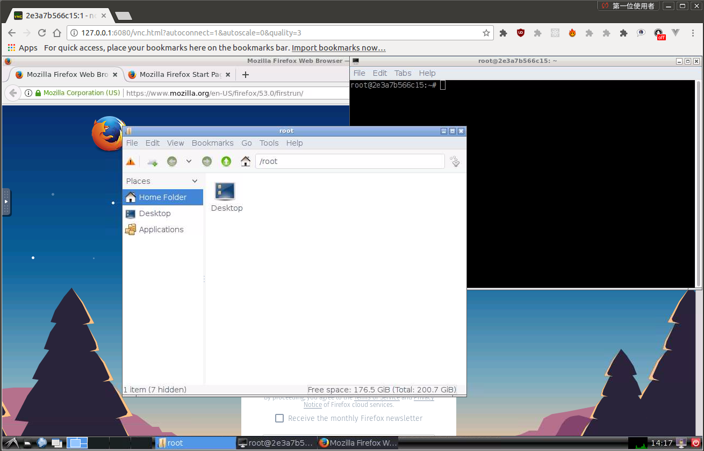

   - 更多操作

     - 指定启动的可视化界面的分辨率

       `sudo docker run -p 6080:80 -e RESOLUTION=1920x1080 -v /dev/shm:/dev/shm dorowu/ubuntu-desktop-lxde-vnc`

     - 默认的desktop用户（默认是root），如果需要指定其他用户和密码

       ```
       sudo docker run -p 6080:80 -e USER=doro -e PASSWORD=password -v /dev/shm:/dev/shm dorowu/ubuntu-desktop-lxde-vnc
       ```

     - 停止容器的运行

       `sodo docker ps -l` 查看当前运行的docker

       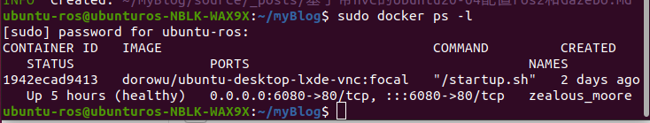

       `sudo docker stop 1942ecad9413`

       再次查看容器列表

       

     - 重新启动已经exit的容器

       `sudo docker restart 1942ecad9413`

2. 该容器中的基本工具

   - 命令行窗口LXTerminal

     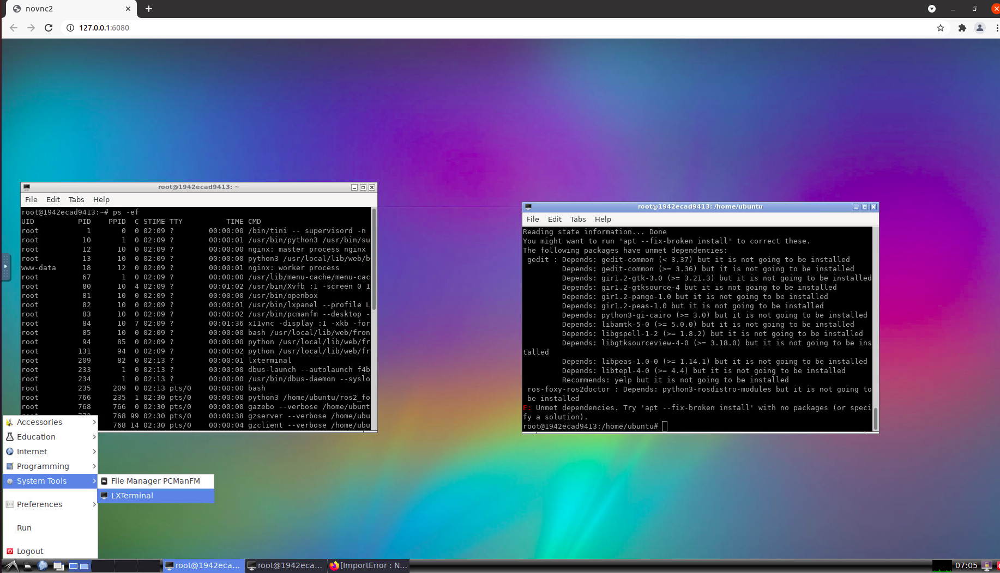

   - 浏览器

     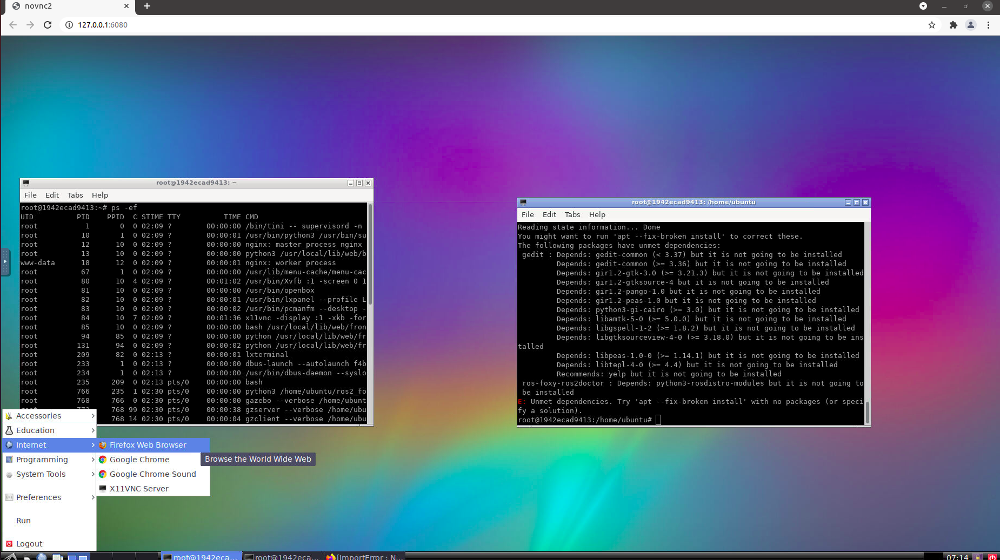

     

# 安装ROS2

## 安装foxy版本

- 官网链接：https://docs.ros.org/en/foxy/Installation/Ubuntu-Install-Binary.html#，以下都是通过网页界面在命令行窗口LXTerminal中进行操作

- 配置ros2 apt的仓库

  `apt update && sudo apt install curl gnupg2 lsb-release`

  ```markdown
  curl -sSL https://raw.githubusercontent.com/ros/rosdistro/master/ros.key  -o /usr/share/keyrings/ros-archive-keyring.gpg
  ```

  ```
  echo "deb [arch=$(dpkg --print-architecture) signed-by=/usr/share/keyrings/ros-archive-keyring.gpg] http://packages.ros.org/ros2/ubuntu $(lsb_release -cs) main" | sudo tee /etc/apt/sources.list.d/ros2.list > /dev/null
  ```

- 下载ros2的deb包，下载链接https://github.com/ros2/ros2/releases

  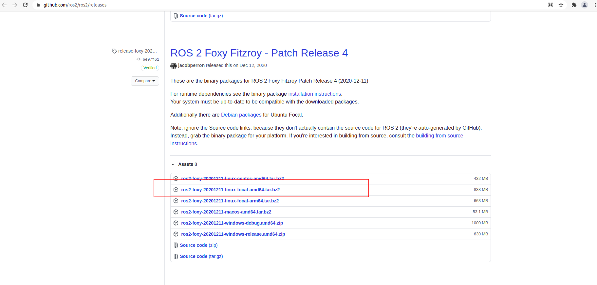

  解压下载好的压缩包

  `mkdir -p /home/ubuntu/ros2_foxy`

  `cd /home/ubuntu/ros2_foxy`

  `tar xf /root/Downloads/ros2-foxy-20201211-linux-focal-amd64.tar.bz2`

- 安装并初始化rosdep工具

  `apt update`

  `apt install -y python3-rosdep`

  `rosdep init`

  `rosdep update`	执行rosdep update的时候，应当挂梯子，不然很难通过，正常情况下，执行这一步最好不要在root权限下，但是实际执行也没有问题，只报了一个warning

- 安全缺少的依赖

  `rosdep install --from-paths /home/ubuntu/ros2_foxy/ros2-linux/share --ignore-src --rosdistro foxy -y --skip-keys "console_bridge fastcdr fastrtps osrf_testing_tools_cpp poco_vendor rmw_connext_cpp rosidl_typesupport_connext_c rosidl_typesupport_connext_cpp rti-connext-dds-5.3.1 tinyxml_vendor tinyxml2_vendor urdfdom urdfdom_headers"`

- 安装python3的库

  `apt install -y libpython3-dev python3-pip`

  `pip3 install -U argcomplete`

- 设置环境变量并测试用例

  启动发布者

  `source /opt/ros/foxy/setup.bash`

  `ros2 run demo_nodes_cpp talker`

  启动监听者

  `source /opt/ros/foxy/setup.bash`

  `ros2 run demo_nodes_py listener`

## 坑点

- 在执行完上述安装步骤之后，我们发现colcon并没有被装上（如果装好了，请忽略坑点），于是我们参考https://colcon.readthedocs.io/en/released/user/installation.html进行colcon编译系统的安装

  - 选择ros2的仓库

    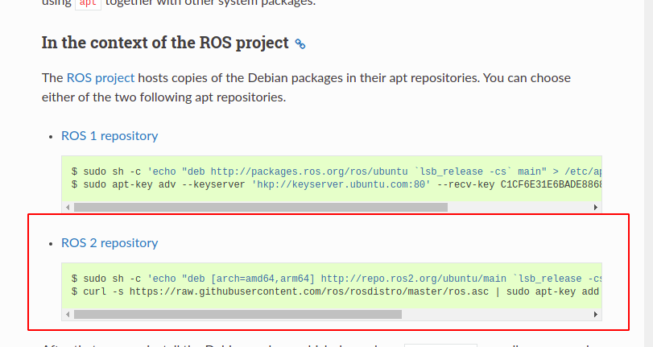

  - 执行以下命令配置好colcon的apt仓库

    `sh -c 'echo "deb [arch=amd64,arm64] http://repo.ros2.org/ubuntu/main `lsb_release -cs` main" > /etc/apt/sources.list.d/ros2-latest.list'` 

    `curl -s https://raw.githubusercontent.com/ros/rosdistro/master/ros.asc | sudo apt-key add -` 这一步也需要挂梯子才能快速完成

  - 安装deb包

    `apt update`

    `apt install python3-colcon-common-extensions`

    执行第二步时，并不能通过，网上搜了一堆的方法，发现与此相同的报错信息和解决方法

    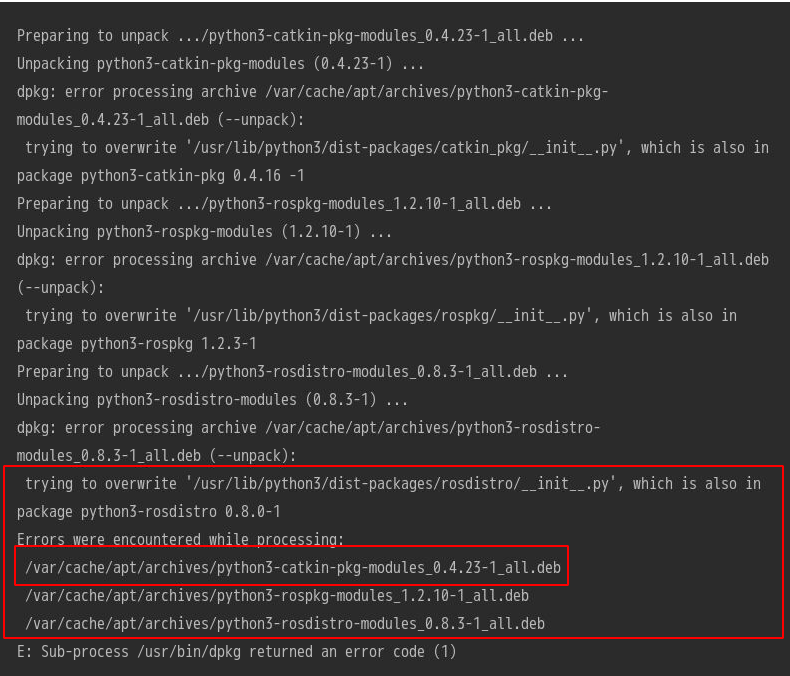

    python3-catkin-pkg-modules_0.4.23-1_all.deb这个包无法装上，原因是

    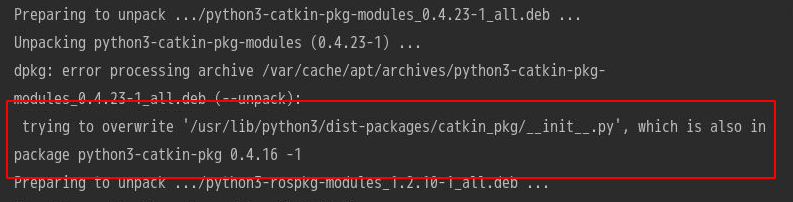

    无法overwrite已经存在的其他版本的pkg

    因此，我们需要强制执行覆盖overwrite操作

    首先，下载deb包https://www.dulando.info/ros/ubuntu/pool/main/p/python3-catkin-pkg-modules/，这里根据报错信息选择了0.4.23-1_all版本

    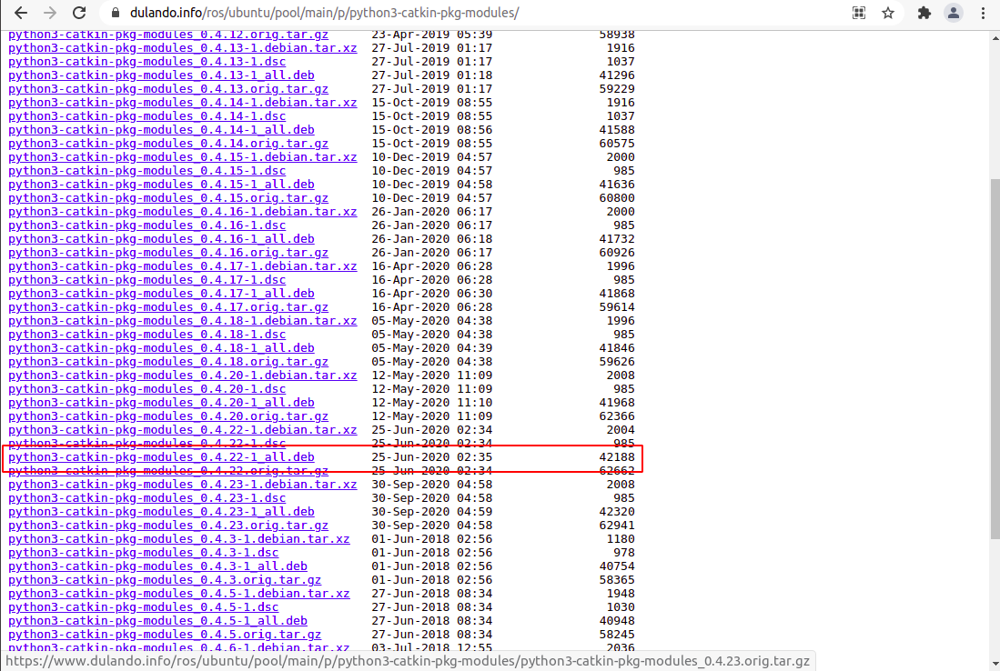

    接下来，进入到该deb包所在的目录

    `cd /root/Downloads`

    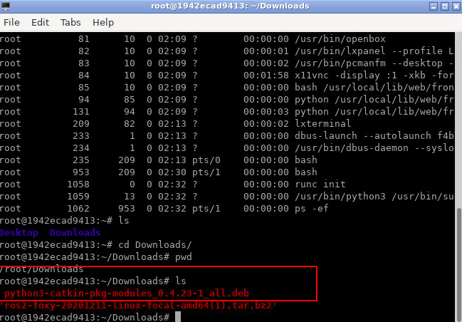

    最后执行dpkg安装命令

    `dpkg -i --force-overwrite python3-catkin-pkg-modules_0.4.23-1_all.deb`

    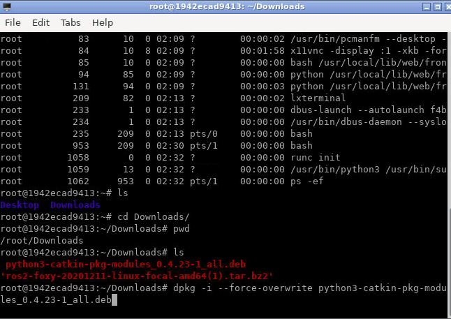

    再次安装python3-colcon-common-extensions，就能通过了，这样系统中便可以使用colcon这个编译系统

    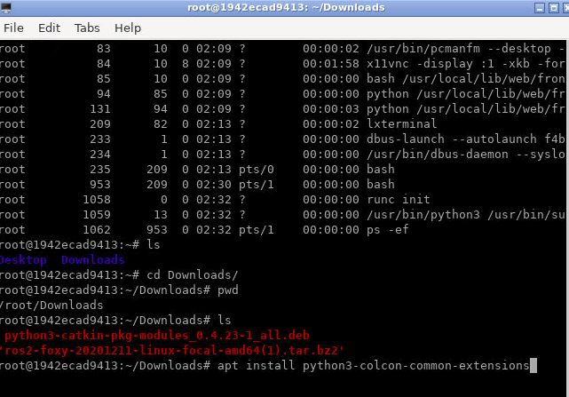

    

# 安装Gazebo

## one-liner安装方式

- 安装

  新开命令行窗口LXTerminal

  `curl -sSL http://get.gazebosim.org | sh`

- 运行

  `gazebo`

  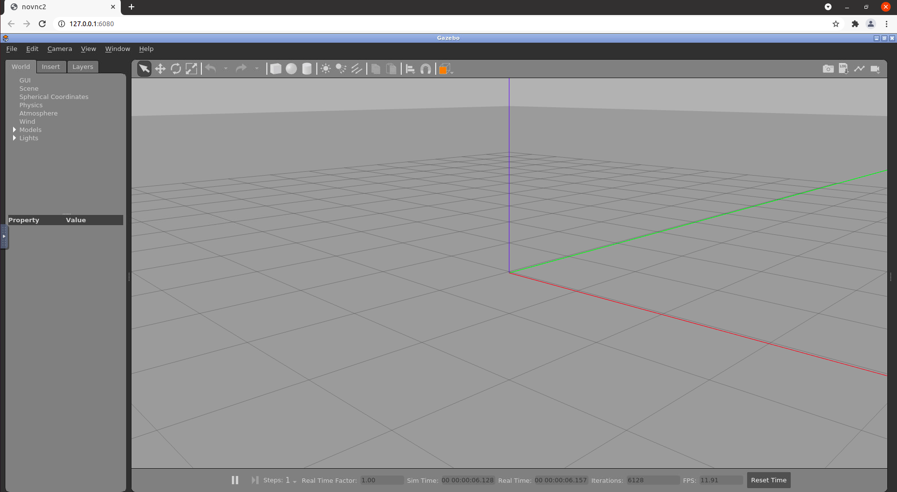

## 坑点

- one-liner安装方式推荐在梯子下执行，不然可能无法解析网页


# 运行robot_sim项目

## 按照官方教程安装gazebo_ros_pkgs

- 链接http://gazebosim.org/tutorials?tut=ros2_installing&cat=connect_ros

- deb包安装

  `sudo apt install ros-foxy-gazebo-ros-pkgs`

## 克隆并编译运行robot_sim项目

- 编译（新开命令行窗口LXTerminal）

  `source /opt/ros/foxy/setup.bash`

  `cd /home/ubuntu/workspace/robot_sim`	(此处代码放在/home/ubuntu/workspace/下)

  `colcon builid --packages-select warehouse_robot_spawner_pkg`

  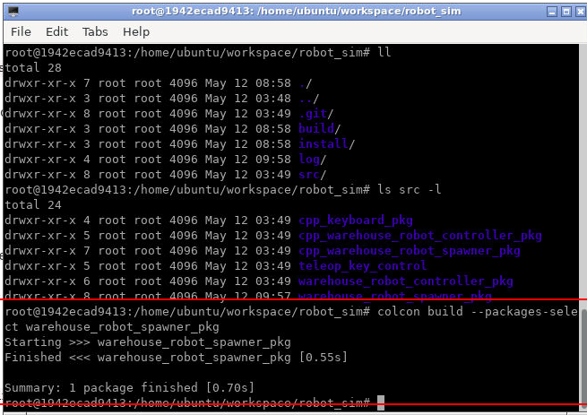

- 运行

  `source /home/ubuntu/workspace/robot_sim/install/setup.bash`

  `ros2 launch warehouse_robot_spawner_pkg gazebo_world.launch.py`

  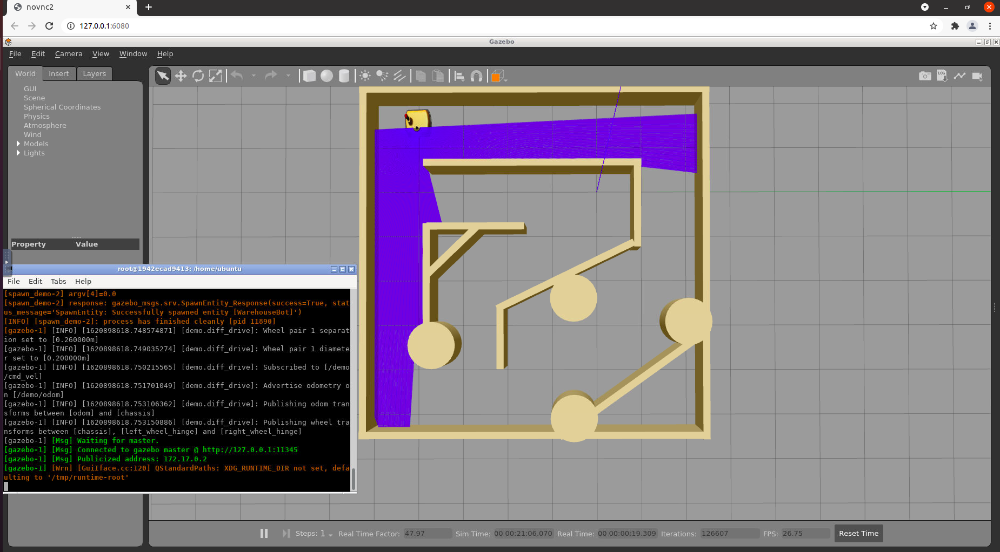

## 坑点

- “No module named gazebo_msgs.msg”

  报出这个错误，一方面可能是没有安装gazebo_ros_pkgs，另一方面，在运行前设置环境变量一定是`source /opt/ros/foxy/setup.bash`，不能是`source /home/ubuntu/ros2_foxy/ros2-linux/setup.bash`，因为按照后者，gazebo_ros_pkgs的环境就不会被配置

- 启动demo时需要很长时间，这是正常的，第一次启动会卡在world文件的加载过程中，之后就正常了，我们理解是需要下载model。

  


