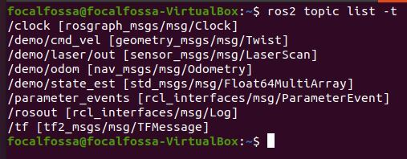

# 前置条件

- 在Ubuntu中已经安装了ROS2(这里安装的是rolling)
- 已经具备在Gazebo中创建机器人模型的能力


# 创建仓储机器人

## 生成model.config

1. 为model建立一个文件夹

   `mkdir -p ~/.gazebo/models/mobile_warehouse_robot`

2. 生成并编辑model.config文件

   `gedit ~/.gazebo/models/mobile_warehouse_robot/model.config`

   写入以下内容

   ```
   <?xml version="1.0"?>
   <model>
     <name>Mobile Warehouse Robot</name>
     <version>1.0</version>
     <sdf version='1.4'>model.sdf</sdf>
     
     <author>
       <name>mwf</name>
       <email>figoowen2003@126.com</email>
     </author>
     
     <description>
       A basic differential drive mobile warehouse robot
     </description>
   </model>
   ```

## 下载Mesh文件

- Mesh文件让机器人看起来更加的真实

- 添加Mesh文件的具体教程，参考http://gazebosim.org/tutorials/?tut=attach_meshes

- 所有的仓储机器人mesh文件都位于http://models.gazebosim.org/

- 下载步骤：

  - `cd ~/.gazebo/models`

  - ```
    wget -q -R *index.html*,*.tar.gz --no-parent -r -x -nH http://models.gazebosim.org/warehouse_robot/
    ```

    该网址的页面显示如下

    

  - 下载文件[Hokuyo Laser Range Finder](https://www.hokuyo-aut.jp/) [mesh file](http://models.gazebosim.org/hokuyo/)

    `cd ~/.gazebo/models`

    ```
    wget -q -R *index.html*,*.tar.gz --no-parent -r -x -nH http://models.gazebosim.org/hokuyo/
    ```

    该网址的页面显示如下

    

## 创建model.sdf

- sdf:  [Simulation Description Format](http://sdformat.org/)这个文件包含了创建一个mobile_warehouse_robot模型所需要的标签

- 步骤：

  - ```
    gedit ~/.gazebo/models/mobile_warehouse_robot/model.sdf
    ```

  - 写入以下内容

    ```
    <?xml version='1.0'?>
    <!--
      Gazebo ROS differential drive plugin 
    
      Try sending commands:
    
        ros2 topic pub /demo/cmd_vel geometry_msgs/Twist '{linear: {x: 0.05}}' -1
    
        ros2 topic pub /demo/cmd_vel geometry_msgs/Twist '{angular: {z: 0.1}}' -1
    
      Try listening to odometry:
    
        ros2 topic echo /demo/odom
    
      Try listening to TF:
    
        ros2 run tf2_ros tf2_echo odom chassis
    
        ros2 run tf2_ros tf2_echo chassis right_wheel
    
        ros2 run tf2_ros tf2_echo chassis left_wheel
    -->
    <sdf version='1.4'>
      <model name="mobile_warehouse_robot">  
         <!-- If true, physics engine will ignore -->
         <static>false</static>    
         
           <!-- Add the rectangular base of the robot -->
           <link name='chassis'>
           
             <!--Position of the center will be: -->
             <!--x=0 meters, y=0 meters, z=0.1 meters-->
             <!--Orientation of the center will be: -->
             <!--Roll=0 rad, Pitch=0 rad, Yaw=0 rad -->
             <pose>0 0 .04 0 0 0</pose>
    
               <!-- Specify the shape for collisions -->
               <collision name='collision'>
                 <geometry>
                   <box>
                     <!-- Box is 0.4 meters in length -->
                     <!-- 0.2 meters in width -->
                     <!-- 0.1 meters in height -->
                     <size>.4 .2 .1</size>
                   </box>
                 </geometry>
               </collision>
    
               <!-- Specify the shape for visualization -->
               <visual name='visual'>
                 <pose> 0 0 0.02 0 0 0 </pose>
                 <geometry>
                   <mesh>
                     <uri>model://warehouse_robot/meshes/robot.dae</uri>
                     <scale>0.9 0.5 0.5 </scale>
                   </mesh>
                 </geometry>
               </visual>
               
               <!-- Add a caster wheel -->
               <collision name='caster_collision'>
                 <pose>-0.19 0 0 0 0 0</pose>
                 <geometry>
                   <sphere>
                     <radius>.06</radius>
                   </sphere>
                 </geometry>
    
                 <surface>
                   <friction>
                     <ode>
                       <!-- Coefficients of friction -->
                       <mu>0</mu>
                       <mu2>0</mu2>
                       <!-- Force dependent slip -->
                       <slip1>1.0</slip1>
                       <slip2>1.0</slip2>
                     </ode>
                   </friction>
                 </surface>
               </collision>
    
               <visual name='caster_visual'>
                 <pose>-0.19 0 0 0 0 0</pose>
                 <geometry>
                   <sphere>
                     <radius>.06</radius>
                   </sphere>
                 </geometry>
               </visual>           
           </link>      
    
           <!-- Add the left wheel -->     
           <link name="left_wheel">
             <pose>0.12 0.19 0.1 0 1.5707 1.5707</pose>
             <collision name="collision">
               <geometry>
                 <cylinder>
                   <radius>.12</radius>
                   <length>.08</length>
                 </cylinder>
               </geometry>
             </collision>
             <visual name="visual">
               <geometry>
                 <cylinder>
                   <radius>.12</radius>
                   <length>.08</length>
                 </cylinder>
               </geometry>
             </visual>
           </link>  
     
           <!-- Add the right wheel -->      
           <link name="right_wheel">
             <pose>0.12 -0.19 0.1 0 1.5707 1.5707</pose>
             <collision name="collision">
               <geometry>
                 <cylinder>
                   <radius>.12</radius>
                   <length>.08</length>
                 </cylinder>
               </geometry>
             </collision>
             <visual name="visual">
               <geometry>
                 <cylinder>
                   <radius>.12</radius>
                   <length>.08</length>
                 </cylinder>
               </geometry>
             </visual>
           </link>
          
           <!-- Add the laser range finder -->
           <link name="laser_link">
             <inertial>
               <!-- Mass of the laser range finder in kg -->
               <mass>0.1</mass>
             </inertial>
             <!-- Position is towards the front of the robot -->
             <!-- Laser finder is mounted on top -->
             <pose>0.15 0 0.30 0 0 0</pose>
             
             <!-- Add a mesh to make it more visually appealing -->
             <visual name="visual">
               <geometry>
                 <mesh>
                   <uri>model://hokuyo/meshes/hokuyo.dae</uri>
                 </mesh>
               </geometry>
             </visual>
             
             <!-- Collision properties of the base of the laser range finder-->
             <collision name="collision-base">
               <pose>0 0 -0.0145 0 0 0</pose>
               <geometry>
                 <box>
                   <size>0.05 0.05 0.041</size>
                 </box>
               </geometry>
             </collision>
             <!-- Collision properties of the top of the laser range finder-->
             <collision name="collision-top">
               <pose>0 0 0.0205 0 0 0</pose>
               <geometry>
                 <cylinder>
                   <radius>0.021</radius>
                   <length>0.029</length>
                 </cylinder>
               </geometry>
             </collision>
             
             <!-- Describes the type and properties of the sensor -->
    	 <sensor name="laser" type="ray">
    	   <pose>0.01 0 0.0175 0 -0 0</pose>
               <ray>
                 <scan>
                   <horizontal>
                     <samples>181</samples>
                     <resolution>1</resolution>
                     <min_angle>-1.57080</min_angle>
                     <max_angle>1.57080</max_angle>
                   </horizontal>
                 </scan>
                 <range>
                   <min>0.08</min>
                   <max>10</max>
                   <resolution>0.05</resolution>
                 </range>
               </ray>
               <always_on>1</always_on>
               <update_rate>10</update_rate>
               <visualize>true</visualize>
    
               <plugin name='laser' filename='libgazebo_ros_ray_sensor.so'>
                 <ros>
                   <namespace>/demo</namespace>
                   <argument>--ros-args --remap ~/out:=scan</argument>
                 </ros>
                 <output_type>sensor_msgs/LaserScan</output_type>
               </plugin>
    	 </sensor>
           </link>
          
           <!-- Add motor for the left wheel -->
           <joint type="revolute" name="left_wheel_hinge">
             <pose>0 0 -0.03 0 0 0</pose>
             <child>left_wheel</child>
             <parent>chassis</parent>
             <axis>
               <xyz>0 1 0</xyz>
             </axis>
           </joint>
    
           <!-- Add motor for the right wheel -->
           <joint type="revolute" name="right_wheel_hinge">
             <pose>0 0 0.03 0 0 0</pose>
             <child>right_wheel</child>
             <parent>chassis</parent>
             <axis>
               <xyz>0 1 0</xyz>
             </axis>
           </joint>
          
           <!-- Connect laser range finder to the robot's body -->
           <joint type="fixed" name="laser_joint">
             <child>laser_link</child>
             <parent>chassis</parent>
           </joint>
          
           <!-- Controls the differential drive robot -->
           <plugin name='diff_drive' filename='libgazebo_ros_diff_drive.so'>
             <ros>
               <namespace>/demo</namespace>
               <remapping>cmd_vel:=cmd_vel</remapping>
               <remapping>odom:=odom</remapping>
             </ros>
    
             <!-- wheels -->
             <left_joint>left_wheel_hinge</left_joint>
             <right_joint>right_wheel_hinge</right_joint>
    
             <!-- kinematics -->
             <wheel_separation>0.26</wheel_separation>
             <wheel_diameter>0.2</wheel_diameter>
    
             <!-- limits -->
             <max_wheel_torque>20</max_wheel_torque>
             <max_wheel_acceleration>1.0</max_wheel_acceleration>
    
             <!-- output -->
             <publish_odom>true</publish_odom>
             <publish_odom_tf>true</publish_odom_tf>
             <publish_wheel_tf>true</publish_wheel_tf>
    
             <odometry_frame>odom</odometry_frame>
             <robot_base_frame>chassis</robot_base_frame>
           </plugin>      
      </model>
    </sdf>
    ```

  ## 测试一下你的robot

  - 运行Gazebo

    `gazebo`

  - 在Gazebo界面的左侧，点击“Insert”的tab页，然后在左侧的列表中，单机"Mobile Warehouse Robot"

    

    ​	

# 集成ROS2和Gazebo

## 安装gazebo_ros_pkgs

- 打开一个新的terminal，安装该pkg

- 我们需要安装完整的包，其中的差速插件（differential drive plugin）能让我们通过ROS2命令控制机器人的速度（此处选择了foxy版对应的pkg，尽量选择最新的版本）

  `sudo apt install ros-foxy-gazebo-ros-pkgs`

## 测试ROS2和Gazebo的交互

- 打开一个新的terminal，安装一些额外的工具

  `sudo apt install ros-foxy-ros-core ros-foxy-geometry2`

- 打开一个 新的terminal，加载一个demo robot

  `gazebo --verbose /opt/ros/foxy/share/gazebo_plugins/worlds/gazebo_ros_diff_drive_demo.world`


在这个world文件中，提供了一些命令，来控制这个demo robot，如下


打开一个新的terminal，输入以下命令

`ros2 topic pub /demo/cmd_demo geometry_msgs/Twist '{linear: {x: 1.0}}' -1`

机器人将向前方运动

- 现在，CTRL + C关闭已经打开的Gazebo窗口，重新启动Gazebo

  `gazebo`

- 加载之前创建的“Mobile Warehouse Robot”模型，在terminal窗口中，会显示以下信息

  

- 新开一个terminal，查看当前所有的topic

  `ros2 topic list -t`

  

- 输入以下命令(/demo/cmd_vel是设置机器人速度的topic)

  `ros2 topic pub /demo/cmd_vel geometry_msgs/Twist '{linear: {x: 0.05}}' -1`

  


# 建立仓库模型

## 创建model.config文件

- 新建文件夹

  `mkdir -p ~/.gazebo/models/small_warehouse`

- 新建config 文件，写入以下的内容

  `gedit ~/.gazebo/models/small_warehouse/model.config`

  ```
  <?xml version="1.0"?>
  <model>
    <name>Small Warehouse</name>
    <version>1.0</version>
    <sdf version='1.4'>model.sdf</sdf>
  
    <author>
     <name>Automatic Addison</name>
     <email>automaticaddison@todo.todo</email>
    </author>
  
    <description>
      A small warehouse.
    </description>
  </model>
  ```

## 创建model.sdf文件

- 新建model.sdf文件，并写入以下内容

  `gedit ~/.gazebo/models/small_warehouse/model.sdf`

  ```
  <?xml version='1.0'?>
  <sdf version='1.5'>
    <model name='small_warehouse'>
      <link name='Wall_10'>
        <pose frame=''>-2.02568 2.92333 0 0 -0 3.14159</pose>
        <self_collide>0</self_collide>
        <kinematic>0</kinematic>
        <visual name='Wall_10_Visual'>
          <pose frame=''>0 0 0.5 0 -0 0</pose>
          <geometry>
            <box>
              <size>1.8711 0.15 1</size>
            </box>
          </geometry>
          <material>
            <script>
              <uri>file://media/materials/scripts/gazebo.material</uri>
              <name>Gazebo/Grey</name>
            </script>
            <ambient>1 0.764706 0.305882 1</ambient>
            <diffuse>0.7 0.7 0.7 1</diffuse>
            <specular>0.01 0.01 0.01 1</specular>
            <emissive>0 0 0 1</emissive>
            <shader type='pixel'/>
          </material>
          <cast_shadows>1</cast_shadows>
          <transparency>0</transparency>
        </visual>
        <collision name='Wall_10_Collision'>
          <laser_retro>0</laser_retro>
          <max_contacts>10</max_contacts>
          <pose frame=''>0 0 0.5 0 -0 0</pose>
          <geometry>
            <box>
              <size>1.8711 0.15 1</size>
            </box>
          </geometry>
          <surface>
            <friction>
              <ode>
                <mu>1</mu>
                <mu2>1</mu2>
                <fdir1>0 0 0</fdir1>
                <slip1>0</slip1>
                <slip2>0</slip2>
              </ode>
            </friction>
            <bounce>
              <restitution_coefficient>0</restitution_coefficient>
              <threshold>1e+06</threshold>
            </bounce>
            <contact>
              <collide_without_contact>0</collide_without_contact>
              <collide_without_contact_bitmask>1</collide_without_contact_bitmask>
              <collide_bitmask>1</collide_bitmask>
              <ode>
                <soft_cfm>0</soft_cfm>
                <soft_erp>0.2</soft_erp>
                <kp>1e+13</kp>
                <kd>1</kd>
                <max_vel>0.01</max_vel>
                <min_depth>0</min_depth>
              </ode>
              <bullet>
                <split_impulse>1</split_impulse>
                <split_impulse_penetration_threshold>-0.01</split_impulse_penetration_threshold>
                <soft_cfm>0</soft_cfm>
                <soft_erp>0.2</soft_erp>
                <kp>1e+13</kp>
                <kd>1</kd>
              </bullet>
            </contact>
          </surface>
        </collision>
      </link>
      <link name='Wall_11'>
        <pose frame=''>-2.887 0.69235 0 0 0 -1.5708</pose>
        <self_collide>0</self_collide>
        <kinematic>0</kinematic>
        <visual name='Wall_11_Visual'>
          <pose frame=''>0 0 0.5 0 -0 0</pose>
          <geometry>
            <box>
              <size>4.62378 0.15 1</size>
            </box>
          </geometry>
          <material>
            <script>
              <uri>file://media/materials/scripts/gazebo.material</uri>
              <name>Gazebo/Grey</name>
            </script>
            <ambient>1 0.764706 0.305882 1</ambient>
            <diffuse>0.7 0.7 0.7 1</diffuse>
            <specular>0.01 0.01 0.01 1</specular>
            <emissive>0 0 0 1</emissive>
            <shader type='pixel'/>
          </material>
          <cast_shadows>1</cast_shadows>
          <transparency>0</transparency>
        </visual>
        <collision name='Wall_11_Collision'>
          <laser_retro>0</laser_retro>
          <max_contacts>10</max_contacts>
          <pose frame=''>0 0 0.5 0 -0 0</pose>
          <geometry>
            <box>
              <size>4.62378 0.15 1</size>
            </box>
          </geometry>
          <surface>
            <friction>
              <ode>
                <mu>1</mu>
                <mu2>1</mu2>
                <fdir1>0 0 0</fdir1>
                <slip1>0</slip1>
                <slip2>0</slip2>
              </ode>
            </friction>
            <bounce>
              <restitution_coefficient>0</restitution_coefficient>
              <threshold>1e+06</threshold>
            </bounce>
            <contact>
              <collide_without_contact>0</collide_without_contact>
              <collide_without_contact_bitmask>1</collide_without_contact_bitmask>
              <collide_bitmask>1</collide_bitmask>
              <ode>
                <soft_cfm>0</soft_cfm>
                <soft_erp>0.2</soft_erp>
                <kp>1e+13</kp>
                <kd>1</kd>
                <max_vel>0.01</max_vel>
                <min_depth>0</min_depth>
              </ode>
              <bullet>
                <split_impulse>1</split_impulse>
                <split_impulse_penetration_threshold>-0.01</split_impulse_penetration_threshold>
                <soft_cfm>0</soft_cfm>
                <soft_erp>0.2</soft_erp>
                <kp>1e+13</kp>
                <kd>1</kd>
              </bullet>
            </contact>
          </surface>
        </collision>
      </link>
      <link name='Wall_11_clone'>
        <pose frame=''>-4.44208 0.738947 0 0 0 -1.5708</pose>
        <self_collide>0</self_collide>
        <kinematic>0</kinematic>
        <visual name='ModelPreview_2::Wall_11_clone::Wall_11_Visual'>
          <pose frame=''>0 0 0.5 0 -0 0</pose>
          <geometry>
            <box>
              <size>7.42809 0.15 1</size>
            </box>
          </geometry>
          <material>
            <script>
              <uri>file://media/materials/scripts/gazebo.material</uri>
              <name>Gazebo/Grey</name>
            </script>
            <ambient>1 0.764706 0.305882 1</ambient>
            <diffuse>0.7 0.7 0.7 1</diffuse>
            <specular>0.01 0.01 0.01 1</specular>
            <emissive>0 0 0 1</emissive>
            <shader type='pixel'/>
          </material>
          <cast_shadows>1</cast_shadows>
          <transparency>0</transparency>
        </visual>
        <collision name='Wall_11_Collision'>
          <laser_retro>0</laser_retro>
          <max_contacts>10</max_contacts>
          <pose frame=''>0 0 0.5 0 -0 0</pose>
          <geometry>
            <box>
              <size>7.42809 0.15 1</size>
            </box>
          </geometry>
          <surface>
            <friction>
              <ode>
                <mu>1</mu>
                <mu2>1</mu2>
                <fdir1>0 0 0</fdir1>
                <slip1>0</slip1>
                <slip2>0</slip2>
              </ode>
            </friction>
            <bounce>
              <restitution_coefficient>0</restitution_coefficient>
              <threshold>1e+06</threshold>
            </bounce>
            <contact>
              <collide_without_contact>0</collide_without_contact>
              <collide_without_contact_bitmask>1</collide_without_contact_bitmask>
              <collide_bitmask>1</collide_bitmask>
              <ode>
                <soft_cfm>0</soft_cfm>
                <soft_erp>0.2</soft_erp>
                <kp>1e+13</kp>
                <kd>1</kd>
                <max_vel>0.01</max_vel>
                <min_depth>0</min_depth>
              </ode>
              <bullet>
                <split_impulse>1</split_impulse>
                <split_impulse_penetration_threshold>-0.01</split_impulse_penetration_threshold>
                <soft_cfm>0</soft_cfm>
                <soft_erp>0.2</soft_erp>
                <kp>1e+13</kp>
                <kd>1</kd>
              </bullet>
            </contact>
          </surface>
        </collision>
      </link>
      <link name='Wall_14'>
        <pose frame=''>-0.409926 -1.55115 0 0 -0 3.14159</pose>
        <self_collide>0</self_collide>
        <kinematic>0</kinematic>
        <visual name='Wall_14_Visual'>
          <pose frame=''>0 0 0.5 0 -0 0</pose>
          <geometry>
            <box>
              <size>2.36648 0.15 1</size>
            </box>
          </geometry>
          <material>
            <script>
              <uri>file://media/materials/scripts/gazebo.material</uri>
              <name>Gazebo/Grey</name>
            </script>
            <ambient>1 0.764706 0.305882 1</ambient>
            <diffuse>0.7 0.7 0.7 1</diffuse>
            <specular>0.01 0.01 0.01 1</specular>
            <emissive>0 0 0 1</emissive>
            <shader type='pixel'/>
          </material>
          <cast_shadows>1</cast_shadows>
          <transparency>0</transparency>
        </visual>
        <collision name='Wall_14_Collision'>
          <laser_retro>0</laser_retro>
          <max_contacts>10</max_contacts>
          <pose frame=''>0 0 0.5 0 -0 0</pose>
          <geometry>
            <box>
              <size>2.36648 0.15 1</size>
            </box>
          </geometry>
          <surface>
            <friction>
              <ode>
                <mu>1</mu>
                <mu2>1</mu2>
                <fdir1>0 0 0</fdir1>
                <slip1>0</slip1>
                <slip2>0</slip2>
              </ode>
            </friction>
            <bounce>
              <restitution_coefficient>0</restitution_coefficient>
              <threshold>1e+06</threshold>
            </bounce>
            <contact>
              <collide_without_contact>0</collide_without_contact>
              <collide_without_contact_bitmask>1</collide_without_contact_bitmask>
              <collide_bitmask>1</collide_bitmask>
              <ode>
                <soft_cfm>0</soft_cfm>
                <soft_erp>0.2</soft_erp>
                <kp>1e+13</kp>
                <kd>1</kd>
                <max_vel>0.01</max_vel>
                <min_depth>0</min_depth>
              </ode>
              <bullet>
                <split_impulse>1</split_impulse>
                <split_impulse_penetration_threshold>-0.01</split_impulse_penetration_threshold>
                <soft_cfm>0</soft_cfm>
                <soft_erp>0.2</soft_erp>
                <kp>1e+13</kp>
                <kd>1</kd>
              </bullet>
            </contact>
          </surface>
        </collision>
      </link>
      <link name='Wall_15'>
        <pose frame=''>-1.53187 -0.513425 0 0 -0 1.5708</pose>
        <self_collide>0</self_collide>
        <kinematic>0</kinematic>
        <visual name='Wall_15_Visual'>
          <pose frame=''>0 0 0.5 0 -0 0</pose>
          <geometry>
            <box>
              <size>2.06622 0.15 1</size>
            </box>
          </geometry>
          <material>
            <script>
              <uri>file://media/materials/scripts/gazebo.material</uri>
              <name>Gazebo/Grey</name>
            </script>
            <ambient>1 0.764706 0.305882 1</ambient>
            <diffuse>0.7 0.7 0.7 1</diffuse>
            <specular>0.01 0.01 0.01 1</specular>
            <emissive>0 0 0 1</emissive>
            <shader type='pixel'/>
          </material>
          <cast_shadows>1</cast_shadows>
          <transparency>0</transparency>
        </visual>
        <collision name='Wall_15_Collision'>
          <laser_retro>0</laser_retro>
          <max_contacts>10</max_contacts>
          <pose frame=''>0 0 0.5 0 -0 0</pose>
          <geometry>
            <box>
              <size>2.06622 0.15 1</size>
            </box>
          </geometry>
          <surface>
            <friction>
              <ode>
                <mu>1</mu>
                <mu2>1</mu2>
                <fdir1>0 0 0</fdir1>
                <slip1>0</slip1>
                <slip2>0</slip2>
              </ode>
            </friction>
            <bounce>
              <restitution_coefficient>0</restitution_coefficient>
              <threshold>1e+06</threshold>
            </bounce>
            <contact>
              <collide_without_contact>0</collide_without_contact>
              <collide_without_contact_bitmask>1</collide_without_contact_bitmask>
              <collide_bitmask>1</collide_bitmask>
              <ode>
                <soft_cfm>0</soft_cfm>
                <soft_erp>0.2</soft_erp>
                <kp>1e+13</kp>
                <kd>1</kd>
                <max_vel>0.01</max_vel>
                <min_depth>0</min_depth>
              </ode>
              <bullet>
                <split_impulse>1</split_impulse>
                <split_impulse_penetration_threshold>-0.01</split_impulse_penetration_threshold>
                <soft_cfm>0</soft_cfm>
                <soft_erp>0.2</soft_erp>
                <kp>1e+13</kp>
                <kd>1</kd>
              </bullet>
            </contact>
          </surface>
        </collision>
      </link>
      <link name='Wall_19'>
        <pose frame=''>0.837565 0.010614 0 0 -0 3.14159</pose>
        <self_collide>0</self_collide>
        <kinematic>0</kinematic>
        <visual name='Wall_19_Visual'>
          <pose frame=''>0 0 0.5 0 -0 0</pose>
          <geometry>
            <box>
              <size>1.32777 0.15 1</size>
            </box>
          </geometry>
          <material>
            <script>
              <uri>file://media/materials/scripts/gazebo.material</uri>
              <name>Gazebo/Grey</name>
            </script>
            <ambient>1 0.764706 0.305882 1</ambient>
            <diffuse>0.7 0.7 0.7 1</diffuse>
            <specular>0.01 0.01 0.01 1</specular>
            <emissive>0 0 0 1</emissive>
            <shader type='pixel'/>
          </material>
          <cast_shadows>1</cast_shadows>
          <transparency>0</transparency>
        </visual>
        <collision name='Wall_19_Collision'>
          <laser_retro>0</laser_retro>
          <max_contacts>10</max_contacts>
          <pose frame=''>0 0 0.5 0 -0 0</pose>
          <geometry>
            <box>
              <size>1.32777 0.15 1</size>
            </box>
          </geometry>
          <surface>
            <friction>
              <ode>
                <mu>1</mu>
                <mu2>1</mu2>
                <fdir1>0 0 0</fdir1>
                <slip1>0</slip1>
                <slip2>0</slip2>
              </ode>
            </friction>
            <bounce>
              <restitution_coefficient>0</restitution_coefficient>
              <threshold>1e+06</threshold>
            </bounce>
            <contact>
              <collide_without_contact>0</collide_without_contact>
              <collide_without_contact_bitmask>1</collide_without_contact_bitmask>
              <collide_bitmask>1</collide_bitmask>
              <ode>
                <soft_cfm>0</soft_cfm>
                <soft_erp>0.2</soft_erp>
                <kp>1e+13</kp>
                <kd>1</kd>
                <max_vel>0.01</max_vel>
                <min_depth>0</min_depth>
              </ode>
              <bullet>
                <split_impulse>1</split_impulse>
                <split_impulse_penetration_threshold>-0.01</split_impulse_penetration_threshold>
                <soft_cfm>0</soft_cfm>
                <soft_erp>0.2</soft_erp>
                <kp>1e+13</kp>
                <kd>1</kd>
              </bullet>
            </contact>
          </surface>
        </collision>
      </link>
      <link name='Wall_20'>
        <pose frame=''>-0.484506 1.39698 0 0 -0 2.02352</pose>
        <self_collide>0</self_collide>
        <kinematic>0</kinematic>
        <visual name='Wall_20_Visual'>
          <pose frame=''>0 0 0.5 0 -0 0</pose>
          <geometry>
            <box>
              <size>3.22686 0.15 1</size>
            </box>
          </geometry>
          <material>
            <script>
              <uri>file://media/materials/scripts/gazebo.material</uri>
              <name>Gazebo/Grey</name>
            </script>
            <ambient>1 0.764706 0.305882 1</ambient>
            <diffuse>0.7 0.7 0.7 1</diffuse>
            <specular>0.01 0.01 0.01 1</specular>
            <emissive>0 0 0 1</emissive>
            <shader type='pixel'/>
          </material>
          <cast_shadows>1</cast_shadows>
          <transparency>0</transparency>
        </visual>
        <collision name='Wall_20_Collision'>
          <laser_retro>0</laser_retro>
          <max_contacts>10</max_contacts>
          <pose frame=''>0 0 0.5 0 -0 0</pose>
          <geometry>
            <box>
              <size>3.22686 0.15 1</size>
            </box>
          </geometry>
          <surface>
            <friction>
              <ode>
                <mu>1</mu>
                <mu2>1</mu2>
                <fdir1>0 0 0</fdir1>
                <slip1>0</slip1>
                <slip2>0</slip2>
              </ode>
            </friction>
            <bounce>
              <restitution_coefficient>0</restitution_coefficient>
              <threshold>1e+06</threshold>
            </bounce>
            <contact>
              <collide_without_contact>0</collide_without_contact>
              <collide_without_contact_bitmask>1</collide_without_contact_bitmask>
              <collide_bitmask>1</collide_bitmask>
              <ode>
                <soft_cfm>0</soft_cfm>
                <soft_erp>0.2</soft_erp>
                <kp>1e+13</kp>
                <kd>1</kd>
                <max_vel>0.01</max_vel>
                <min_depth>0</min_depth>
              </ode>
              <bullet>
                <split_impulse>1</split_impulse>
                <split_impulse_penetration_threshold>-0.01</split_impulse_penetration_threshold>
                <soft_cfm>0</soft_cfm>
                <soft_erp>0.2</soft_erp>
                <kp>1e+13</kp>
                <kd>1</kd>
              </bullet>
            </contact>
          </surface>
        </collision>
      </link>
      <link name='Wall_24'>
        <pose frame=''>1.8412 2.79579 0 0 0 -0.948986</pose>
        <self_collide>0</self_collide>
        <kinematic>0</kinematic>
        <visual name='Wall_24_Visual'>
          <pose frame=''>0 0 0.5 0 -0 0</pose>
          <geometry>
            <box>
              <size>3.76645 0.15 1</size>
            </box>
          </geometry>
          <material>
            <script>
              <uri>file://media/materials/scripts/gazebo.material</uri>
              <name>Gazebo/Grey</name>
            </script>
            <ambient>1 0.764706 0.305882 1</ambient>
            <diffuse>0.7 0.7 0.7 1</diffuse>
            <specular>0.01 0.01 0.01 1</specular>
            <emissive>0 0 0 1</emissive>
            <shader type='pixel'/>
          </material>
          <cast_shadows>1</cast_shadows>
          <transparency>0</transparency>
        </visual>
        <collision name='Wall_24_Collision'>
          <laser_retro>0</laser_retro>
          <max_contacts>10</max_contacts>
          <pose frame=''>0 0 0.5 0 -0 0</pose>
          <geometry>
            <box>
              <size>3.76645 0.15 1</size>
            </box>
          </geometry>
          <surface>
            <friction>
              <ode>
                <mu>1</mu>
                <mu2>1</mu2>
                <fdir1>0 0 0</fdir1>
                <slip1>0</slip1>
                <slip2>0</slip2>
              </ode>
            </friction>
            <bounce>
              <restitution_coefficient>0</restitution_coefficient>
              <threshold>1e+06</threshold>
            </bounce>
            <contact>
              <collide_without_contact>0</collide_without_contact>
              <collide_without_contact_bitmask>1</collide_without_contact_bitmask>
              <collide_bitmask>1</collide_bitmask>
              <ode>
                <soft_cfm>0</soft_cfm>
                <soft_erp>0.2</soft_erp>
                <kp>1e+13</kp>
                <kd>1</kd>
                <max_vel>0.01</max_vel>
                <min_depth>0</min_depth>
              </ode>
              <bullet>
                <split_impulse>1</split_impulse>
                <split_impulse_penetration_threshold>-0.01</split_impulse_penetration_threshold>
                <soft_cfm>0</soft_cfm>
                <soft_erp>0.2</soft_erp>
                <kp>1e+13</kp>
                <kd>1</kd>
              </bullet>
            </contact>
          </surface>
        </collision>
      </link>
      <link name='Wall_24_clone'>
        <pose frame=''>-1.0172 -1.00075 0 0 0 -0.803995</pose>
        <self_collide>0</self_collide>
        <kinematic>0</kinematic>
        <visual name='ModelPreview_2::Wall_24_clone::Wall_24_Visual'>
          <pose frame=''>0 0 0.5 0 -0 0</pose>
          <geometry>
            <box>
              <size>1.5 0.15 1</size>
            </box>
          </geometry>
          <material>
            <script>
              <uri>file://media/materials/scripts/gazebo.material</uri>
              <name>Gazebo/Grey</name>
            </script>
            <ambient>1 0.764706 0.305882 1</ambient>
            <diffuse>0.7 0.7 0.7 1</diffuse>
            <specular>0.01 0.01 0.01 1</specular>
            <emissive>0 0 0 1</emissive>
            <shader type='pixel'/>
          </material>
          <cast_shadows>1</cast_shadows>
          <transparency>0</transparency>
        </visual>
        <collision name='Wall_24_Collision'>
          <laser_retro>0</laser_retro>
          <max_contacts>10</max_contacts>
          <pose frame=''>0 0 0.5 0 -0 0</pose>
          <geometry>
            <box>
              <size>1.5 0.15 1</size>
            </box>
          </geometry>
          <surface>
            <friction>
              <ode>
                <mu>1</mu>
                <mu2>1</mu2>
                <fdir1>0 0 0</fdir1>
                <slip1>0</slip1>
                <slip2>0</slip2>
              </ode>
            </friction>
            <bounce>
              <restitution_coefficient>0</restitution_coefficient>
              <threshold>1e+06</threshold>
            </bounce>
            <contact>
              <collide_without_contact>0</collide_without_contact>
              <collide_without_contact_bitmask>1</collide_without_contact_bitmask>
              <collide_bitmask>1</collide_bitmask>
              <ode>
                <soft_cfm>0</soft_cfm>
                <soft_erp>0.2</soft_erp>
                <kp>1e+13</kp>
                <kd>1</kd>
                <max_vel>0.01</max_vel>
                <min_depth>0</min_depth>
              </ode>
              <bullet>
                <split_impulse>1</split_impulse>
                <split_impulse_penetration_threshold>-0.01</split_impulse_penetration_threshold>
                <soft_cfm>0</soft_cfm>
                <soft_erp>0.2</soft_erp>
                <kp>1e+13</kp>
                <kd>1</kd>
              </bullet>
            </contact>
          </surface>
        </collision>
      </link>
      <link name='Wall_6'>
        <pose frame=''>-0.787021 -2.89307 0 0 -0 0</pose>
        <self_collide>0</self_collide>
        <kinematic>0</kinematic>
        <visual name='Wall_6_Visual'>
          <pose frame=''>0 0 0.5 0 -0 0</pose>
          <geometry>
            <box>
              <size>7.34986 0.15 1</size>
            </box>
          </geometry>
          <material>
            <script>
              <uri>file://media/materials/scripts/gazebo.material</uri>
              <name>Gazebo/Grey</name>
            </script>
            <ambient>1 0.764706 0.305882 1</ambient>
            <diffuse>0.7 0.7 0.7 1</diffuse>
            <specular>0.01 0.01 0.01 1</specular>
            <emissive>0 0 0 1</emissive>
            <shader type='pixel'/>
          </material>
          <cast_shadows>1</cast_shadows>
          <transparency>0</transparency>
        </visual>
        <collision name='Wall_6_Collision'>
          <laser_retro>0</laser_retro>
          <max_contacts>10</max_contacts>
          <pose frame=''>0 0 0.5 0 -0 0</pose>
          <geometry>
            <box>
              <size>7.34986 0.15 1</size>
            </box>
          </geometry>
          <surface>
            <friction>
              <ode>
                <mu>1</mu>
                <mu2>1</mu2>
                <fdir1>0 0 0</fdir1>
                <slip1>0</slip1>
                <slip2>0</slip2>
              </ode>
            </friction>
            <bounce>
              <restitution_coefficient>0</restitution_coefficient>
              <threshold>1e+06</threshold>
            </bounce>
            <contact>
              <collide_without_contact>0</collide_without_contact>
              <collide_without_contact_bitmask>1</collide_without_contact_bitmask>
              <collide_bitmask>1</collide_bitmask>
              <ode>
                <soft_cfm>0</soft_cfm>
                <soft_erp>0.2</soft_erp>
                <kp>1e+13</kp>
                <kd>1</kd>
                <max_vel>0.01</max_vel>
                <min_depth>0</min_depth>
              </ode>
              <bullet>
                <split_impulse>1</split_impulse>
                <split_impulse_penetration_threshold>-0.01</split_impulse_penetration_threshold>
                <soft_cfm>0</soft_cfm>
                <soft_erp>0.2</soft_erp>
                <kp>1e+13</kp>
                <kd>1</kd>
              </bullet>
            </contact>
          </surface>
        </collision>
      </link>
      <link name='Wall_6_clone'>
        <pose frame=''>-0.718431 4.37517 0 0 -0 0</pose>
        <self_collide>0</self_collide>
        <kinematic>0</kinematic>
        <visual name='ModelPreview_2::Wall_6_clone::Wall_6_Visual'>
          <pose frame=''>0 0 0.5 0 -0 0</pose>
          <geometry>
            <box>
              <size>7.41907 0.15 1</size>
            </box>
          </geometry>
          <material>
            <script>
              <uri>file://media/materials/scripts/gazebo.material</uri>
              <name>Gazebo/Grey</name>
            </script>
            <ambient>1 0.764706 0.305882 1</ambient>
            <diffuse>0.7 0.7 0.7 1</diffuse>
            <specular>0.01 0.01 0.01 1</specular>
            <emissive>0 0 0 1</emissive>
            <shader type='pixel'/>
          </material>
          <cast_shadows>1</cast_shadows>
          <transparency>0</transparency>
        </visual>
        <collision name='Wall_6_Collision'>
          <laser_retro>0</laser_retro>
          <max_contacts>10</max_contacts>
          <pose frame=''>0 0 0.5 0 -0 0</pose>
          <geometry>
            <box>
              <size>7.41907 0.15 1</size>
            </box>
          </geometry>
          <surface>
            <friction>
              <ode>
                <mu>1</mu>
                <mu2>1</mu2>
                <fdir1>0 0 0</fdir1>
                <slip1>0</slip1>
                <slip2>0</slip2>
              </ode>
            </friction>
            <bounce>
              <restitution_coefficient>0</restitution_coefficient>
              <threshold>1e+06</threshold>
            </bounce>
            <contact>
              <collide_without_contact>0</collide_without_contact>
              <collide_without_contact_bitmask>1</collide_without_contact_bitmask>
              <collide_bitmask>1</collide_bitmask>
              <ode>
                <soft_cfm>0</soft_cfm>
                <soft_erp>0.2</soft_erp>
                <kp>1e+13</kp>
                <kd>1</kd>
                <max_vel>0.01</max_vel>
                <min_depth>0</min_depth>
              </ode>
              <bullet>
                <split_impulse>1</split_impulse>
                <split_impulse_penetration_threshold>-0.01</split_impulse_penetration_threshold>
                <soft_cfm>0</soft_cfm>
                <soft_erp>0.2</soft_erp>
                <kp>1e+13</kp>
                <kd>1</kd>
              </bullet>
            </contact>
          </surface>
        </collision>
      </link>
      <link name='Wall_7'>
        <pose frame=''>2.90228 0.736783 0 0 -0 1.5708</pose>
        <self_collide>0</self_collide>
        <kinematic>0</kinematic>
        <visual name='Wall_7_Visual'>
          <pose frame=''>0 0 0.5 0 -0 0</pose>
          <geometry>
            <box>
              <size>7.42238 0.15 1</size>
            </box>
          </geometry>
          <material>
            <script>
              <uri>file://media/materials/scripts/gazebo.material</uri>
              <name>Gazebo/Grey</name>
            </script>
            <ambient>1 0.764706 0.305882 1</ambient>
            <diffuse>0.7 0.7 0.7 1</diffuse>
            <specular>0.01 0.01 0.01 1</specular>
            <emissive>0 0 0 1</emissive>
            <shader type='pixel'/>
          </material>
          <cast_shadows>1</cast_shadows>
          <transparency>0</transparency>
        </visual>
        <collision name='Wall_7_Collision'>
          <laser_retro>0</laser_retro>
          <max_contacts>10</max_contacts>
          <pose frame=''>0 0 0.5 0 -0 0</pose>
          <geometry>
            <box>
              <size>7.42238 0.15 1</size>
            </box>
          </geometry>
          <surface>
            <friction>
              <ode>
                <mu>1</mu>
                <mu2>1</mu2>
                <fdir1>0 0 0</fdir1>
                <slip1>0</slip1>
                <slip2>0</slip2>
              </ode>
            </friction>
            <bounce>
              <restitution_coefficient>0</restitution_coefficient>
              <threshold>1e+06</threshold>
            </bounce>
            <contact>
              <collide_without_contact>0</collide_without_contact>
              <collide_without_contact_bitmask>1</collide_without_contact_bitmask>
              <collide_bitmask>1</collide_bitmask>
              <ode>
                <soft_cfm>0</soft_cfm>
                <soft_erp>0.2</soft_erp>
                <kp>1e+13</kp>
                <kd>1</kd>
                <max_vel>0.01</max_vel>
                <min_depth>0</min_depth>
              </ode>
              <bullet>
                <split_impulse>1</split_impulse>
                <split_impulse_penetration_threshold>-0.01</split_impulse_penetration_threshold>
                <soft_cfm>0</soft_cfm>
                <soft_erp>0.2</soft_erp>
                <kp>1e+13</kp>
                <kd>1</kd>
              </bullet>
            </contact>
          </surface>
        </collision>
      </link>
      <link name='link_1'>
        <pose frame=''>1 -1.44562 0.5 0 -0 0</pose>
        <visual name='visual'>
          <pose frame=''>0 0 0 0 -0 0</pose>
          <geometry>
            <cylinder>
              <radius>0.5</radius>
              <length>1</length>
            </cylinder>
          </geometry>
          <material>
            <script>
              <uri>file://media/materials/scripts/gazebo.material</uri>
              <name>Gazebo/Grey</name>
            </script>
            <ambient>1 0.764706 0.305882 1</ambient>
            <diffuse>0.7 0.7 0.7 1</diffuse>
            <specular>0.01 0.01 0.01 1</specular>
            <emissive>0 0 0 1</emissive>
            <shader type='pixel'/>
          </material>
          <cast_shadows>1</cast_shadows>
          <transparency>0</transparency>
        </visual>
        <collision name='collision'>
          <laser_retro>0</laser_retro>
          <max_contacts>10</max_contacts>
          <pose frame=''>0 0 0 0 -0 0</pose>
          <geometry>
            <cylinder>
              <radius>0.5</radius>
              <length>1</length>
            </cylinder>
          </geometry>
          <surface>
            <friction>
              <ode>
                <mu>1</mu>
                <mu2>1</mu2>
                <fdir1>0 0 0</fdir1>
                <slip1>0</slip1>
                <slip2>0</slip2>
              </ode>
            </friction>
            <bounce>
              <restitution_coefficient>0</restitution_coefficient>
              <threshold>1e+06</threshold>
            </bounce>
            <contact>
              <collide_without_contact>0</collide_without_contact>
              <collide_without_contact_bitmask>1</collide_without_contact_bitmask>
              <collide_bitmask>1</collide_bitmask>
              <ode>
                <soft_cfm>0</soft_cfm>
                <soft_erp>0.2</soft_erp>
                <kp>1e+13</kp>
                <kd>1</kd>
                <max_vel>0.01</max_vel>
                <min_depth>0</min_depth>
              </ode>
              <bullet>
                <split_impulse>1</split_impulse>
                <split_impulse_penetration_threshold>-0.01</split_impulse_penetration_threshold>
                <soft_cfm>0</soft_cfm>
                <soft_erp>0.2</soft_erp>
                <kp>1e+13</kp>
                <kd>1</kd>
              </bullet>
            </contact>
          </surface>
        </collision>
      </link>
      <link name='link_2'>
        <pose frame=''>0.498835 4 0.5 0 -0 0</pose>
        <visual name='visual'>
          <pose frame=''>0 0 0 0 -0 0</pose>
          <geometry>
            <cylinder>
              <radius>0.5</radius>
              <length>1</length>
            </cylinder>
          </geometry>
          <material>
            <script>
              <uri>file://media/materials/scripts/gazebo.material</uri>
              <name>Gazebo/Grey</name>
            </script>
            <ambient>1 0.764706 0.305882 1</ambient>
            <diffuse>0.7 0.7 0.7 1</diffuse>
            <specular>0.01 0.01 0.01 1</specular>
            <emissive>0 0 0 1</emissive>
            <shader type='pixel'/>
          </material>
          <cast_shadows>1</cast_shadows>
          <transparency>0</transparency>
          <cast_shadows>1</cast_shadows>
          <transparency>0</transparency>
        </visual>
        <collision name='collision'>
          <laser_retro>0</laser_retro>
          <max_contacts>10</max_contacts>
          <pose frame=''>0 0 0 0 -0 0</pose>
          <geometry>
            <cylinder>
              <radius>0.5</radius>
              <length>1</length>
            </cylinder>
          </geometry>
          <surface>
            <friction>
              <ode>
                <mu>1</mu>
                <mu2>1</mu2>
                <fdir1>0 0 0</fdir1>
                <slip1>0</slip1>
                <slip2>0</slip2>
              </ode>
            </friction>
            <bounce>
              <restitution_coefficient>0</restitution_coefficient>
              <threshold>1e+06</threshold>
            </bounce>
            <contact>
              <collide_without_contact>0</collide_without_contact>
              <collide_without_contact_bitmask>1</collide_without_contact_bitmask>
              <collide_bitmask>1</collide_bitmask>
              <ode>
                <soft_cfm>0</soft_cfm>
                <soft_erp>0.2</soft_erp>
                <kp>1e+13</kp>
                <kd>1</kd>
                <max_vel>0.01</max_vel>
                <min_depth>0</min_depth>
              </ode>
              <bullet>
                <split_impulse>1</split_impulse>
                <split_impulse_penetration_threshold>-0.01</split_impulse_penetration_threshold>
                <soft_cfm>0</soft_cfm>
                <soft_erp>0.2</soft_erp>
                <kp>1e+13</kp>
                <kd>1</kd>
              </bullet>
            </contact>
          </surface>
        </collision>
      </link>
      <link name='link_3'>
        <pose frame=''>0 1.56543 0.5 0 -0 0</pose>
        <visual name='visual'>
          <pose frame=''>0 0 0 0 -0 0</pose>
          <geometry>
            <cylinder>
              <radius>0.5</radius>
              <length>1</length>
            </cylinder>
          </geometry>
          <material>
            <script>
              <uri>file://media/materials/scripts/gazebo.material</uri>
              <name>Gazebo/Grey</name>
            </script>
            <ambient>1 0.764706 0.305882 1</ambient>
            <diffuse>0.7 0.7 0.7 1</diffuse>
            <specular>0.01 0.01 0.01 1</specular>
            <emissive>0 0 0 1</emissive>
            <shader type='pixel'/>
          </material>
          <cast_shadows>1</cast_shadows>
          <transparency>0</transparency>
          <cast_shadows>1</cast_shadows>
          <transparency>0</transparency>
        </visual>
        <collision name='collision'>
          <laser_retro>0</laser_retro>
          <max_contacts>10</max_contacts>
          <pose frame=''>0 0 0 0 -0 0</pose>
          <geometry>
            <cylinder>
              <radius>0.5</radius>
              <length>1</length>
            </cylinder>
          </geometry>
          <surface>
            <friction>
              <ode>
                <mu>1</mu>
                <mu2>1</mu2>
                <fdir1>0 0 0</fdir1>
                <slip1>0</slip1>
                <slip2>0</slip2>
              </ode>
            </friction>
            <bounce>
              <restitution_coefficient>0</restitution_coefficient>
              <threshold>1e+06</threshold>
            </bounce>
            <contact>
              <collide_without_contact>0</collide_without_contact>
              <collide_without_contact_bitmask>1</collide_without_contact_bitmask>
              <collide_bitmask>1</collide_bitmask>
              <ode>
                <soft_cfm>0</soft_cfm>
                <soft_erp>0.2</soft_erp>
                <kp>1e+13</kp>
                <kd>1</kd>
                <max_vel>0.01</max_vel>
                <min_depth>0</min_depth>
              </ode>
              <bullet>
                <split_impulse>1</split_impulse>
                <split_impulse_penetration_threshold>-0.01</split_impulse_penetration_threshold>
                <soft_cfm>0</soft_cfm>
                <soft_erp>0.2</soft_erp>
                <kp>1e+13</kp>
                <kd>1</kd>
              </bullet>
            </contact>
          </surface>
        </collision>
      </link>
      <link name='link_4'>
        <pose frame=''>2.54621 1.57728 0.5 0 -0 0</pose>
        <visual name='visual'>
          <pose frame=''>0 0 0 0 -0 0</pose>
          <geometry>
            <cylinder>
              <radius>0.5</radius>
              <length>1</length>
            </cylinder>
          </geometry>
          <material>
            <script>
              <uri>file://media/materials/scripts/gazebo.material</uri>
              <name>Gazebo/Grey</name>
            </script>
            <ambient>1 0.764706 0.305882 1</ambient>
            <diffuse>0.7 0.7 0.7 1</diffuse>
            <specular>0.01 0.01 0.01 1</specular>
            <emissive>0 0 0 1</emissive>
            <shader type='pixel'/>
          </material>
          <cast_shadows>1</cast_shadows>
          <transparency>0</transparency>
          <cast_shadows>1</cast_shadows>
          <transparency>0</transparency>
        </visual>
        <collision name='collision'>
          <laser_retro>0</laser_retro>
          <max_contacts>10</max_contacts>
          <pose frame=''>0 0 0 0 -0 0</pose>
          <geometry>
            <cylinder>
              <radius>0.5</radius>
              <length>1</length>
            </cylinder>
          </geometry>
          <surface>
            <friction>
              <ode>
                <mu>1</mu>
                <mu2>1</mu2>
                <fdir1>0 0 0</fdir1>
                <slip1>0</slip1>
                <slip2>0</slip2>
              </ode>
            </friction>
            <bounce>
              <restitution_coefficient>0</restitution_coefficient>
              <threshold>1e+06</threshold>
            </bounce>
            <contact>
              <collide_without_contact>0</collide_without_contact>
              <collide_without_contact_bitmask>1</collide_without_contact_bitmask>
              <collide_bitmask>1</collide_bitmask>
              <ode>
                <soft_cfm>0</soft_cfm>
                <soft_erp>0.2</soft_erp>
                <kp>1e+13</kp>
                <kd>1</kd>
                <max_vel>0.01</max_vel>
                <min_depth>0</min_depth>
              </ode>
              <bullet>
                <split_impulse>1</split_impulse>
                <split_impulse_penetration_threshold>-0.01</split_impulse_penetration_threshold>
                <soft_cfm>0</soft_cfm>
                <soft_erp>0.2</soft_erp>
                <kp>1e+13</kp>
                <kd>1</kd>
              </bullet>
            </contact>
          </surface>
        </collision>
      </link>
      <static>1</static>
      <allow_auto_disable>1</allow_auto_disable>
    </model>
  </sdf>
  
  ```

## 测试仓库模型

- 打开terminal，输入gazebo

- 在“insert”标签下，点击“Small Warehouse”

  


# 使用ROS2启动机器人和仓库（python版）

## 创建package

- 打开一个新的terminal，新建workspace(以dev_ws为例)

  `mkdir -p ~/dev_ws/src`

  `cd ~/dev_ws/src`

- 创建名为warehouse_robot_spawner_pkg的功能包

  `ros2 pkg create --build-type ament_python warehouse_robot_spawner_pkg`

## package的初始设置

- 查看功能包目录中的内容

  `cd ~/dev_ws/src/warehouse_robot_spawner_pkg`

  `dir`

  


- 编辑package.xml文件，写入以下内容

  ```
  <?xml version="1.0"?>
  <?xml-model href="http://download.ros.org/schema/package_format3.xsd" schematypens="http://www.w3.org/2001/XMLSchema"?>
  <package format="3">
    <name>warehouse_robot_spawner_pkg</name>
    <version>0.0.0</version>
    <description>how to spawn a mobile robot in warehouse</description>
    <maintainer email="figoowen2003@126.com">ubuntu-ros</maintainer>
    <license>Apache License 2.0</license>
  
    <test_depend>ament_copyright</test_depend>
    <test_depend>ament_flake8</test_depend>
    <test_depend>ament_pep257</test_depend>
    <test_depend>python3-pytest</test_depend>
  
    <export>
      <build_type>ament_python</build_type>
    </export>
  </package>
  ```

- 编辑setup.py文件，写入以下内容

  ```
  import os # Operating system library
  from glob import glob # Handles file path names
  from setuptools import setup # Facilitates the building of packages
  
  package_name = 'warehouse_robot_spawner_pkg'
  
  # Path of the current directory
  cur_directory_path = os.path.abspath(os.path.dirname(__file__))
  
  setup(
      name=package_name,
      version='0.0.0',
      packages=[package_name],
      data_files=[
          ('share/ament_index/resource_index/packages',
              ['resource/' + package_name]),
          ('share/' + package_name, ['package.xml']),
          
          # Path to the launch file      
          (os.path.join('share', package_name,'launch'), glob('launch/*.launch.py')),
  
          # Path to the world file
          (os.path.join('share', package_name,'worlds/'), glob('./worlds/*')),
  
          # Path to the warehouse sdf file
          (os.path.join('share', package_name,'models/small_warehouse/'), glob('./models/small_warehouse/*')),
  
          # Path to the mobile robot sdf file
          (os.path.join('share', package_name,'models/mobile_warehouse_robot/'), glob('./models/mobile_warehouse_robot/*')),
          
          # Path to the world file (i.e. warehouse + global environment)
          (os.path.join('share', package_name,'models/'), glob('./worlds/*')),
      ],
      install_requires=['setuptools'],
      zip_safe=True,
      maintainer='focalfossa',
      maintainer_email='focalfossa@todo.todo',
      description='TODO: Package description',
      license='TODO: License declaration',
      tests_require=['pytest'],
      entry_points={
          'console_scripts': [
            'spawn_demo = warehouse_robot_spawner_pkg.spawn_demo:main'
          ],
      },
  )
  ```

- 从~/.gazebo/models/路径下拷贝机器人模型和仓库模型

  `cd ~/.gazebo/models`

  `cp -r mobile_warehouse_robot ~/dev_ws/src/warehouse_robot_spawner_pkg/models`

  `cp -r small_warehouse ~/dev_ws/src/warehouse_robot_spawner_pkg/models`

  同时拷贝下载的meshes文件

  `cp -r hokuyo ~/dev_ws/src/warehouse_robot_spawner_pkg/models`

  `cp -r warehouse_robot ~/dev_ws/src/warehouse_robot_spawner_pkg/models`

  检查以下所有的model都拷贝成功

  `cd ~/dev_ws/src/warehouse_robot_spawner_pkg/models`

  `dir`

  

- 创建后缀名为world的sdf文件

  `mkdir ~/dev_ws/src/warehouse_robot_spawner_pkg/worlds`

  `cd ~/dev_ws/src/warehouse_robot_spawner_pkg/worlds`

  `gedit warehouse.world`
  写入以下内容

  ```
  <sdf version='1.4'>
    <world name='default'>
      <light name='sun' type='directional'>
        <cast_shadows>1</cast_shadows>
        <pose>0 0 10 0 -0 0</pose>
        <diffuse>0.8 0.8 0.8 1</diffuse>
        <specular>0.2 0.2 0.2 1</specular>
        <attenuation>
          <range>1000</range>
          <constant>0.9</constant>
          <linear>0.01</linear>
          <quadratic>0.001</quadratic>
        </attenuation>
        <direction>0.5 0.1 -0.9</direction>
      </light>
          <model name='ground_plane'>
        <static>1</static>
        <link name='link'>
          <collision name='collision'>
            <geometry>
              <plane>
                <normal>0 0 1</normal>
                <size>100 100</size>
              </plane>
            </geometry>
            <surface>
              <friction>
                <ode>
                  <mu>100</mu>
                  <mu2>50</mu2>
                </ode>
              </friction>
              <bounce/>
              <contact>
                <ode/>
              </contact>
            </surface>
            <max_contacts>10</max_contacts>
          </collision>
          <visual name='visual'>
            <cast_shadows>0</cast_shadows>
            <geometry>
              <plane>
                <normal>0 0 1</normal>
                <size>100 100</size>
              </plane>
            </geometry>
            <material>
              <script>
                <uri>file://media/materials/scripts/gazebo.material</uri>
                <name>Gazebo/Grey</name>
              </script>
            </material>
          </visual>
          <velocity_decay>
            <linear>0</linear>
            <angular>0</angular>
          </velocity_decay>
          <self_collide>0</self_collide>
          <kinematic>0</kinematic>
          <gravity>1</gravity>
        </link>
      </model>
      <scene>
        <ambient>0.4 0.4 0.4 1</ambient>
        <background>0.7 0.7 0.7 1</background>
        <shadows>0</shadows>
      </scene>
      <physics type='ode'>
        <max_step_size>0.01</max_step_size>
        <real_time_factor>1</real_time_factor>
        <real_time_update_rate>0</real_time_update_rate>
        <gravity>0 0 -9.8</gravity>
      </physics>
      <state world_name='default'>
        <sim_time>0 0</sim_time>
        <real_time>0 44986</real_time>
        <wall_time>1377677575 940727583</wall_time>
      </state>
      <gui fullscreen='0'>
        <camera name='user_camera'>
          <pose>2.6 -1.69 12.2 0 1.56 3.14</pose>
          <view_controller>orbit</view_controller>
        </camera>
      </gui>
      <!-- A simple warehouse -->
      <include>
        <uri>model://small_warehouse</uri>
        <pose>2.4 -2.1 0 0 0 0</pose>
      </include>
      
      <!-- mobile_warehouse_robot 
        <include>
          <pose>0 0 0.33 0 0 0</pose>
          <uri>model://mobile_warehouse_robot</uri>
        </include>   -->
    </world>
  </sdf>
  ```

## 创建一个世界孵化器的节点（Node）

`cd ~/dev_ws/src/warehouse_robot_spawner_pkg/warehouse_robot_spawner_pkg/`

新建名为spawn_demo.py的文件

`gedit spawn_demo.py`

写入以下内容

```
"""
ROS 2 node to spawn a mobile robot inside a warehouse.

Author:
  - Addison Sears-Collins
  - https://automaticaddison.com
"""
import os # Operating system library
import sys # Python runtime environment library
import rclpy # ROS Client Library for Python

# Package Management Library
from ament_index_python.packages import get_package_share_directory 

# Gazebo's service to spawn a robot
from gazebo_msgs.srv import SpawnEntity

def main():

    """ Main for spawning a robot node """
    # Get input arguments from user
    argv = sys.argv[1:]

    # Start node
    rclpy.init()

    # Get the file path for the robot model
    sdf_file_path = os.path.join(
        get_package_share_directory("warehouse_robot_spawner_pkg"), "models",
        "mobile_warehouse_robot", "model.sdf")
        
    # Create the node
    node = rclpy.create_node("entity_spawner")

    # Show progress in the terminal window
    node.get_logger().info(
        'Creating Service client to connect to `/spawn_entity`')
    client = node.create_client(SpawnEntity, "/spawn_entity")

    # Get the spawn_entity service
    node.get_logger().info("Connecting to `/spawn_entity` service...")
    if not client.service_is_ready():
        client.wait_for_service()
        node.get_logger().info("...connected!")

    # Get path to the robot
    sdf_file_path = os.path.join(
        get_package_share_directory("warehouse_robot_spawner_pkg"), "models",
        "mobile_warehouse_robot", "model.sdf")

    # Show file path
    print(f"robot_sdf={sdf_file_path}")
    
    # Set data for request
    request = SpawnEntity.Request()
    request.name = argv[0]
    request.xml = open(sdf_file_path, 'r').read()
    request.robot_namespace = argv[1]
    request.initial_pose.position.x = float(argv[2])
    request.initial_pose.position.y = float(argv[3])
    request.initial_pose.position.z = float(argv[4])

    node.get_logger().info("Sending service request to `/spawn_entity`")
    future = client.call_async(request)
    rclpy.spin_until_future_complete(node, future)
    if future.result() is not None:
        print('response: %r' % future.result())
    else:
        raise RuntimeError(
            'exception while calling service: %r' % future.exception())

    node.get_logger().info("Done! Shutting down node.")
    node.destroy_node()
    rclpy.shutdown()

if __name__ == "__main__":
    main()

```

## 创建launch文件

`mkdir ~/dev_ws/src/warehouse_robot_spawner_pkg/launch/`

`cd ~/dev_ws/src/warehouse_robot_spawner_pkg/launch/`

新建名为gazebo_world.launch.py的文件，写入以下内容

```
# Copyright 2019 Open Source Robotics Foundation, Inc.
#
# Licensed under the Apache License, Version 2.0 (the "License");
# you may not use this file except in compliance with the License.
# You may obtain a copy of the License at
#
#     http://www.apache.org/licenses/LICENSE-2.0
#
# Unless required by applicable law or agreed to in writing, software
# distributed under the License is distributed on an "AS IS" BASIS,
# WITHOUT WARRANTIES OR CONDITIONS OF ANY KIND, either express or implied.
# See the License for the specific language governing permissions and
# limitations under the License.
 
"""
Demo for spawn_entity.
Launches Gazebo and spawns a model
"""
# A bunch of software packages that are needed to launch ROS2
import os
from launch import LaunchDescription
from launch.actions import IncludeLaunchDescription
from launch.launch_description_sources import PythonLaunchDescriptionSource
from launch.substitutions import ThisLaunchFileDir,LaunchConfiguration
from launch_ros.actions import Node
from launch.actions import ExecuteProcess
from ament_index_python.packages import get_package_share_directory
 
def generate_launch_description():
    use_sim_time = LaunchConfiguration('use_sim_time', default='True')
    world_file_name = 'warehouse.world'
    pkg_dir = get_package_share_directory('warehouse_robot_spawner_pkg')
 
    os.environ["GAZEBO_MODEL_PATH"] = os.path.join(pkg_dir, 'models')
 
    world = os.path.join(pkg_dir, 'worlds', world_file_name)
    launch_file_dir = os.path.join(pkg_dir, 'launch')
 
    gazebo = ExecuteProcess(
            cmd=['gazebo', '--verbose', world, '-s', 'libgazebo_ros_init.so', 
            '-s', 'libgazebo_ros_factory.so'],
            output='screen')
 
    #GAZEBO_MODEL_PATH has to be correctly set for Gazebo to be able to find the model
    #spawn_entity = Node(package='gazebo_ros', node_executable='spawn_entity.py',
    #                    arguments=['-entity', 'demo', 'x', 'y', 'z'],
    #                    output='screen')
    spawn_entity = Node(package='warehouse_robot_spawner_pkg', executable='spawn_demo',
                        arguments=['WarehouseBot', 'demo', '-1.5', '-4.0', '0.0'],
                        output='screen')
 
    return LaunchDescription([
        gazebo,
        spawn_entity,
    ])
```

## 编译功能包

`cd ~/dev_ws/`

安装setuptools

`sudo pip3 install setuptools`

编译

`colcon build --packages-select warehouse_robot_spawner_pkg`

## 启动

`cd ~/dev_ws`

`ros2 launch warehouse_robot_spawner_pkg gazebo_world.launch.py`


查看当前的topic

`ros2 topic list -t`


# 让机器人在仓库中运动起来（Python版）

## 创建运动和控制的功能包

`cd ~/dev_ws/src`

`ros2 pkg create --build-type ament_python warehouse_robot_controller_pkg`

## 功能包的基本配置

`cd ~/dev_ws/src/warehouse_robot_controller_pkg`

`gedit package.xml`

写入以下内容

```
<?xml version="1.0"?>
<?xml-model href="http://download.ros.org/schema/package_format3.xsd" schematypens="http://www.w3.org/2001/XMLSchema"?>
<package format="3">
  <name>warehouse_robot_controller_pkg</name>
  <version>0.0.0</version>
  <description>Controls the motion of a warehouse mobile robot.</description>
  <maintainer email="automaticaddison@todo.todo">focalfossa</maintainer>
  <license>TODO: License declaration</license>

  <test_depend>ament_copyright</test_depend>
  <test_depend>ament_flake8</test_depend>
  <test_depend>ament_pep257</test_depend>
  <test_depend>python3-pytest</test_depend>

  <export>
    <build_type>ament_python</build_type>
  </export>
</package>
```

`gedit setup.py`

写入以下内容

```
import os # Operating system library
from glob import glob # Handles file path names
from setuptools import setup

package_name = 'warehouse_robot_controller_pkg'

setup(
    name=package_name,
    version='0.0.0',
    packages=[package_name],
    data_files=[
        ('share/ament_index/resource_index/packages',
            ['resource/' + package_name]),
        ('share/' + package_name, ['package.xml']),
        
        # Path to the launch file      
        (os.path.join('share', package_name,'launch'), glob('launch/*.launch.py')),        
    ],
    install_requires=['setuptools'],
    zip_safe=True,
    maintainer='ubuntu-ros',
    maintainer_email='figoowen2003@126.com',
    description='Control the motion of a warehouse mobile robot',
    license='Apache License 2.0',
    tests_require=['pytest'],
    entry_points={
        'console_scripts': [
          'robot_controller = warehouse_robot_controller_pkg.robot_controller:main',
          'robot_estimator = warehouse_robot_controller_pkg.robot_estimator:main',         
        ],
    },
)
```

## 创建名为Estimator的节点（node）

`cd ~/dev_ws/src/warehouse_robot_controller_pkg/warehouse_robot_controller_pkg/`

`gedit robot_estimator.py`

写入以下内容

```
# Author: Addison Sears-Collins
# Date: March 19, 2021
# ROS Version: ROS 2 Foxy Fitzroy
 
# Python math library
import math
 
# ROS client library for Python
import rclpy
 
# Used to create nodes
from rclpy.node import Node
 
# Twist is linear and angular velocity
from geometry_msgs.msg import Twist 
 
# Position, orientation, linear velocity, angular velocity
from nav_msgs.msg import Odometry
 
# Handles laser distance scan to detect obstacles
from sensor_msgs.msg import LaserScan
 
# Used for laser scan
from rclpy.qos import qos_profile_sensor_data
 
# Enable use of std_msgs/Float64MultiArray message
from std_msgs.msg import Float64MultiArray 
 
# Scientific computing library for Python
import numpy as np
 
class Estimator(Node):
  """
  Class constructor to set up the node
  """
  def __init__(self):
 
    ############## INITIALIZE ROS PUBLISHERS AND SUBSCRIBERS ######
    super().__init__('Estimator')
 
    # Create a subscriber
    # This node subscribes to messages of type
    # nav_msgs/Odometry (i.e. position and orientation of the robot)
    self.odom_subscriber = self.create_subscription(
                           Odometry,
                           '/demo/odom',
                           self.odom_callback,
                           10)
 
    # Create a subscriber 
    # This node subscribes to messages of type 
    # geometry_msgs/Twist.msg. We are listening to the velocity commands here.
    # The maximum number of queued messages is 10.
    self.velocity_subscriber = self.create_subscription(
                               Twist,
                               '/demo/cmd_vel',
                               self.velocity_callback,
                               10)
 
    # Create a publisher
    # This node publishes the estimated position (x, y, yaw) 
    # The type of message is std_msgs/Float64MultiArray
    self.publisher_state_est = self.create_publisher(
                               Float64MultiArray, 
                               '/demo/state_est', 
                               10)
 
  def odom_callback(self, msg):
    """
    Receive the odometry information containing the position and orientation
    of the robot in the global reference frame. 
    The position is x, y, z.
    The orientation is a x,y,z,w quaternion. 
    """                    
    roll, pitch, yaw = self.euler_from_quaternion(
      msg.pose.pose.orientation.x,
      msg.pose.pose.orientation.y,
      msg.pose.pose.orientation.z,
      msg.pose.pose.orientation.w)
 
    obs_state_vector_x_y_yaw = [msg.pose.pose.position.x,msg.pose.pose.position.y,yaw]
 
    # Publish the estimated state (x position, y position, yaw angle)
    self.publish_estimated_state(obs_state_vector_x_y_yaw)
 
  def publish_estimated_state(self, state_vector_x_y_yaw):
    """
    Publish the estimated pose (position and orientation) of the 
    robot to the '/demo/state_est' topic. 
    :param: state_vector_x_y_yaw [x, y, yaw] 
    x is in meters, y is in meters, yaw is in radians
    """
    msg = Float64MultiArray()
    msg.data = state_vector_x_y_yaw
    self.publisher_state_est.publish(msg)
 
  def euler_from_quaternion(self, x, y, z, w):
    """
    Convert a quaternion into euler angles (roll, pitch, yaw)
    roll is rotation around x in radians (counterclockwise)
    pitch is rotation around y in radians (counterclockwise)
    yaw is rotation around z in radians (counterclockwise)
    """
    t0 = +2.0 * (w * x + y * z)
    t1 = +1.0 - 2.0 * (x * x + y * y)
    roll_x = math.atan2(t0, t1)
 
    t2 = +2.0 * (w * y - z * x)
    t2 = +1.0 if t2 > +1.0 else t2
    t2 = -1.0 if t2 < -1.0 else t2
    pitch_y = math.asin(t2)
 
    t3 = +2.0 * (w * z + x * y)
    t4 = +1.0 - 2.0 * (y * y + z * z)
    yaw_z = math.atan2(t3, t4)
 
    return roll_x, pitch_y, yaw_z # in radians
 
  def velocity_callback(self, msg):
    """
    Listen to the velocity commands (linear forward velocity 
    in the x direction in the robot's reference frame and 
    angular velocity (yaw rate) around the robot's z-axis.
    [v,yaw_rate]
    [meters/second, radians/second]
    """
    # Forward velocity in the robot's reference frame
    v = msg.linear.x
 
    # Angular velocity around the robot's z axis
    yaw_rate = msg.angular.z
 
def main(args=None):
    """
    Entry point for the program.
    """
    # Initialize rclpy library
    rclpy.init(args=args)
 
    # Create the node
    estimator = Estimator()
 
    # Spin the node so the callback function is called.
    # Pull messages from any topics this node is subscribed to.
    # Publish any pending messages to the topics.
    rclpy.spin(estimator)
 
    # Destroy the node explicitly
    # (optional - otherwise it will be done automatically
    # when the garbage collector destroys the node object)
    estimator.destroy_node()
     
    # Shutdown the ROS client library for Python
    rclpy.shutdown()
 
if __name__ == '__main__':
    main()
```

## 创建名为Controller的节点

`gedit robot_controller.py`

写入以下内容

```
# Author: Addison Sears-Collins
# Date: March 19, 2021
# ROS Version: ROS 2 Foxy Fitzroy
 
############## IMPORT LIBRARIES #################
# Python math library
import math 
 
# ROS client library for Python
import rclpy 
 
# Enables pauses in the execution of code
from time import sleep 
 
# Used to create nodes
from rclpy.node import Node
 
# Enables the use of the string message type
from std_msgs.msg import String 
 
# Twist is linear and angular velocity
from geometry_msgs.msg import Twist     
                     
# Handles LaserScan messages to sense distance to obstacles (i.e. walls)        
from sensor_msgs.msg import LaserScan    
 
# Handle Pose messages
from geometry_msgs.msg import Pose 
 
# Handle float64 arrays
from std_msgs.msg import Float64MultiArray
                     
# Handles quality of service for LaserScan data
from rclpy.qos import qos_profile_sensor_data 
 
# Scientific computing library
import numpy as np 
 
class Controller(Node):
  """
  Create a Controller class, which is a subclass of the Node 
  class for ROS2.
  """
  def __init__(self):
    """
    Class constructor to set up the node
    """
    ##################### ROS SETUP ####################################################
    # Initiate the Node class's constructor and give it a name
    super().__init__('Controller')
 
    # Create a subscriber
    # This node subscribes to messages of type Float64MultiArray  
    # over a topic named: /demo/state_est
    # The message represents the current estimated state:
    #   [x, y, yaw]
    # The callback function is called as soon as a message 
    # is received.
    # The maximum number of queued messages is 10.
    self.subscription = self.create_subscription(
                        Float64MultiArray,
                        '/demo/state_est',
                        self.state_estimate_callback,
                        10)
    self.subscription  # prevent unused variable warning
 
    # Create a subscriber
    # This node subscribes to messages of type 
    # sensor_msgs/LaserScan     
    self.scan_subscriber = self.create_subscription(
                           LaserScan,
                           '/demo/laser/out',
                           self.scan_callback,
                           qos_profile=qos_profile_sensor_data)
                            
    # Create a publisher
    # This node publishes the desired linear and angular velocity of the robot (in the
    # robot chassis coordinate frame) to the /demo/cmd_vel topic. Using the diff_drive
    # plugin enables the robot model to read this /demo/cmd_vel topic and execute
    # the motion accordingly.
    self.publisher_ = self.create_publisher(
                      Twist, 
                      '/demo/cmd_vel', 
                      10)
 
    # Initialize the LaserScan sensor readings to some large value
    # Values are in meters.
    self.left_dist = 999999.9 # Left
    self.leftfront_dist = 999999.9 # Left-front
    self.front_dist = 999999.9 # Front
    self.rightfront_dist = 999999.9 # Right-front
    self.right_dist = 999999.9 # Right
 
    ################### ROBOT CONTROL PARAMETERS ##################
    # Maximum forward speed of the robot in meters per second
    # Any faster than this and the robot risks falling over.
    self.forward_speed = 0.025
 
    # Current position and orientation of the robot in the global 
    # reference frame
    self.current_x = 0.0
    self.current_y = 0.0
    self.current_yaw = 0.0
 
    ############# WALL FOLLOWING PARAMETERS #######################     
    # Finite states for the wall following mode
    #  "turn left": Robot turns towards the left
    #  "search for wall": Robot tries to locate the wall        
    #  "follow wall": Robot moves parallel to the wall
    self.wall_following_state = "turn left"
         
    # Set turning speeds (to the left) in rad/s 
    # These values were determined by trial and error.
    self.turning_speed_wf_fast = 3.0  # Fast turn
    self.turning_speed_wf_slow = 0.05 # Slow turn
 
    # Wall following distance threshold.
    # We want to try to keep within this distance from the wall.
    self.dist_thresh_wf = 0.50 # in meters  
 
    # We don't want to get too close to the wall though.
    self.dist_too_close_to_wall = 0.19 # in meters
 
  def state_estimate_callback(self, msg):
    """
    Extract the position and orientation data. 
    This callback is called each time
    a new message is received on the '/demo/state_est' topic
    """
    # Update the current estimated state in the global reference frame
    curr_state = msg.data
    self.current_x = curr_state[0]
    self.current_y = curr_state[1]
    self.current_yaw = curr_state[2]
 
    # Command the robot to keep following the wall      
    self.follow_wall()
 
  def scan_callback(self, msg):
    """
    This method gets called every time a LaserScan message is 
    received on the '/demo/laser/out' topic 
    """
    # Read the laser scan data that indicates distances
    # to obstacles (e.g. wall) in meters and extract
    # 5 distinct laser readings to work with.
    # Each reading is separated by 45 degrees.
    # Assumes 181 laser readings, separated by 1 degree. 
    # (e.g. -90 degrees to 90 degrees....0 to 180 degrees)
 
    #number_of_laser_beams = str(len(msg.ranges))       
    self.left_dist = msg.ranges[180]
    self.leftfront_dist = msg.ranges[135]
    self.front_dist = msg.ranges[90]
    self.rightfront_dist = msg.ranges[45]
    self.right_dist = msg.ranges[0]
             
  def follow_wall(self):
    """
    This method causes the robot to follow the boundary of a wall.
    """
    # Create a geometry_msgs/Twist message
    msg = Twist()
    msg.linear.x = 0.0
    msg.linear.y = 0.0
    msg.linear.z = 0.0
    msg.angular.x = 0.0
    msg.angular.y = 0.0
    msg.angular.z = 0.0        
 
    # Logic for following the wall
    # >d means no wall detected by that laser beam
    # <d means an wall was detected by that laser beam
    d = self.dist_thresh_wf
     
    if self.leftfront_dist > d and self.front_dist > d and self.rightfront_dist > d:
      self.wall_following_state = "search for wall"
      msg.linear.x = self.forward_speed
      msg.angular.z = -self.turning_speed_wf_slow # turn right to find wall
 
    elif self.leftfront_dist > d and self.front_dist < d and self.rightfront_dist > d:
      self.wall_following_state = "turn left"
      msg.angular.z = self.turning_speed_wf_fast
 
    elif (self.leftfront_dist > d and self.front_dist > d and self.rightfront_dist < d):
      if (self.rightfront_dist < self.dist_too_close_to_wall):
        # Getting too close to the wall
        self.wall_following_state = "turn left"
        msg.linear.x = self.forward_speed
        msg.angular.z = self.turning_speed_wf_fast      
      else:             
        # Go straight ahead
        self.wall_following_state = "follow wall" 
        msg.linear.x = self.forward_speed   
 
    elif self.leftfront_dist < d and self.front_dist > d and self.rightfront_dist > d:
      self.wall_following_state = "search for wall"
      msg.linear.x = self.forward_speed
      msg.angular.z = -self.turning_speed_wf_slow # turn right to find wall
 
    elif self.leftfront_dist > d and self.front_dist < d and self.rightfront_dist < d:
      self.wall_following_state = "turn left"
      msg.angular.z = self.turning_speed_wf_fast
 
    elif self.leftfront_dist < d and self.front_dist < d and self.rightfront_dist > d:
      self.wall_following_state = "turn left"
      msg.angular.z = self.turning_speed_wf_fast
 
    elif self.leftfront_dist < d and self.front_dist < d and self.rightfront_dist < d:
      self.wall_following_state = "turn left"
      msg.angular.z = self.turning_speed_wf_fast
             
    elif self.leftfront_dist < d and self.front_dist > d and self.rightfront_dist < d:
      self.wall_following_state = "search for wall"
      msg.linear.x = self.forward_speed
      msg.angular.z = -self.turning_speed_wf_slow # turn right to find wall
     
    else:
      pass
 
    # Send velocity command to the robot
    self.publisher_.publish(msg)    
 
def main(args=None):
 
    # Initialize rclpy library
    rclpy.init(args=args)
     
    # Create the node
    controller = Controller()
 
    # Spin the node so the callback function is called
    # Pull messages from any topics this node is subscribed to
    # Publish any pending messages to the topics
    rclpy.spin(controller)
 
    # Destroy the node explicitly
    # (optional - otherwise it will be done automatically
    # when the garbage collector destroys the node object)
    controller.destroy_node()
     
    # Shutdown the ROS client library for Python
    rclpy.shutdown()
 
if __name__ == '__main__':
    main()
```

## 创建launch文件

`mkdir ~/dev_ws/src/warehouse_robot_controller_pkg/launch/`

`cd ~/dev_ws/src/warehouse_robot_controller_pkg/launch/`

新建名为controller_estimator.launch.py的文件

`gedit controller_estimator.launch.py`

写入以下内容

```
import os
from launch import LaunchDescription
from launch_ros.actions import Node
 
 
def generate_launch_description():
 
  return LaunchDescription([
    Node(package='warehouse_robot_controller_pkg', executable='robot_controller',
      output='screen'),
    Node(package='warehouse_robot_controller_pkg', executable='robot_estimator',
      output='screen'),
  ])
```

## 编译功能包

`cd ~/dev_ws/`

`colcon build --packages-select warehouse_robot_controller_pkg`

## 运行

新开一个terminal，依次输入以下命令，启动world孵化器

`cd ~/dev_ws/`

`ros2 launch warehouse_robot_spawner_pkg gazebo_world.launch.py`

再打开一个terminal，启动控制器

`cd ~/dev_ws/`

`ros2 launch warehouse_robot_controller_pkg controller_estimator.launch.py`

实际运行效果如下


查看topic

`ros2 topic list -t`




# 手动控制机器人（Python版）

- 安装turtlebot3功能包（目前是foxy版）

  `sudo apt install ros-foxy-turtlebot3*`

  详细信息，参考链接https://navigation.ros.org/getting_started/index.html

- 新开一个terminal，启动spawner

  `ros2 launch warehouse_robot_spawner_pkg gazebo_world.launch.py`

- 再开一个terminal，输入remap操作，将键盘命令从发往/cmd_vel变更为发往/demo/cmd_vel

  `export TURTLEBOT3_MODEL=burger`

  `ros2 run turtlebot3_teleop teleop_keyboard --ros-args --remap /cmd_vel:=/demo/cmd_vel`

