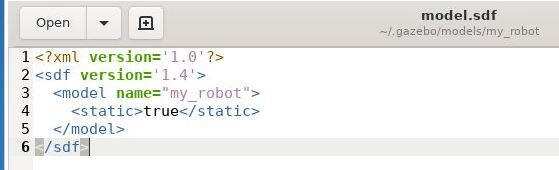
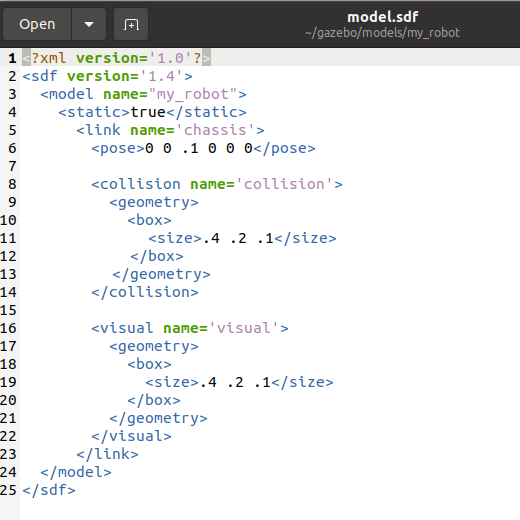
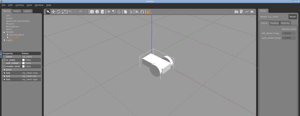

# 前置条件

- Linux环境：Ubuntu 20.04

- 安装ROS2：foxy或者rolling，尽量安装最新版

  参考链接：https://www.ros.org/install/

- 安装gazebo：目前最新的是11版

  参考链接：

# Model目录的建立

1. 创建model文件夹

   `mkdir -p ~/.gazebo/model/my_robot`

2. 创建一个model config文件

   `gedit ~/.gazebo/models/my_robot/model.config`

   向文件中添加以下内容

   ```
   <?xml version="1.0"?>
   <model>
     <name>My Robot</name>
     <version>1.0</version>
     <sdf version='1.4'>model.sdf</sdf>
    
     <author>
      <name>My Name</name>
      <email>me@my.email</email>
     </author>
    
     <description>
       My awesome robot.
     </description>
   </model>
   ```

3. 创建model.sdf文件，该文件提供了创建一个机器人模型实例所需要的标签

   ```
   gedit ~/.gazebo/models/my_robot/model.sdf
   ```

   向上述文件中添加以下内容

   ```
   <?xml version='1.0'?>
   <sdf version='1.4'>
     <model name="my_robot">
     </model>
   </sdf>
   ```

# 创建模型（model）

1. 创建机器人的主体

   

   在创建机器人的时候，我们希望Gazebo的physics engine能够忽略这个机器人，那么在标签<model name="my_robot">下添加

   <static>true<static>，如上图

   接着，在<static>true<static>标签下，添加以下内容

   ```
   <link name='chassis'>
     <pose>0 0 .1 0 0 0</pose>
    
     <collision name='collision'>
       <geometry>
         <box>
           <size>.4 .2 .1</size>
         </box>
       </geometry>
     </collision>
    
     <visual name='visual'>
       <geometry>
         <box>
           <size>.4 .2 .1</size>
         </box>
       </geometry>
     </visual>
   </link>
   ```

   最终model.sdf如下

   

   这样我们就创建了一个box，它的名字(link name)是‘chassis’

2. chassis的pose标签

   - pose代表的是chassis几何中心的位置（x = 0 meters， y = 0 meters, z = .01meters）以及它的姿态（roll = 0 radians, pitch = 0 radians, yaw = 0 radians）。
     - roll：绕x轴旋转
     - pitch：绕y轴旋转
     - yaw：绕z轴旋转

3. collision标签和visusal标签

   - collision定义了几何形状，它将被Gazebo的collision detection engine所使用。
   - visual定义了机器人的显示形状，它将被Gazebo的rendering engine所使用
   - 大多数情况下这两个tag是一直的

4. 添加一个caster wheel

   - caster wheel将被设计为一个半径0.05米的圆球

   - 编辑model.sdf文件，添加如下内容（在第一个</visual>之后，</link>之前）

     `gedit ~/.gazebo/models/my_robot/model.sdf`

     ```
     <collision name='caster_collision'>
       <pose>-0.15 0 -0.05 0 0 0</pose>
       <geometry>
           <sphere>
           <radius>.05</radius>
         </sphere>
       </geometry>
      
       <surface>
         <friction>
           <ode>
             <mu>0</mu>
             <mu2>0</mu2>
             <slip1>1.0</slip1>
             <slip2>1.0</slip2>
           </ode>
         </friction>
       </surface>
     </collision>
      
     <visual name='caster_visual'>
       <pose>-0.15 0 -0.05 0 0 0</pose>
       <geometry>
         <sphere>
           <radius>.05</radius>
         </sphere>
       </geometry>
     </visual>
     ```

5. 添加左轮和右轮

   - 编辑model.sdf文件（在</link>之后，</model>之前），添加以下内容

     `gedit ~/.gazebo/models/my_robot/model.sdf`

     ```
     <link name="left_wheel">
        <pose>0.1 0.13 0.1 0 1.5707 1.5707</pose>
        <collision name="collision">
          <geometry>
            <cylinder>
              <radius>.1</radius>
              <length>.05</length>
            </cylinder>
          </geometry>
        </collision>
        <visual name="visual">
          <geometry>
            <cylinder>
              <radius>.1</radius>
              <length>.05</length>
            </cylinder>
          </geometry>
        </visual>
      </link>
     ```

     ```
     <link name="right_wheel">
         <pose>0.1 -0.13 0.1 0 1.5707 1.5707</pose>
         <collision name="collision">
           <geometry>
             <cylinder>
               <radius>.1</radius>
               <length>.05</length>
             </cylinder>
           </geometry>
         </collision>
         <visual name="visual">
           <geometry>
             <cylinder>
               <radius>.1</radius>
               <length>.05</length>
             </cylinder>
           </geometry>
         </visual>
       </link>
     ```

     

6. 添加左转动关节和右转动关节

   - 将robot从static改变为dynamic状态，修改model.sdf文件

     `<static>false</static>`

   - 添加左右两个转动关节（在最后一个</model>之前添加以下内容）

     ```
     <joint type="revolute" name="left_wheel_hinge">
       <pose>0 0 -0.03 0 0 0</pose>
       <child>left_wheel</child>
       <parent>chassis</parent>
       <axis>
         <xyz>0 1 0</xyz>
       </axis>
     </joint>
      
     <joint type="revolute" name="right_wheel_hinge">
       <pose>0 0 0.03 0 0 0</pose>
       <child>right_wheel</child>
       <parent>chassis</parent>
       <axis>
         <xyz>0 1 0</xyz>
       </axis>
     </joint>
     ```

     